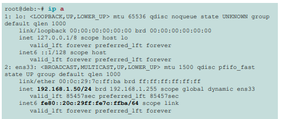
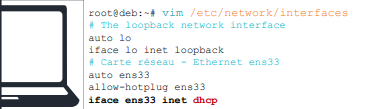
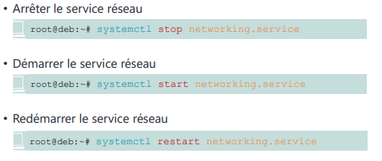
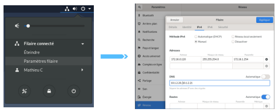
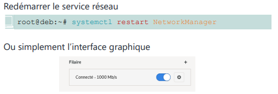

# Module 05 – Gestion du réseau

## Objectifs
- Prendre des informations sur le réseau
- Configuration réseau d’un système sans interface
graphique

- Configuration réseau d’un système avec interface
graphique


> Interroger et configurer le réseau sous Linux.


## Prendre des informations

### Les prérequis

- Pour une mise en réseau des postes client et serveur, il faut que la couche IP soit correctement réalisée

- La configuration IP a généralement besoin :
    - D’une adresse IP
    - D’un masque réseau
    - Potentiellement d’une passerelle par défaut
  
- Afin de pouvoir résoudre les noms d’hôtes, il faudra aussi
renseigner un ou des serveurs DNS

### Connaître l’adresse réseau

- Dans un shell, commande ``ip`` avec l’option ``address`` ou son raccourci ``a``




### Connaître passerelle et serveur DNS

- Dans un shell, commande ``ip`` avec l’option ``route`` ou son
raccourci ``r``


```
root@deb:~# ipr
default via 192.168.1.1 dev ens
192.168.1.0/24 dev ens33 proto kernel scope link src
192.168.1.
```
- Les informations de DNS se trouvent dans le fichier ``/etc/resolv.conf``
```
root@deb:~# cat /etc/resolv.conf
search mondomaine.fr
nameserver 10.1.2.
nameserver 10.1.2.
```


## Système sans interface graphique

### Configuration IP en DHCP

- La configuration IP et DNS sur un système sans interface graphique se fait dans deux fichiers de configuration

- Le fichier ``/etc/network/interfaces`` permet de gérer la partie IP
- Il est possible d’avoir une configuration simplifiée via un serveur DHCP ou une configuration statique



### Configuration IP statique

- Mettre en place une configuration statiquedans le fichier
``/etc/network/interfaces``

### Configuration serveur DNS statique

- Mettre en place une configuration **statique** dans le fichier ``/etc/resolv.conf`` via la directive ``nameserver``


### Prise en compte des modifications

On utilise la commande ``systemctl`` pour gérer le service ``networking``




## Configuration réseau d’un système graphique

### Gestion du réseau avec Network Manager

Network Manager est utilisé dans le cas d’un système Linux avec interface graphique (Desktop)




### Prise en compte des modifications


On utilise la commande ``systemctl`` pour gérer le service ``NetworkManager``




### Conclusion

- Vous savez consulter les informations réseau sur un systèmeLinux
- Vous pouvez configurer l’adressage IP sur un serveur
- Vous pouvez configurer l’adressage IP sur un poste avec interface graphique


