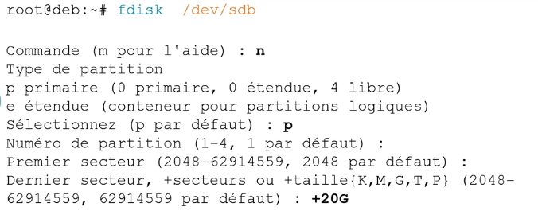

# Module 07 – Gestion des espaces de stockage


 ## Objectifs

- Comprendre le fonctionnement du partitionnement sous Linux
- Utiliser la commande ``fdisk``
- Connaître les systèmes de fichiers sous Linux

> Créer des partitions en mode « legacy »

## Partitionner un disque

### La norme Intel du MBR

- Le MBR (Master Boot Record) est constitué de 2 principaux éléments :
  - Le boot loader : 446 premiers octets - Sous Linux il contient le stage 1 de GRUB
  - La table de partition : 64 octets, contient la position des 4 partitions primaires
- La partition étendue pourra quant à elle stocker les informations de 56 partitions logiques
- La plus grosse problématique du MBR est la taille limite des partitions fixée au maximum à 2,2To

- Le **GPT** *(GUID Partition Table)* est créé en 2013, il est le remplaçant du **MBR**
- Le nombre maximum de partitions est fixé à **128** (voire 256)
- La limite théorique des partitions et des disques est de 9,4 Zo (Zeta octet)

### Nommage des disques sous Linux

- Sous Linux, les disques de type SCSI/SATA sont matérialisés dans le répertoire ``/dev`` suivi de sd puis la lettre correspondant au disque
- Par exemple, s’il y a deux disques dans le système :
  - ``/dev/sda`` correspond au premier disque détecté
  - ``/dev/sdb`` correspond au deuxième disque


### Nommage des partitions

- Linux ne nomme pas les partitions à la suite
- Linux va réserver les chiffres de 1 à 4 pour les partitions principales (principale et étendue)
- Quel que soit le nombre de partitions principales, s’il y a une partition étendue alors les partitions logiques commenceront quoiqu’il arrive à 5


- Exemple : le deuxième disque du système est partitionné avec 2 partitions principales et une partition étendue contenant 3 partitions logiques. Linux présentera tout cela de cette façon :
  
  


## Outil de partitionnement

### La commande fdisk ###
```
fdisk [option] <peripherique de stockage> 
```
•-l affiche la table de partition du périphérique


Pour pouvoir réellement passer en ``mode édition`` de la table de partitions :




De manière générale, laisser faire le système. Pour prendre le disque entier, laisser tout par défaut. *(ici est spécifié +20G soit création d'une partition de 20 gigas)*

Une nouvelle partition 1 de type Linux et de taille 20 GiB a été créée (option p = print)


Une fois les partitions créées, il ne faut pas oublier de définir le type de partition via la commande ``t`` *(type)*.


L’enregistrement des modifications se fait via la commande ``w`` *(q pour sortir sans enregistrer)*


## Conclusion

- Vous comprenez le fonctionnement du partitionnement sous Linux
- Vous savez utiliser la commande fdisk
- Vous connaissez les systèmes de fichiers sous Linux