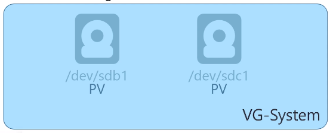
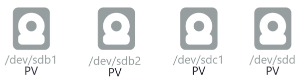
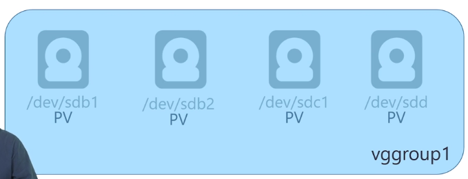
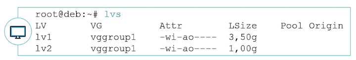

# Gestion des espaces de stockage avancée - LVM

## Objectifs

- Comprendre le fonctionnement de LVM
- Préparer le stockage pour LVM
- Créer et modifier des groupes de volumes et volumes logiques

> Créer des partitions en mode « moderne »

## Présentation de LVM

 ### LVM : Logical Volume Manager**

- Le **LVM** permet de s’affranchir des limites physiques des périphériques. LVM implémente une couche logique pour une gestion plus souple et plus évolutive des volumes de stockage
- On gère plusieurs types d’éléments :
  - Les volumes physiques **(PV)** : désignent les périphériques intégrés dans LVM 
  - Les groupes de volumes **(VG)** : permettent de regrouper les volumes physiques 
  - Les volumes logiques **(LV)** : désignent les unités définies au sein des groupes de volumes

- La création d’un ou plusieurs groupes de volumes sera faite à partir des volumes physiques *(partitions)* disponibles. Les groupes de volumes seront ensuite découpés en volumes logiques 
- Ces volumes logiques pourront alors être utilisés comme n'importe quel volume de stockage
  



- Les commandes de gestion s'organisent autour de ces dénominations et respectent toujours la même logique. Pour la création, on aura par exemple :
  - ``pvcreate`` : création des volumes physiques 
  - ``vgcreate`` : création des groupes de volumes 
  - ``lvcreate`` : création des volumes logiques
- Il en sera de même pour toutes les autres directives : ``display``, ``extend``, ``reduce``, ``remove``...


## Créer des LVM

### LVM : prérequis

Définir l'identifiant des partitions à utiliser avec fdisk, utiliser l'ID **8e** – Linux LVM :


### Créer des partitions LVM

> Créer des volumes physiques :**pvcreate**

```
root@deb:~# pvcreate /dev/sdb1 /dev/sdb2 /dev/sdc1 /dev/sdd
```


> Créer des volumes groups :**vgcreate**

```
root@deb:~# vgcreate vggroup1 /dev/sdb1 /dev/sdb2 /dev/sdc1
```



> Créer des volumes logiques : **lvcreate**

```
root@deb:~# lvcreate -n lv1 -L 2G vggroup1 root@deb:~# lvcreate -n lv2 -L 512M vggroup1
```


Il y aura deux chemins possibles pour manipuler le Volume Logique
```
/dev/vgsystem/lvhome
```
Ou
```
/dev/mapper/vgsystem-lvhome
```


## Modifier des LVM


### Agrandir un Volume Group

> Ajouter des volumes physiques au VG : **vgextend**

```
root@deb:~# vgextend vggroup1 /dev/sdd
```




### Créer des partitions LVM

> Agrandir des volumes logiques : **lvextend**
> 


- De la même façon, ``lvreduce`` permet de réduire la taille d'un volume logique
- Attention, le système de fichier ne prendra pas en compte automatiquement ces changements. Il faudra forcer un redimensionnement pour pouvoir utiliser tout l'espace. *> plus compliqué et dangereux > risque de destruction des données !*
- La commande ``resize2fs`` qui permet de redimensionner un système de fichier sera étudiée dans le module suivant

### Afficher les informations LVM

- Plusieurs commandes sont disponibles pour obtenir des informations sur les volumes LVM configurés
- On peut les regrouper en deux « familles »
  - Informations résumées avec « s » : **pvs**, **vgs**, **lvs** *(s = summarize)*
  - Informations détaillées avec « display » : **pvdisplay**, **vgdisplay**, **lvdisplay**


> Afficher les informations résumées sur tous les groupes de volumes : 


> Afficher les informations détaillées sur tous les groupes de volumes :


> Afficher les informations détaillées sur un groupe de volumes :


> Afficher les informations résumées sur tous les Volumes Logiques :



> Afficher les informations détaillées sur tous les Volumes Logiques :


> Afficher les informations détaillées sur un Volume Logique :


- Toutes les commandes LVM sont également disponibles dans un shell dédié, accessible avec la commande ``lvm``


## Conclusion

- Vous savez préparer des disques et partitions pour LVM
- Vous savez créer et modifier des Volumes Groups
- Vous savez créer et modifier des Logical Volumes
