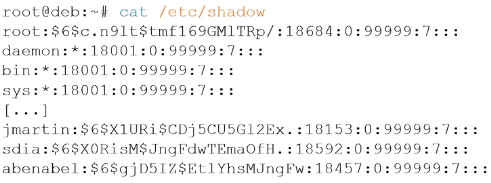

# Module 10 – Gestion des utilisateurs et groupes**


## Objectifs

- Créer et gérer des groupes et utilisateurs
- Consulter les fichiers de configuration
- Effectuer une élévation de privilèges en environnement GNU/Linux


## Considérations générales

### Les identifiants

- Sous Linux, les utilisateurs sont représentés par deux valeurs importantes : 
  - L’``UID`` : l’identifiant ``utilisateur``
  - Le ``GID`` : l’identifiant du ``groupe principal``
- Il est possible qu’un utilisateur appartienne à plusieurs groupes. Il y aura donc les notions de groupe principal et de groupe secondaire.
- Le groupe principal est le groupe attribué à l’utilisateur au moment de sa connexion.


- Il existe trois types d’utilisateurs :
  - ``root`` : UID=0, GID=0

C’est le super-administrateur du système. Il a tout pouvoir. Il est donc conseillé d’être le moins possible sous cette identité, voire fortement conseillé de ne pas se connecter avec mais de faire une élévation de privilèges via la commande su -. 

Sur certains systèmes, il sera impossible de se connecter en root dans l’interface graphique.

- ``daemon`` : UID 1-999, GID 1-999 Les utilisateurs compris entre 1 et 999 pour leur UID/GID représentent les utilisateurs applicatifs (les services). En effet sous Linux 99% des services ne sont pas exécutés sous l’identité de root mais sous leur propre identité à des fins de sécurité.
- ``Utilisateur`` : UID et GID > 1000
Les utilisateurs « humains » sont représentés par des UID/GID supérieurs à 1000.


## Les fichiers liés à la gestion des groupes

### Généralités

- Les informations concernant les groupes d’un système Linux sont contenus dans les fichiers ``/etc/group`` et ``/etc/gshadow``
- Nous pourrons y prendre des informations, mais nous ne les modifierons jamais directement
- La manipulation des groupes devra se faire par les commandes dédiées


### Le fichier ``/etc/group``

- Ce fichier est composé de plusieurs champs, séparés par le caractère  ``:``


- Analyse de colonnes
  


### Le fichier ``/etc/gshadow``

- Ce fichier contient les informations cachées sur les groupes séparés par le caractère  **:** . Il est rarement utilisé
  


- Analyse de colonnes


- Si le champ du mot de passe contient les caractères « ``!`` » ou « ``*`` », les utilisateurs ne pourront pas utiliser le mot de passe pour accéder au groupe. 
- Si le champ est vide, dans ce cas seul les membres du groupe pourront obtenir les permissions du groupe.
- Le champ administrateur contient la liste des administrateurs du groupe séparé par des virgules. Les administrateurs peuvent modifier le mot de passe et les membres du groupe.


## Commandes de gestion des groupes

### groupadd

```
groupadd <options> [nom du groupe]
```

- Option usuelle :

``-g [GID]`` : valeur numérique de l’identifiant du groupe.

Cette valeur doit être unique. 

Par défaut, le plus petit identifiant supérieur au ``GID_MIN`` et aux identifiants des groupes existants est utilisé.


### groupmod

```
groupmod <options> [nom du groupe]
```

- Options usuelles :
  - ``-g [GID]`` : change le GID d’un groupe. Attention aux orphelins des fichiers créés préalablement
  - ``-n [nouveau nom]`` : change le nom du groupe


### groupdel

```
groupdel <options> [nom du groupe]
```

- Cette commande permet de supprimer un groupe s’il est vidé de tous ses membres avant


### gpasswd

```
gpasswd <options> [nom du groupe]
```

- Cette commande permet d’administrer les groupes
- Options usuelles :
  - ``-a [utilisateur]`` : ajoute « utilisateur » au groupe.
  - ``-d [utilisateur]`` : supprime « utilisateur » au groupe.


## Les fichiers liés à la gestion des utilisateurs


### Informations concernant les utilisateurs

- Les informations concernant les utilisateurs d’un système Linux sont contenus dans les fichiers ``/etc/passwd`` et ``/etc/shadow``
- Nous pourrons y prendre des informations, mais nous ne les modifierons jamais directement
- La manipulation des utilisateurs devra se faire par les commandes dédiées


### Le fichier /etc/passwd

- Ce fichier est composé de plusieurs champs, séparés par le caractère  ``:``


- En général, il y a un ``x`` dans la colonne du mot de passe, cela indique que le mot de passe est dans le fichier ``/etc/shadow``. 
- Le champ ``UID`` indique le numéro qui est l’identifiant unique de l’utilisateur.
- Le champ ``GID`` détermine quel est le groupe principal de l’utilisateur.
- Le champ ``nom,complet`` comporte des informations complémentaires comme le nom complet, le téléphone, etc. Ces informations peuvent être directement indiquées lors de la création de l’utilisateur ou via la commande ``chfn``.
- Le champ répertoire personnel contient le chemin du répertoire d’accueil de l’utilisateur, si celui-ci a été créé.
- Le champ shell correspond au chemin du binaire correspondant au shell de l’utilisateur. Il est possible de le modifier avec la commande ``chsh``.


### Le fichier /etc/shadow

- Ce fichier contient les informations cachées des utilisateurs séparées par le caractère  ``:``




- ``User`` : champ contenant le nom de l’utilisateur
- ``Mot de passe`` : champ contenant le hash du mot de passe. Cette colonne est composée de 3 champs séparés par des « ``$`` »
- ``Premier champ`` : algorithme de hashage
  - ``$1$`` signifie MD5
  - ``$2a$`` signifie Blowfish
  - ``$2$`` signifie Blowfish (manipulation correcte de caractères 8 bits)
  - ``$5$`` signifie SHA-256
  - ``$6$`` signifie SHA-512
- ``Deuxième champ`` : le sel (ou grain de sable). C’est une chaîne de caractère aléatoire qui sera ajoutée au mot de passe avant de faire son hash


- ``Troisième champ`` : le hash du mot de passe plus son sel. Le hash est une chaîne de caractère unique généré par l’algorithme de hash. Plus l’algorithme est fort plus le hash est complexe à décrypter.
- Le fait d’utiliser un sel dans le stockage des mots de passe permet d’augmenter la sécurité des mots de passe. Le principe du hash est de générer une chaîne de caractère unique d’une certaine taille par rapport à une chaîne de caractère donnée. Donc si deux utilisateurs ont le même mot de passe, par exemple « ``Pa$$w0rd`` », alors les hashs purs seront identiques. L’ajout du sel fait en sorte que les hashs soient différents, pourtant les utilisateurs ont le même mot de passe.


- ``Date de dernier changement de mot de passe`` : nombre de jours depuis le 1er janvier 1970 déterminant le dernier changement du mot de passe. Une valeur à 0 force le changement du mot de passe pour l’utilisateur à la prochaine connexion. Si ce champ est vide, l’utilisateur ne subit pas les options de vieillissement du mot de passe.
- ``Âge minimum`` : l’âge minimum est la durée en jour que l’utilisateur devra attendre avant de pouvoir changer son mot de passe de nouveau. Un champ vide ou à 0 signifie qu’il n’y a pas d’âge minimum.

## Commandes de gestion des utilisateurs

### useradd

```
useradd <options> [utilisateur]
```

- Options usuelles :
  - ``-m`` : useradd crée le répertoire d’accueil de l’utilisateur.
  - ``-d [/chemin/rep/accueil]`` : répertoire d’accueil de l’utilisateur. Si non indiqué, useradd utilisera le nom de l’utilisateur et la valeur de la variable HOME du fichier /etc/default/useradd.
  - ``-u [UID]`` : indique l’UID de l’utilisateur. Si non renseigné, useradd utilisera le plus petit UID disponible.

- -``g [GID]`` : indique le GID du groupe **principal** de l’utilisateur.
- ``-G [groupe1,groupe2,groupe*n*]`` : indique la liste des groupes secondaires de l’utilisateur séparés par des « ``,`` ».
- ``-s`` : indique le shell de l’utilisateur sous la forme du chemin absolu du binaire.
- ``-r`` : indique la création d’un utilisateur système.

Lors de la création d’un utilisateur, si l’option ``–m`` est passée à ``useradd``, alors useradd copiera le contenu du répertoire ``/etc/skel`` dans le répertoire d’accueil de l’utilisateur.


### usermod

```
usermod <options> [utilisateur]
```

- Options usuelles :
  - ``-d [/home/DIR]`` : indique le nouveau répertoire d’accueil de l’utilisateur. Si l’option ``–m`` est fournie, le contenu du répertoire actuel sera déplacé dans le nouveau répertoire d’accueil
  - ``-e [DATE FIN VALIDITE]`` : date à laquelle le compte utilisateur sera désactivé. La date est indiquée dans le format ``AAAA-MM- JJ`` ou en nombre de jours depuis le 1er janvier 1970. 

Un paramètre ``DATE\_FIN\_VALIDITÉ`` vide **désactivera** l'expiration du compte.


- ``-f [DUREE INACTIVITE]`` : nombre de jours suivant la fin de validité d’un mot de passe après lequel le compte est **définitivement** désactivé. Une valeur de ``0`` désactive le compte dès que le mot de passe a dépassé sa fin de validité, et une valeur de ``-1`` désactive cette fonctionnalité.
- ``-g [GID]`` : nom du nouveau groupe principal de l’utilisateur. Tout fichier du répertoire personnel de l'utilisateur appartenant au groupe principal précédent de l'utilisateur appartiendra à ce nouveau groupe.

Le groupe propriétaire des fichiers en dehors du répertoire personnel de l'utilisateur doit être modifié manuellement.

```
usermod <options> [utilisateur]
```

- Options usuelles :
  - ``-G [groupe1,groupe2,groupen]`` : liste des groupes secondaires de l’utilisateur. Si l’utilisateur appartient déjà à des groupes secondaires, il est peut-être utile d’ajouter l’option -a afin de ne pas perdre ces appartenances. Le groupe propriétaire des fichiers en dehors du répertoire personnel de l'utilisateur doit être modifié manuellement.
  - ``-a`` : ajouter les groupes supplémentaires à l’utilisateur. 

À n’utiliser qu’avec l’option ``-G``.


```
usermod <options> [utilisateur**]
```

- Options usuelles :
  - ``-s [shell]`` : chemin du nouveau shell de l’utilisateur (peut être configuré à l’aide de la commande ``chsh``).
  - -``L`` : verrouille le mot de passe de l’utilisateur. 

Cette option ajoute un « ``!`` » devant le hash du mot de passe dans ``/etc/shadow``.

Remarque : pour verrouiller le compte (et pas seulement l'accès par un mot de passe), il est également nécessaire de placer ``DATE\_FIN\_VALIDITÉ`` à ``1``.

- ``-U`` : déverrouille le mot de passe de l’utilisateur.


### userdel

```
userdel <options> [nom du groupe]
```

- Cette commande permet de supprimer un utilisateur.
- Option usuelle :
  - ``-r`` : les fichiers présents dans le répertoire d’accueil de l’utilisateur seront également supprimés. Les fichiers de l’utilisateur présents dans d’autres répertoires ne seront pas supprimés.


### passwd

```
passwd <options> [utilisateur]
```

- En plus de pouvoir changer le mot de passe, si root l’exécute, ``passwd`` modifiera suivant les options passées les champs du fichier ``/etc/shadow|``.
- Options usuelles :
  - ``-e [utilisateur]`` : annuler immédiatement la validité du mot de passe d’un utilisateur. Celui-ci sera obligé de changer son mot de passe à sa prochaine connexion.
  - ``-l [utilisateur]`` : verrouille le mot de passe en ajoutant un « ``!`` » devant le hash du mot de passe dans ``/etc/shadow``.
  - ``-u [utilisateur]`` : déverrouille le mot de passe en supprimant le « ``!`` » devant le hash du mot de passe dans ``/etc/shadow``.


## Changement d’identité et élévation de privilèges


### La commande su

```
su <options> [utilisateur]
```

- ``su`` permet de changer d’utilisateur ou d’exécuter une commande sous l’identité d’un autre utilisateur. 
- Si la commande est invoquée par un simple utilisateur, il faudra qu’il connaisse le mot de passe de l’autre utilisateur. 
- ``su`` peut aussi permettre de devenir root. 
- ``-s [shell]`` : préciser le shell à utiliser pour l’ouverture de session.
- **ou** ``-l [utilisateur]`` : faire un changement complet d’identité (charge les variables d’environnement de l’utilisateur cible).
- ``-c [cmd]`` : exécuter la commande, il est conseillé de mettre la commande entre simples quote.


### La commande sudo

```
sudo <options> [commande]
```

- La commande ``sudo`` permet de déléguer des tâches précises d'administration à certains utilisateurs. Par exemple, il sera possible d'accorder les privilèges de gestion des utilisateurs à un groupe d'utilisateurs.
- Nous ne rentrerons pas dans les détails dans ce cours.
- Afin qu’un utilisateur puisse utiliser la commande ``sudo``, il faut qu’il soit renseigné dans le fichier de configuration ``/etc/sudoers`` et renseigner les commandes qu’il pourra utiliser.


- De façon simple, il est possible de donner tous les droits root à un utilisateur en ajoutant le groupe ``sudo`` à l’utilisateur.
- L’utilisation de la commande ``sudo`` demande le mot de passe de l’utilisateur et non celui de root. L’élévation de privilège sera gardée en mémoire pour cinq minutes par défaut.


Lorsque vous utilisez l'option "``-i``", la session interactive en tant que superutilisateur est ouverte avec un nouvel environnement et un nouveau répertoire de travail. Cela signifie que vous obtenez un shell (interpréteur de commandes) avec les variables d'environnement et les paramètres du superutilisateur.

## Conclusion

- Vous savez créer et gérer des groupes et utilisateurs
- Vous savez consulter les fichiers de configuration
- Vous savez effectuer une élévation de privilèges en environnement GNU/Linux
