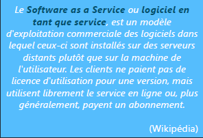
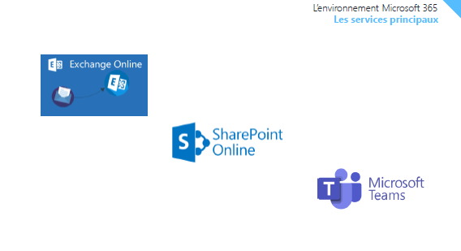
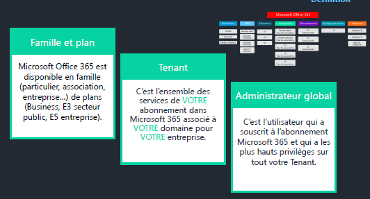
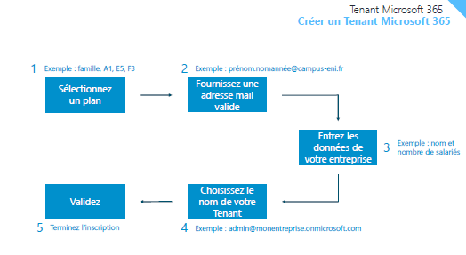
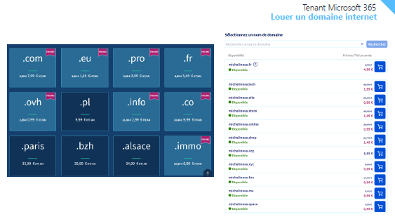

# Découverte de Microsoft 365

## L’environnement Microsoft 365

**Saas** : software as a service : plus de licence office mais abonnement qui donne accès au logiciel sur un serveur distant, qui évolue constamment et est mis à jour. Problème : comme la suite office évolue constamment, elle peut éventuellement devenir incompatible avec une application métier utilisée en parallèle. Pour cette raison, il peut être intéressant de posséder une version « boîte » de secours.

- Offres cloud
- Multiplateformes
- Particuliers et entreprises
- Moins de serveurs sur site > déporté dans le cloud

Exchange : tout le système de messageries de Microsoft

Onedrive : 1 tera par défaut dans le cloud

Suite office

Teams : travail collaboratif > basé sur Sharepoint Online

>>> toutes ces briques reposent sur un socle qui s’appelle AZURE Active Directory (qui gère la partie authentification, sécurité, et fait le lien entre ces applications)

- Licences : 
  - Pour les particuliers : abonnement famille, personnel, famille et étudiant > différences qui évoluent en fonction de la licence
  - Pour les PME : Business basic (en ligne uniquement), business standard, business premium
  - Education : A1, A3, A5
  - Associations : ce qui change, c’est la tarification (système de donations qui permet la gratuité)
  - Gouvernement,
  - Employé de terrain
  - Entreprise (permet une plus large utilisation)

La partie licensing est relativement complexe, il faut bien se documenter.

Autres applications moins connues incluses : Yammer, Onenote, Stream, Delve, Dynamics 365

L’exemple de Yammer : c’est un réseau social d’entreprise

Sharepoint online : aspect « partage » (communauté, app mobile, réseau social) ; aspect organisationnel (lien avec Onedrive) ; applications de gestion orientées business, mais permet également de construire des applications (développement)

## Tenant Microsoft 365

**Le « tenant » Microsoft 365** : c’est une bulle, un espace créé spécifiquement pour votre environnement : abonnements en fonction de la configuration de l’entreprise, mise en place d’un domaine personnel (ex : eni-ecole.fr fait partie du tenant de l’école ENI).

- Le compte qui souscrit au tenant est l’administrateur global, c’est-à-dire l’administrateur qui a le plus haut niveau de privilège.

Comment créer un tenant ?

- Sélectionner un plan (famille, PME ou enterprise ?)
- Fournir une adresse mail de référence (ex : <prénom.nomannee@campus-eni.fr>)
- Entrer les données de l’entreprise (par ex le nombre de licences à associer, les noms des utilisateurs etc.)
- Choisir le nom du Tenant (ex : <admin@monentreprise.onmicrosoft.com>)
- Valider

Le tenant n’est pas modifiable !

Pour avoir une adresse mail personnalisée : il suffit de louer un nom de domaine auprès d’un registrar, qui sera plaqué sur le Tenant.

