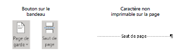
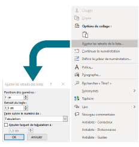
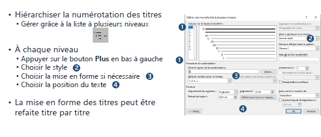
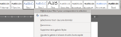
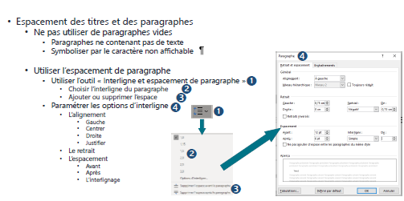
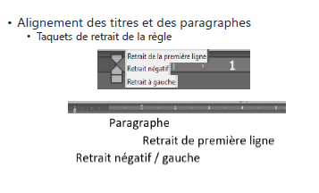
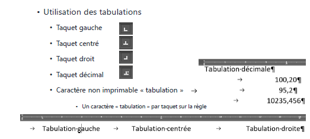
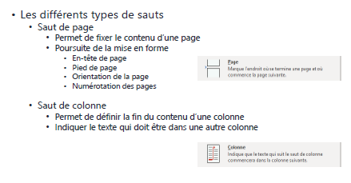
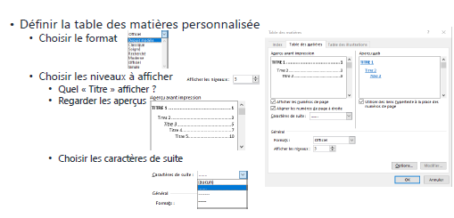

# Connaissances des notions de base Word

## Objectifs

- Découvrir les fonctionnalités de Microsoft Word
- Mettre en forme un document
- Utiliser les fonctionnalités de Word qui permettent d’automatiser la mise en forme du document

---

## L’interface de Word

### Au démarrage, choisir

- Nouveau document
- Un modèle
- Document récent

### Présentation de Word

- La barre de titre
  - Affiche le nom du fichier et du logiciel
- Le ruban
  - Séparé sous forme d’onglets
  - Contenant les commandes par thèmes (accueil, mise en page, affichage…)
- La barre accès rapide
  - Personnalisable
  - Contient les commandes les plus utilisées
- La zone utilisateur
  - Affiche le nom de l’utilisateur de la licence

### Les règles

- Pas affichées par défaut
- Permet de positionner les éléments précisément et les taquets de tabulation
- La zone de rédaction
  - Contient le texte de votre document

---

## Création d’un document

- Afficher les caractères non imprimables : 
  - Menu Accueil
- Écrire plusieurs pages du document
- Taper au kilomètre
- Sans mise en forme
- Identifier les différents éléments :
  - Les titres
  - Les paragraphes
  - Les listes :
    - À puces
    - Numérotées

---

## Écriture d’un document

### Mettre en forme le document

- Alignement des paragraphes :
- Positionner des taquets de tabulations
- Utiliser les tabulations
- Espacement des paragraphes :
- Éviter les paragraphes vides
- Création des styles de paragraphes :
- Appliquer un style aux différents paragraphes
- Pas de paragraphe du style normal

---

- Mettre en forme le document
 - Enchaînement des paragraphes :
  - Lier les styles les uns aux autres
- Utilisation des sauts :
 - Permettre de fixer le contenu de chaque page
- Création du sommaire automatiquement
- Finir l’écriture du document

---

## Mise en forme d’un document

### Prévoir des pages vides (si nécessaire) :

- Pour la page de garde
- Pour le sommaire
- Insérer des sauts de page
  - Menu Insertion
- 

---

## Gestion des titres

- Mettre en forme les titres :
  - Choisir la numérotation
  - Choisir la police :
    - Casse (Majuscule/Minuscule)
    - Taille
   - Mettre en forme le texte
    - Gras
    - Italique
    - Souligné
  - Ajuster les retraits de la liste (clic droit sur la puce) :
    - Espacement de la marge
    - Espacement entre la numérotation et le texte (tabulation)
  - Caractère entre la numérotation et le texte :
    - Tabulation ou Espace

---

- Mettre en forme le style Titre
- Mettre à jour le style Titre1 avec le titre nouvellement créé
  - Menu Accueil

- Procéder de la même façon avec les autres titres
- Les autres titres apparaissent automatiquement dans l’accès rapide des styles

---

---

- Les étapes
  1. Créer les différents titres 
  2. Définir la liste à plusieurs niveaux 
  3. Refaire la gestion des retraits qui aura sûrement été modifiée 

---

## Gestion des paragraphes

---

---

## Gestion de l’espacement

---

---

## Gestion de l’alignement

---

## Gestion des tabulations

---

## Gestion des tabulations (suite)

- Utilisation des tabulations durant la création du document
 - Positionner les tabulations durant la frappe 
 - Sélectionner le texte à aligner
 - Positionner les taquets de tabulation
 - Créer un style pour une réutilisation

---

## Gestion des sauts

---

---

## Gestion de la table des matières

---

---

- Personnaliser la table des matières
  - Dépend de la mise en forme des styles TM X
  - Apparaît au fur et à mesure de leur utilisation

