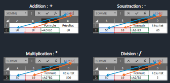
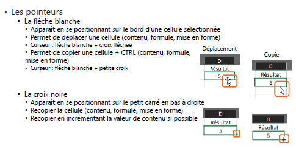
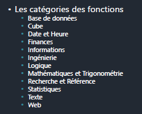
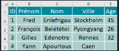
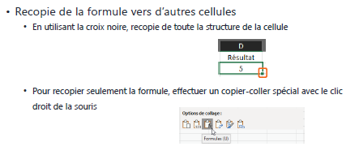
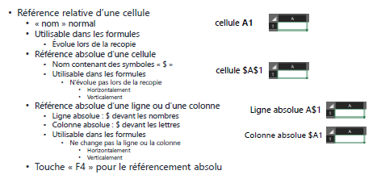

## Notions de base d'Excel

### Classeur Excel
Un classeur Excel est le document principal dans lequel vous travaillez. Voici quelques opérations de base liées aux classeurs :

- **Créer un classeur** :
  - Vous pouvez créer un nouveau classeur vide.
  - Ou partir d'un modèle prédéfini.
- **Ouvrir un classeur** :
  - À partir de fichiers récents.
  - En recherchant le classeur sur votre ordinateur ou sur le réseau.

Les classeurs Excel ont des limites en termes de nombre de feuilles, de lignes et de colonnes, mais elles sont généralement assez élevées. Voici quelques-unes de ces limites :
- Nombre de feuilles : 255
- Nombre de lignes maximum : 10 148 576
- Nombre de colonnes maximum : 16 384
- Nom des cellules va de A1 à XFD10148576
- Nom d'une feuille : 31 caractères maximum

### Utilisation d'Excel
- Excel est souvent utilisé pour des calculs simples, comme une calculatrice.
- Les opérateurs mathématiques de base sont utilisés, tels que l'addition (+), la soustraction (-), la multiplication (*), la division (/).
- L'ordre de calcul suit la règle classique : Pourcentage (%), Exposant (^), Multiplication (*), Division (/), Soustraction (-), et enfin l'Addition (+). Cependant, vous pouvez changer cet ordre avec l'utilisation de parenthèses pour définir des priorités.
- 

### Les cellules
- Les cellules d'Excel sont référencées par une ou plusieurs lettres (pour les colonnes) et un nombre (pour les lignes). Par exemple, la première cellule est A1 et la dernière cellule est XFD10148576.
- Vous pouvez modifier les références des cellules, et même leur donner un nom.
- Il existe diverses façons de sélectionner des cellules et d'éditer leur contenu.

### Les fonctions
Excel propose de nombreuses fonctions prédéfinies qui vous permettent d'effectuer une variété d'opérations, des calculs mathématiques aux manipulations de texte en passant par la recherche et la logique.

Voici quelques exemples de fonctions :
- Fonctions mathématiques : `ALEA()`, `ARRONDI()`, `ENT()`, `PRODUIT()`, `SOMME()`, `QUOTIENT()`, `MOD()`, etc.

- Fonctions texte : `CONCAT()`, `DROITE()`, `GAUCHE()`, `MAJUSCULE()`, `MINUSCULE()`, `NBCAR()`, `TEXTE()`, `CNUM()`, etc.

- Fonctions de recherche : `COLONNE()`, `LIGNE()`, `RECHERCHEV()`, `RECHERCHEH()`, `TROUVE()`, etc.

- Fonctions logiques : `SI()`, `ET()`, `OU()`, `SIERREUR()`, etc.

L'utilisation de ces fonctions peut grandement simplifier les calculs et les manipulations de données dans Excel.

### Excel et SharePoint

Excel peut être lié à SharePoint pour faciliter la gestion de documents et le travail collaboratif. SharePoint permet de stocker automatiquement les documents, de gérer les versions, d'ouvrir des versions antérieures sans écraser la version courante, et de suivre les modifications apportées par différents utilisateurs.

Pour ouvrir un classeur Excel stocké sur SharePoint, vous pouvez utiliser le nom du classeur et accéder au menu "Fichier". SharePoint facilite la collaboration sur des documents Excel au sein d'une équipe ou d'une organisation.

