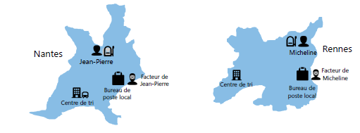
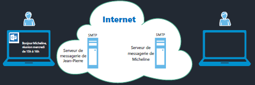
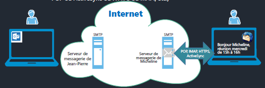
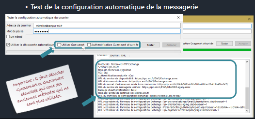
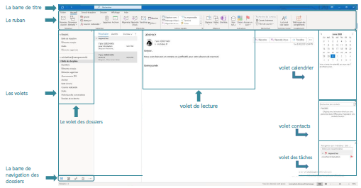
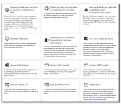
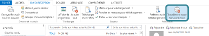

# Exploiter Outlook et savoir le dépanner

## Objectifs

Ce cours vise à vous familiariser avec l'utilisation d'Outlook et à vous apprendre à résoudre les problèmes courants. Les objectifs spécifiques incluent :

1. Comprendre le cheminement d'un email.
2. Connaître l'utilisation des outils de communication asynchrone.
3. Paramétrer un logiciel de messagerie.

## Cheminement d’un courrier

Le processus de cheminement d'un courrier postal est expliqué ci-dessous :

1. **Jean-Pierre de Nantes écrit une lettre à Micheline de Rennes**.
   - Jean-Pierre rédige sa lettre.

2. **Le facteur vient chercher sa lettre**.
   - Le facteur de Jean-Pierre récupère la lettre.

3. **Le facteur donne la lettre au bureau de poste local de Jean-Pierre**.
   - La lettre est remise au bureau de poste local de Jean-Pierre.

4. **Le bureau de poste envoie la lettre au centre de tri de Nantes**.
   - La lettre est acheminée au centre de tri de Nantes.

5. **Le centre de tri de Nantes l'envoie au centre de tri de Rennes**.
   - La lettre est transférée au centre de tri de Rennes.

6. **Le centre de tri de Rennes l'envoie au bureau de poste local de Micheline**.
   - Enfin, la lettre atteint le bureau de poste local de Micheline.

7. **Le facteur de Micheline donne la lettre à Micheline**.
   - Micheline reçoit la lettre et la lit.

## Cheminement d’un mail

Le cheminement d'un email est similaire au courrier postal, mais il se déroule en ligne :

1. **Jean-Pierre de Nantes écrit un courriel à Micheline de Rennes**.
   - Jean-Pierre compose son email à l'aide d'un logiciel tel qu'Outlook.

2. **Le serveur de messagerie de Jean-Pierre vient chercher l'email dans la boîte d'envoi du logiciel** (protocole de soumission SMTP) **et fait une copie dans les éléments envoyés**.

3. **Le serveur de messagerie de Jean-Pierre envoie le mail au serveur de messagerie de Micheline** (protocole SMTP).

4. **Le client de messagerie de Micheline télécharge ses emails depuis son serveur de messagerie** (protocole IMAP, POP, ActiveSync, HTTPS, MAPI, etc.).

## Prérequis pour l'exploitation réseau

Avant d'exploiter Outlook, assurez-vous que les ports nécessaires sont ouverts sur votre pare-feu. Voici une liste des ports et protocoles associés :

- **HTTP (Hypertext Transfer Protocol)** : Ports 80 (non sécurisé) et 443 (TLS/SSL).
- **POP3 (Post Office Protocol)** : Ports 110 (non sécurisé) et 995 (TLS/SSL).
- **IMAP4 (Interactive Message Access Protocol)** : Ports 143 (non sécurisé) et 993 (TLS/SSL).
- **SMTP (Simple Mail Transfer Protocol)** : Ports 25 (non sécurisé), 2525 (soumission client SMTP), 587 ou 2525 (465 déprécié).

## Installation d'Outlook

Pour installer Outlook, suivez ces étapes :

1. Connectez-vous à [https://portal.office.com](https://portal.office.com).

2. Installez Outlook depuis Microsoft 365.

3. Validez votre adresse de récupération : `micheline@campus-eni.fr` avec le code `785245`.

## Autodiscover

Autodiscover est un processus d'autoconfiguration d'Outlook avec un serveur de messagerie en utilisant votre adresse email. Voici comment cela fonctionne :

1. L'utilisateur entre son adresse email lors de l'ouverture d'Outlook.

2. Outlook recherche et se connecte au serveur de messagerie de l'utilisateur.

3. Le client envoie son adresse SMTP pour obtenir les options de configuration.

4. Un fichier `.xml` est téléchargé par le client avec les paramètres du serveur.

5. Outlook se connecte au serveur Exchange Online dans Microsoft 365 et peut recevoir ses emails.

## Test Autodiscover

Vous pouvez tester Autodiscover en suivant ces étapes :

1. Avec CTRL + clic droit sur l'icône Outlook dans la zone de notification, affichez les menus "État de la connexion" et "Tester la configuration automatique de la messagerie".

2. Exécutez le test Autodiscover.

## Présentation d'Outlook

Outlook est un logiciel puissant qui vous permet de gérer votre messagerie électronique, vos rendez-vous, vos réunions, vos contacts et vos tâches. Il existe différentes versions d'Outlook, y compris :

- **Outlook 365** : Disponible avec l'offre Microsoft 365, riche en fonctionnalités et nécessitant des mises à jour.

- **Outlook Online** : Accessible depuis un navigateur, nécessite une connexion Internet, ne prend pas en charge certains comptes.

- **Outlook 2019** : Version installée localement, payante avec l'offre pack Office, nécessite des mises à jour de sécurité.

## L’interface Outlook

L'interface Outlook comprend plusieurs éléments :

- La barre de titre.
- Le ruban.
- Les volets (de navigation des dossiers, contacts, calendrier, tâches, lecture).
- Le volet des dossiers.

## Messagerie Outlook

La messagerie Outlook offre des fonctionnalités telles que l'affichage des rendez-vous, la gestion des conversations et la réponse automatique en cas d'absence.

## Calendrier

Le calendrier d'Outlook vous permet de gérer vos rendez-vous, réunions, et événements. Vous pouvez également créer des groupes de calendriers et des tâches.

## Autres éléments

Outlook gère différents types d'éléments tels que les messages, les rendez-vous, les tâches, les réunions, etc. Vous pouvez les organiser en utilisant des catégories et des règles de gestion de messages.

## Quelques raccourcis clavier

Voici quelques raccourcis clavier utiles pour Outlook :

- **Échap** : Fermer une fenêtre ou un menu.
- **Alt + H** : Accéder à l'onglet Accueil.
- **Ctrl + Maj + M** : Créer un message.
- **Alt + S** : Envoyer un message.
- **Alt + N, A, F** : Insérer un fichier.
- **Ctrl + Maj + K** : Créer une nouvelle tâche.
- **Supprimer** : Supprimer un élément sélectionné (message, tâche ou réunion).
- **Ctrl + E ou F3** : Rechercher un élément.
- **Alt + H, R, P** : Répondre à un courrier.
- **Alt + H, F, W** : Transférer un courrier.
- **Alt + H, R, A** : Sélectionner l'option "Répondre à tous".
- **Alt + J, S** : Accéder à l'onglet "Envoyer/Recevoir".
- **Ctrl + 2** : Accéder au calendrier.
- **Ctrl + Maj + A** : Créer un rendez-vous.
- **Alt + J, A, A, V** : Ouvrir la boîte de dialogue "Enregistrer sous" dans l'onglet des pièces jointes.
- **Ctrl + M ou F9** : Vérifier l'arrivée de nouveaux courriers.

## Dépanner Outlook

Lorsque vous rencontrez des problèmes avec Outlook, voici quelques étapes pour le dépannage :

- **Test distant pour votre infrastructure Microsoft 365** : Vous pouvez tester les accès externes de votre infrastructure Exchange en utilisant [https://testconnectivity.microsoft.com/](https://testconnectivity.microsoft.com/).

- **Validation du login/Password avec Outlook online** : Assurez-vous que vos informations d'identification sont correctes.

- **Journalisation d'Outlook** : La journalisation d'Outlook peut vous aider à récupérer des informations sur les erreurs de connexion.

- **Mode hors connexion** : Il vous permet de diagnostiquer les problèmes de performance réseau.

- **Mode sans échec** : Ce mode permet de démarrer Outlook sans les modules complémentaires, utile pour résoudre certains problèmes de démarrage.

- **Modules complémentaires** : Désactiver les modules inutiles peut améliorer les performances d'Outlook.

- **État de la connexion Outlook** : Vous pouvez surveiller l'état de connexion d'Outlook pour détecter d'éventuels problèmes.

- **Refaire un profil** : En cas de problème, vous pouvez recréer un profil Outlook avec l'Autodiscover pour une configuration automatique.

## Contrôle des fichiers ost/pst

Outlook utilise des fichiers `.ost` et `.pst` pour stocker des données. Vous devez surveiller ces fichiers et les réparer si nécessaire. Les limites des fichiers `.ost` et `.pst` sont à prendre en compte :

- **MaxFileSize** : 50 Go - Taille maximale absolue des fichiers `.ost` et `.pst`.

- **WarnFileSize** : 47,5 Go - Quantité maximale de données que ces fichiers peuvent contenir.

Vous pouvez utiliser des outils tels que SCANPST.EXE ou MicrosoftEasyFix20101.mini.diagcab pour analyser les erreurs pour analyser et réparer ces fichiers.

## Outlook Anywhere

Outlook Anywhere permet un accès aux serveurs Exchange Online depuis Internet sans avoir besoin d'un réseau privé virtuel (VPN).

Vous pouvez tester la connexion avec la commande `Test-OutlookConnectivity`.

Cela couvre les principales notions de ce cours sur l'exploitation d'Outlook et le dépannage. Si vous avez d'autres questions ou des besoins supplémentaires, n'hésitez pas à les poser !