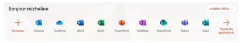
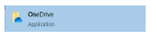
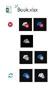
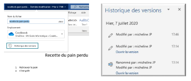
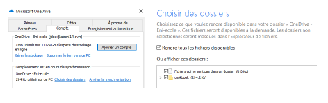
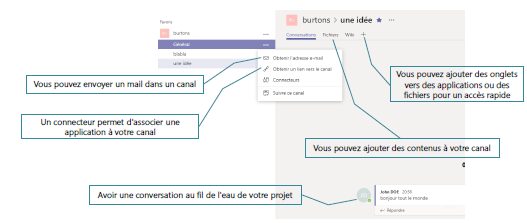

# Exploiter Teams, SharePoint et OneDrive dans un contexte collaboratif

## Objectifs
- Comprendre les enjeux d'une plateforme collaborative
- Utiliser une plateforme Cloud pour exploiter vos données
- Utiliser des outils de synchronisation des données

## SharePoint
### Qu'est-ce que SharePoint ?
- Suite de logiciels qui permet de créer des sites web internes
- SharePoint Online : Service hébergé dans le cloud par Microsoft via un abonnement à Microsoft 365 ou SharePoint Online autonome
- SharePoint Server : Service installé en local (On-premises)
- SharePoint Designer : Service gratuit permettant de gérer des flux de travail (basé sur Business Connectivity Services)
- Synchronisation OneDrive Entreprise : Service de synchronisation de documents à des fins d'utilisation hors connexion

### À quoi sert SharePoint ?
- Partager et collaborer
- Partage de documents et versioning
- Informer et prendre part
- Utilisation avec Teams, blog et site d'actualités
- Transformer des flux métier
- Gérer des flux métier avec des ERP ou des logiciels tiers
- Exploiter et gérer des connaissances collectives
- Créer un Wiki d'entreprise
- Protéger et gérer vos données (anti-programme malveillant)

## OneDrive
### Qu'est-ce que OneDrive ?
- Espace de stockage dans le cloud Azure (1 To par défaut)
- Service SharePoint Online
- Stocke des fichiers depuis différentes plateformes : PC, Tablette, Mobile
- Possibilité de stocker, consulter et partager des fichiers à partir de n'importe quel ordinateur connecté à internet
- Travail avec des utilisateurs externes ou internes
- Possibilité de sécuriser vos fichiers avec des fonctionnalités avancées de chiffrement

### Comment accéder à son OneDrive ?
- Via le portail Microsoft 365

- Via l'application
  

### Les icônes OneDrive
- Les trois tirets bleus signifient qu'il s'agit d'un nouveau fichier
- La croix rouge sur un fichier ou un dossier signifie qu'il ne peut pas être synchronisé
- Le nuage grisé signifie que vous n'êtes pas connecté à votre compte
- Le symbole de pause signifie que votre OneDrive est en pause de synchronisation
- Les flèches circulaires signifient que la synchronisation est en cours
  

## Partager dans OneDrive
- Partage par un lien
- Partage par un mail

### Restaurer son espace OneDrive
- La corbeille dans OneDrive
  
  
  

### Le versioning dans OneDrive
- L'historique des versions vous permet de suivre toutes les modifications sur votre fichier
- Il vous permet aussi de revenir à une version précédente sans perdre la dernière version enregistrée

### La co-édition (co-authoring) dans OneDrive
- Permet d'avoir une notification lorsqu'un autre utilisateur ouvre le même fichier que vous et de travailler avec lui en même temps
- Prise en charge du co-authoring sur les extensions .docx (Word), .pptx (PowerPoint) et .xlsx (Excel)
- Possibilité de retrouver le curseur du co-auteur avec sa couleur associée

### Les paramètres du client OneDrive
- Vous pouvez choisir les dossiers que vous voulez synchroniser
- Gérer les taux de chargement lors de la synchronisation

## Teams
### Qu'est-ce que Teams ?
- Un espace de travail centralisé
- Office et d'autres applications dans Teams en co-édition
- 1 To de stockage
- Conférence audio et vidéo
- Partage d'écran
- Planification de réunion
- Fil de conversation
- Enregistrement de réunion
- Maximum de 250 équipes qu'un utilisateur peut créer
- Multiplateformes (ordinateur, tablette, smartphone)
- Un calendrier

### L'interface de Teams
- Volet Gauche
- Volet Central
- Volet Principal
- Un ou des membres

### Structure d'une équipe
- Équipe
- Canaux (Général, Groupe 1, Groupe 2, Groupe 3, Groupe 4)
- Onglets (publications, fichiers, notes, applications)
- Un ou des propriétaires

### Qu'est-ce qu'une équipe dans Teams ?
- Une équipe est un ensemble d'utilisateurs, de contenus et d'outils
- Maximum de 10 000 membres par équipe
- Un utilisateur peut être membre de 1 000 équipes maximum

### Créer une équipe dans Teams
- Lorsque vous créez une équipe Teams, il sera aussi créé :
  - Un nouveau groupe Microsoft 365
  - Un site SharePoint Online
  - Une boîte aux lettres partagée (cachée par défaut dans Outlook)
  - Un bloc-notes OneNote

### Les paramètres d'une équipe Teams
- Vous pouvez gérer :
  - L'image d'une équipe
  - Les autorisations des membres
  - Les autorisations invité
  - L'utilisation des mentions @mentions
  - L'utilisation de code d'invitation
  - L'utilisation des outils amusants (emojis, GIF, autocollants…)
  - La création de balises (seul le propriétaire peut en créer par défaut)

### Qu'est-ce qu'un canal ?
- Compartimente votre équipe par sujet
- Un canal peut être privé ou public
- Chaque équipe a un canal Général par défaut
- Vous pouvez gérer les notifications par canal
- Un canal supprimé peut être restauré dans un délai maximum de 30 jours
- Maximum de 200 canaux par équipe

### Créer un canal dans Teams
- Un canal est un ensemble de conversations, de contenus et d'outils
- Possibilité d'envoyer un mail dans un canal
- Avoir une conversation au fil de l'eau de votre projet
- Possibilité d'associer une application à votre canal via un connecteur
- Ajout de contenus à votre canal
- Ajout d'onglets vers des applications ou des fichiers pour un accès rapide

### La gestion des fichiers Teams
- Les fichiers sont accessibles par défaut par tous les membres de l'équipe depuis l'onglet Fichiers
- Ils sont stockés dans une bibliothèque SharePoint créée pour chaque canal
- Ils ont les mêmes fonctionnalités que dans OneDrive, c'est-à-dire le versioning et le co-authoring
- Possibilité de transformer un fichier en onglet

### Les messages
- Un message peut être privé ou public
- Un message public est visible par tous les membres de l'équipe ou du canal
- Un message privé ou une conversation ne sont lisibles que par la personne sélectionnée
- Possibilité d'enregistrer un message
- Possibilité de faire une conférence audio ou vidéo à une ou plusieurs personnes et de l'enregistrer dans l'application Stream

### Les réunions d'équipe
- Une réunion peut être planifiée ou créée à l'instant
- Maximum de 250 utilisateurs
- Possibilité de créer une réunion depuis Outlook
- Lors d'une réunion, il est possible de partager :
  - Une présentation PowerPoint
  - Son écran
  - Un tableau blanc
- Existence d'une salle d'attente pour faire patienter des utilisateurs avant le début d'une réunion
- Trois rôles : 
  - L'organisateur qui a créé la réunion et dispose de tous les droits
  - Le présentateur qui peut gérer la réunion et les utilisateurs, mais pas les rôles
  - Le participant
