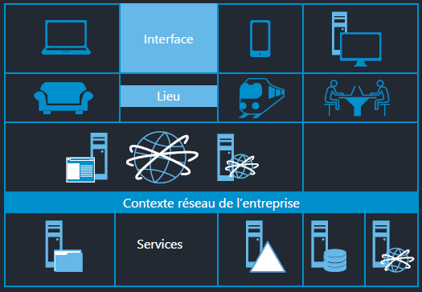
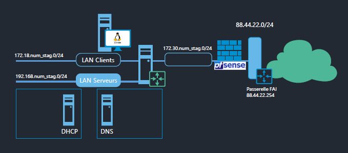

# Services réseau en environnement Linux

## Objectifs

- Définir les besoins en services
- Présenter la maquette

## Public ciblé 

- Techniciens système et réseaux

## Les besoins, de l'utilisateur au service

### Des besoins au service

- Les **utilisateurs** utilisent le système d'information de l'entreprise :
    - Depuis différents **appareils** (ordinateur, téléphone, tablette, etc.) 
    - Depuis différents **lieux** (bureau, transport, maison, etc.)
- Au final, ils accèdent à des **services**
- Ces services sont gérés :
    - Soit par l'équipe système de l'entreprise
    - Soit par un **sous-traitant**

- Les services sont le cœur du système d'information de l'entreprise
- Nous allons voir les principaux services d'un système d'information d'entreprise :
    - La mise en place du **réseau**
    - Le **routage**
    - Le **DNS** 
    - Le **DHCP**

### Des besoins au service

## Bac à sable 

### Principe

- Les services seront installés sur des machines virtuelles (OS : pfSense et Linux Debian 10)
- Plusieurs services pourront être installés sur la même machine virtuelle
- Solution de virtualisation VMware Workstation
- Les réseaux logiques seront isolés grâce à des **VMNet** distincts

### Quelques précautions

Adapter l'**adressage réseau** du LAN de votre FAI.  
Ici `88.44.22.0/24` à remplacer par le réseau de votre FAI, par exemple souvent `192.168.1.0/24`

Adapter l'**adresse IP** de la passerelle FAI.  
Ici `88.44.22.254` à remplacer par l'adresse IP de votre BOX, par exemple `192.168.1.1` ou `192.168.1.254`