# Services réseau en environnement Linux

## Module 02 - Adressage réseau

### Objectifs

- Paramétrer les interfaces réseau d'un serveur Linux.
- Découvrir les différentes méthodes de paramétrage.

### Public ciblé

- Techniciens système et réseaux.

### Nommage des cartes réseaux et outils de configuration

- `Systemd` introduit un nouveau système de nommage des interfaces réseau.
- Il s'adapte suivant le matériel détecté.
- L'interface de loopback s'appelle toujours `lo`.
- Les interfaces réseau vont s'appeler par exemple : `ens[1-n]`, `enp0s[1-n]`.
- L'ancien système de nommage est `eth[0-n]`.

### Configuration avec la commande IP

- Configuration dynamique.
  - Prise en compte directement.
  - Pas conservée après un reboot de la machine.
- Commande qui sert à gérer tout le réseau avec un ensemble de sous-commandes.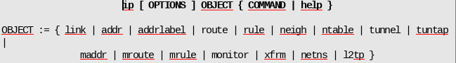
- On indique le type d'objet à manipuler (adresse, route, etc.)
  et les options
- Pour afficher les informations d'adressage.
  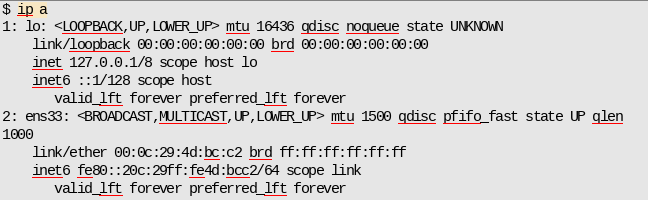
- Ajout ou suppression d'adresses
  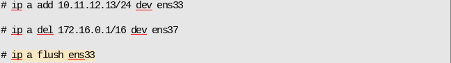
- Activer ou désactiver une interface
  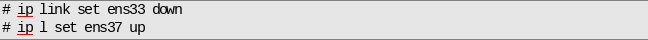
- N'oubliez pas le man
  

### Configuration avec le fichier interfaces

- Configuration stabilisée dans le temps même après le redémarrage du serveur.
- Fichier `/etc/network/interfaces`.
  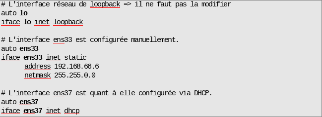
- Interface de loopback à ne pas toucher.
- Interface `ens33` en configuration statique :
  - `address`: adresse IP.
  - `netmask`: le masque de réseau (possible en CIDR sur la ligne `address`).
  - `gateway`: la passerelle.
- Interface `ens37` en DHCP.
- *Ne pas oublier de redémarrer le réseau après configuration*.

```
# systemctl restart networking
```

### Configuration avec Network Manager

- Si Network Manager est installé, utiliser les commandes adéquates et **ne pas configurer** dans le fichier `/etc/network/interfaces`

  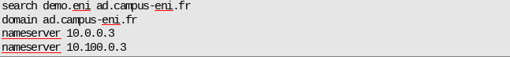

  `.
  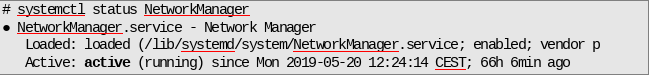
- La commande `nmcli` est utilisée pour gérer les interfaces réseau.
- Possible aussi d'utiliser `nmtui` et l'interface graphique si installée.
- Exemple avec `nmcli` pour afficher la configuration
  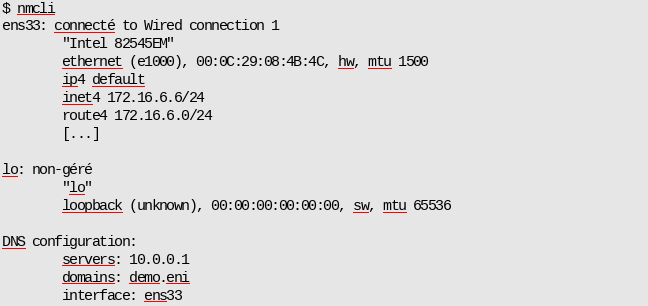
- Modification de l' IP
  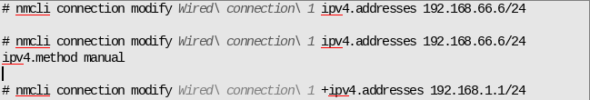

## Passerelle par défaut

- La passerelle par défaut est modifiable avec différentes méthodes :
  - Avec Network Manager.
    
  - Dans le fichier `/etc/network/interfaces`.
    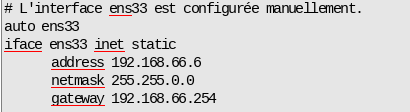
- Utilisation de la commande `ip` pour afficher la table de routage de la machine.
  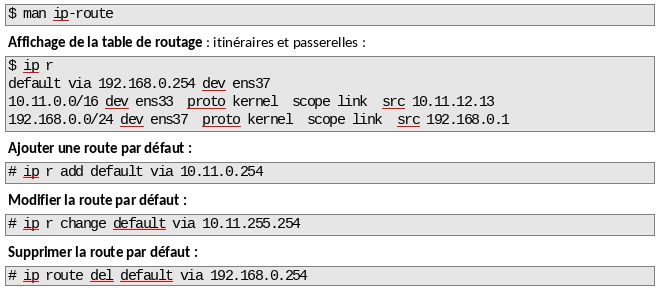
  *Dans tous les cas, la commande « ``ip r`` » permet d'afficher la table de routage de la machine.*

## Nom d'hôte

- Le nom d'hôte de la machine peut être :
  - Un nom court.
  - Un FQDN (Full Qualified Domain Name).
- Il est configuré dans le fichier `/etc/hostname` qui ne doit contenir que le nom d'hôte (court ou long).
- Le nom d'hôte doit être résolvable localement, donc on doit le retrouver dans le fichier `/etc/hosts`.

### Fichiers du nom d'hôte

- Fichier `/etc/hostname`.
  
- Fichier `/etc/hosts`.
  
- La commande `hostname` permet d'afficher le nom d'hôte.

## Client DNS

- La résolution DNS est un autre élément de configuration du réseau.
- Elle peut se faire localement grâce au fichier `/etc/hosts`.
- Avec un serveur DNS configuré avec Network Manager ou avec le fichier `/etc/resolv.conf`.

### L'ordre de résolution

- L'ordre de résolution est défini dans le fichier `/etc/nsswitch.conf`
  
- ou avec une interface graphique.
  
- Il faudra interpréter l'ordre :
  1. Fichier `/etc/hosts`.
  2. mdns4_minimal: interrogation mDNS (multicast DNS) pour les noms d’hôtes IPv4 en `.local`.
  3. Serveur DNS.
  4. myhostname: résolution des noms locaux du poste.

### Configuration du client DNS

- Pour configurer la résolution DNS en tant que client DNS :
  - Avec Network Manager.
    
  - Dans le fichier `/etc/resolv.conf`.
    
  - Utiliser `nameserver` pour définir les serveurs DNS.
  - Utiliser `search` et `domain` pour définir les suffixes DNS.
- Si la configuration est en DHCP, c'est ce dernier qui fournit la configuration DNS.
