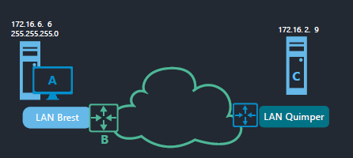
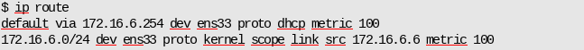
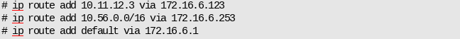
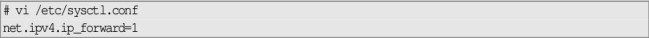
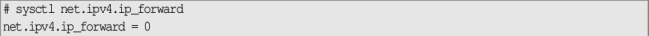
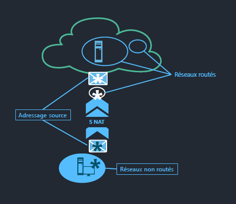
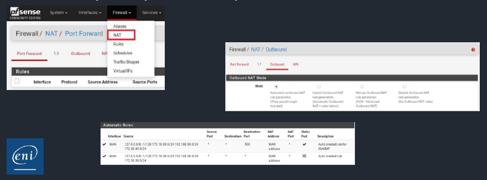

# Routage et traduction d'adresses

## Routage

**Définition**

- Le routage est le processus permettant la communication entre des hôtes de réseaux logiques distincts.

**Fonctionnement**

- L’hôte (A), au moyen de son adresse IP d’hôte et de son masque de réseau, détermine si l’hôte distant (C) est sur le même réseau logique que lui.
- Dans le cas contraire, il recherche dans sa propre table de routage si une route permet de joindre le réseau de destination ; il en extrait l’adresse de passerelle (B).
- Il va falloir mettre en place l'ensemble des routes nécessaires à la communication :

  - Entre les différents réseaux
  - Vers l'extérieur
- Le routage est configuré sur les équipements chargés du routage.
- Un équipement terminal (poste de travail, serveurs) utilise le routeur qui correspond à son réseau.

**Les routes**

- On peut définir plusieurs étendues de routes :

  - routes d'hôtes (peu utilisées)
  - routes de réseaux (configurées sur les routeurs)
  - routes par défaut (configurée sur l'hôte)

**Gestion dynamique**

- La commande `ip route` va permettre de gérer les routes de façon dynamique (*fonctionnelle tant que la machine est allumée, perdue lorsqu'elle est éteinte*).
- Afficher les routes :
  
- Ajouter les 3 types de routes :
  
- Changer une route :
  
- Supprimer une route :
  

**Gestion statique**

- Pour conserver les routes, il faut les configurer :

  - Soit via un export de la commande `ip route`
  - Soit dans le fichier interfaces (*à privilégier*)

**Activation**

- Par défaut, une machine Linux ne route pas les paquets entre les réseaux. Il faut l'activer dans le fichier `/etc/sysctl.conf` :
  
- Il faut ensuite lancer la commande :
  
- Et vérifier (si 1 : activé, si 0 désactivé) :
  

## Traduction d'adresses

**Tables de routage**

- Le routage ne fonctionne que si les réseaux sont dans les tables de routage.
- Dans les cas suivants, ce n'est pas suffisant :

  - Réseaux non routables
  - Réseaux privés non routables sur Internet
  - Réseaux privés non connus des routeurs (pour des maquettes par exemple)

**NAT**

- Pour que les machines de ces réseaux puissent accéder à d'autres réseaux (sortir vers Internet), il faut mettre en place une solution de NAT, pour :

  - Remplacer l'adresse IP source des paquets : NAT de Source ou SNAT
  - Remplacer l'adresse IP de destination : NAT de destination ou DNAT

**iptables**

- Sous Linux, il est possible d'utiliser des règles d'`iptables`.
- Il est aussi possible d'utiliser des frameworks comme Shorewall qui vont créer les règles à partir de fichiers de définition des règles.
- Des outils comme PfSense (utilisé dans ce cours) sont des outils avancés de gestion des règles.

**SNAT**

- Une fiche annexe est proposée pour la configuration détaillée de pfSense pour mettre en place le SNAT.

