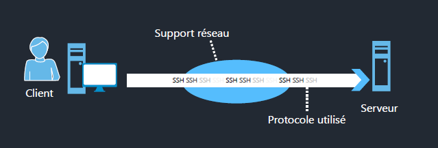
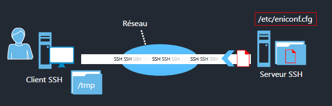
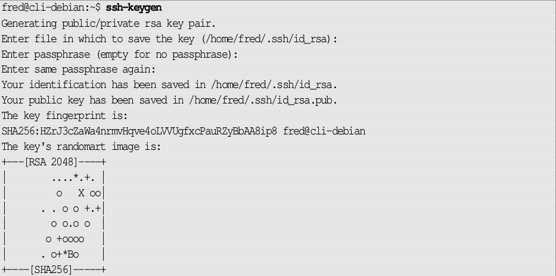
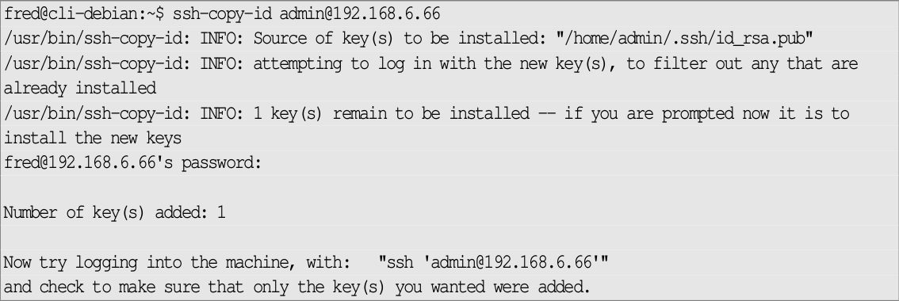
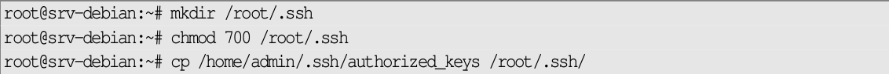

# Administration à distance

## Objectifs
- Mettre en place les accès SSH aux serveurs

## Administration à distance

### Protocole et clients

- Pour administrer un serveur Linux, on va s'y connecter à distance via un protocole sécurisé : `SSH` 
- C'est un **protocole normalisé et sécurisé** permettant de **chiffrer** les communications entre le client et le serveur



### Protocole et clients

#### Côté client

- Sous Linux et macOS, le client sera le client `openssh-client` fourni avec la commande `ssh`, utilisable aussi sous Windows Server 2019 maintenant.
- Sous Windows il est possible d'utiliser :
  - `PuTTy` : outil basique pour se connecter en SSH
  https://www.chiark.greenend.org.uk/~sgtatham/putty 
  - `mRemoteNG` : multifenêtres, multiprotocoles
  https://mremoteng.org/ - https://mremoteng.readthedocs.io/
  - `MobaXterm` : multi-onglets, multiprotocoles
   https://mobaxterm.mobatek.net/


### Transfert de fichiers 

#### Commande scp

- Il est possible de transférer des fichiers de façon sécurisée grâce au protocole SSH avec la commande `scp`.
  
  

- Pour la copie, on utilisera :
  - `scp` sous Linux
  - `WinSCP` sous Windows (ou les outils avancés comme MobaXTerm)

- La commande fonctionne dans les deux sens, soit on transfère un fichier du client vers le serveur soit du serveur vers le client.
- Exemple de copie d'un fichier d'un serveur vers le local :
```
scp user@ip:/etc/eniconf.cfg /tmp
```



### Accès par clé

#### Clés SSH

- De base, l'accès SSH se fait avec un login et password.
- On ne se connecte **jamais** en root via SSH. 
- Il est **préférable** de mettre en place des **clés SSH** pour se connecter.
- Permet aussi d'automatiser des transferts via SCP ou rsync.
- Plusieurs algorithmes de clés : RSA, DSA, ECDSA
- On va utiliser le plus habituel, i.e. RSA.

#### Génération de la clé

- Pour générer une paire de clés SSH, on va utiliser la commande `ssh-keygen`.
- On obtient une paire de fichiers :
  - Une **clé privée** (à conserver en local et backuper) 
  - Une **clé publique** à installer sur les serveurs pour se connecter
- Si le nom n'est pas précisé, les clés s’appellent :
  - `id_rsa` pour la clé privée
  - `id_rsa.pub` pour la clé publique
  


- Suivant le contexte, on mettra ou pas une passphrase :
  - Accès sécurisé sur un serveur : passphrase
  - Synchronisation de données entre deux machines : pas de passphrase
   

#### Copie de la clé

- Une fois la clé générée, on va la copier sur la machine distante.
- On utilise la commande `ssh-copy-id`.



- Par défaut, elle copie la clé `id_rsa`, si besoin préciser le nom de la clé à copier
- Elle génère le fichier `authorized_keys` sur le serveur
- Dans le répertoire `$HOME/.ssh`

#### Clé pour root

- Il n'est pas autorisé de se connecter en root via un login / pass
- Par contre, c'est possible avec une **clé SSH**
- Pour sa mise en place :



