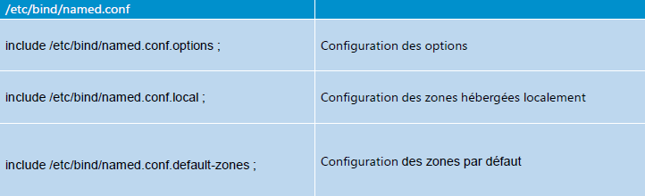
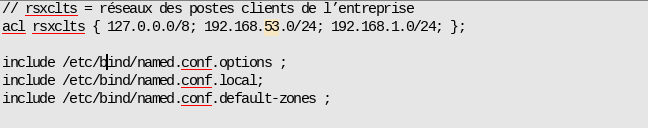
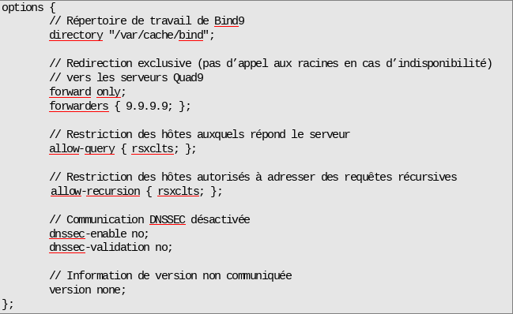

Voici le texte du PDF converti et nettoyé en Markdown avec des explications :

# Services réseau en environnement Linux

## Module 05 – DNS Résolveur

### Objectifs

- Comprendre le fonctionnement du service DNS
- Mettre en place un serveur DNS résolveur

## DNS Partie 1

### Fonctionnement du service DNS

Le service DNS permet :

- De faire la correspondance entre un FQDN (Fully Qualified Domain Name) et une adresse IP
- Et inversement, d'indiquer le nom d'hôte à partir d'une IP
- De connaître les serveurs de messagerie d'un domaine

Le DNS est un service essentiel au fonctionnement d'Internet. Le protocole DNS est standardisé par l'IETF (Internet Engineering Task Force).

Toute machine (client, serveur, mobile, etc.) va constamment faire des requêtes sur le serveur DNS associé pour obtenir des adresses IP.

La structure de nommage du DNS est arborescente. 

Une URL va se lire de la droite vers la gauche pour descendre l'arborescence DNS.

Le séparateur de « niveau » est le point.

Les domaines dits TLD (Top Level Domain) sont gérés par l'IANA (Internet Assigned Numbers Authority).

Le protocole DNS peut aussi être utilisé pour des domaines non résolvables sur Internet pour des réseaux internes.
On utilise alors des suffixes non publics.

| Domaine | Utilité |
|-|-|  
| masuperentreprise.bzh | Nom de domaine utilisé pour référencer les services de mon entreprise accessibles depuis l’Internet |
| **eni**gmes.corp | Nom de domaine propre à mon entreprise dans lequel sont référencées les ressources hébergées et accessibles uniquement localement dans l’entreprise |

On distingue deux « types » de résolution DNS :

- Résoudre les requêtes clientes relatives à tout domaine => **résolveur DNS complet**
- Être source d'information pour un ou plusieurs domaines ciblés => **DNS faisant autorité**

### Le DNS résolveur

#### Rôle

Un serveur DNS résolveur complet doit répondre aux requêtes des clients. Pour y répondre, il doit faire appel à d'autres serveurs DNS. Il n'est pas source d'information de domaines.

#### Fonctionnement  

Un serveur DNS résolveur complet interroge avec des requêtes itératives :

- Les serveurs DNS racines
- Les serveurs DNS faisant autorité sur les TLD  
- Les serveurs DNS faisant autorité sur le domaine

Il peut utiliser un serveur DNS « redirecteur » (forwarder) pour limiter les requêtes qu'il va faire.

On parle de redirecteur inconditionnel quand un serveur DNS lui adresse des requêtes récursives pour résoudre TOUTES les requêtes des clients.

On parle de redirecteur conditionnel pour indiquer pour un espace de nom donné le serveur à qui adresser la requête récursive de résolution.

Les deux peuvent être complémentaires.

Les serveurs DNS gardent les réponses des requêtes en cache. La durée de conservation en cache est définie par les serveurs faisant autorité sur l'enregistrement.

## Mise en place serveur DNS résolveur

### Mise en place

Le serveur DNS utilisé est `bind9` 

Le fichier de configuration inclut d'autres fichiers :

#### DNS résolveur

Fichier /etc/bind/named.conf

- définition d’ACLs et des includes

#### DNS résolveur  

Fichier /etc/bind/named.conf.options

#### DNS résolveur

Fichier ``/etc/bind/named.conf.default-zones``

- Définit les zones par défaut
- Définit les adresses des serveurs racines
- Aucun changement à appliquer

Fichier ``/etc/bind/named.conf.local`` sera vu dans la seconde partie sur le DNS