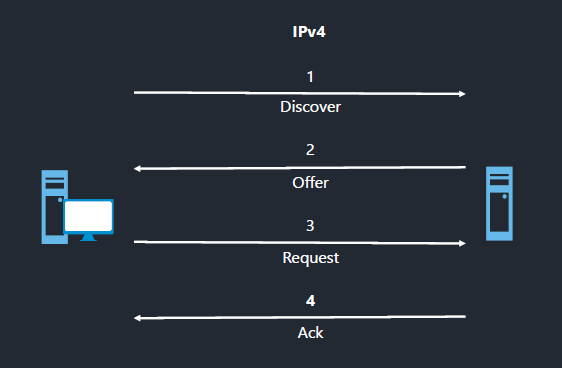
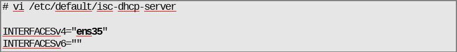
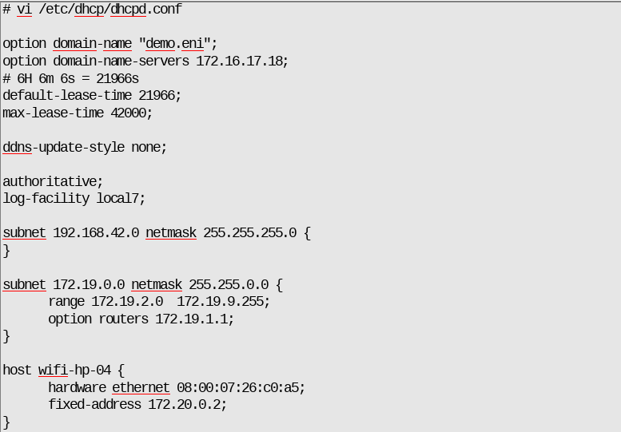
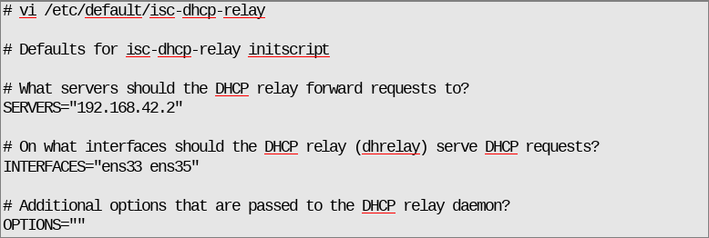

# Le DHCP

## Objectifs

- Comprendre le fonctionnement du service DHCP
- Mise en place d'un service DHCP
- Mise en place d'un relai DHCP

## Le DHCP

Le DHCP permet de fournir des configurations IP aux équipements qui l'utilisent. Il est normalisé par une série de RFC. Il centralise la configuration de l'adresse IP et optimise l'utilisation des plages IP. Il propage les mises à jour de configuration.

## Fonctionnement du service DHCP

### Les requêtes DHCP (en IPv4)

1. **DHCP DISCOVER** : le client broadcast sur le réseau pour demander une configuration IP
2. **DHCP OFFER** : le serveur DHCP fait une proposition de configuration (toujours en broadcast)
3. **DHCP REQUEST** : le client accepte l'offre
4. **DHCP ACK** : le serveur prend acte de l'acceptation et envoi le bail DHCP

### Les serveurs DHCP

Pour mettre en place un service DHCP on a les serveurs suivants :

- **isc-dhcp-server** :
  - **+** service répendu
  - **+** facile à mettre en œuvre
  - **-** n'évolue plus
- **kea** :
  - **+** nouveau produit
  - **-** moins utilisé
  - **-** plus compliqué à configurer

Les deux produits sont soutenus par l’ISC. Pour ce cours, le travail sera fait sur **isc-dhcp-server**.

## Mise en place d’un serveur DHCP

### Caractéristiques serveur DHCP

- Nom du paquet: **isc-dhcp-server**
- Fichiers de configuration:
  - `/etc/default/isc-dhcp-server`
  - `/etc/dhcp/dhcpd.conf`
- Fichier de baux: `/var/lib/dhcp/dhcpd.leases`
- Nom du service: isc-dhcp-server
- Fichier journal: `/var/log/syslog`

### Le fichier `/etc/default/isc-dhcp-server`

Le fichier `/etc/default/isc-dhcp-server` permet de définir sur quelle(s) interface(s) va écouter le service DHCP.

### Configuration serveur DHCP

La configuration se fera dans le fichier `/etc/dhcp/dhcpd.conf`

- `option domain-name` et `option domain-name-servers` : définition du nom de domaine et du serveur DNS
- `default-lease-time` et `max-lease-time` : définition du bail par défaut et du bail maximum
- `ddns-update-style` : permet de définir l'interaction entre le DNS et le DHCP ici aucune
- `authoritative` : serveur DHCP autoritaire
- `subnet` : définition des paramètres pour un réseau :

  - `range` : fourchette d’IP affectables
  - `option router` : paramétrage de la gateway
- `host` : affectation d'une adresse IP pour une machine :

  - `hardware ethernet` : son adresse MAC
  - `fixed-address` : l'adresse IP

La commande `dhcp -t` permet de tester la configuration.

Il faut ensuite redémarrer le service :

- Soit avec la commande `systemctl (status|stop|start|restart) isc-dhcp-server`
- Soit en mode debug `dhcpd -d` (pour voir si tout fonctionne correctement)

## Mise en place d’un relai DHCP

### Relai DHCP

La mise en place d'un relai DHCP est nécessaire si le serveur DHCP est en dehors du domaine de diffusion des clients.

- Paquet à mettre en place: isc-dhcp-relay
- Paramètres à mettre en place:
  - `SERVERS` : pour définir le ou les serveurs DHCP
  - `INTERFACES` : les interfaces d'écoute du service

Il faut ensuite redémarrer le service : `systemctl (status|stop|start|restart) isc-dhcp-relay` (ou en mode debug)