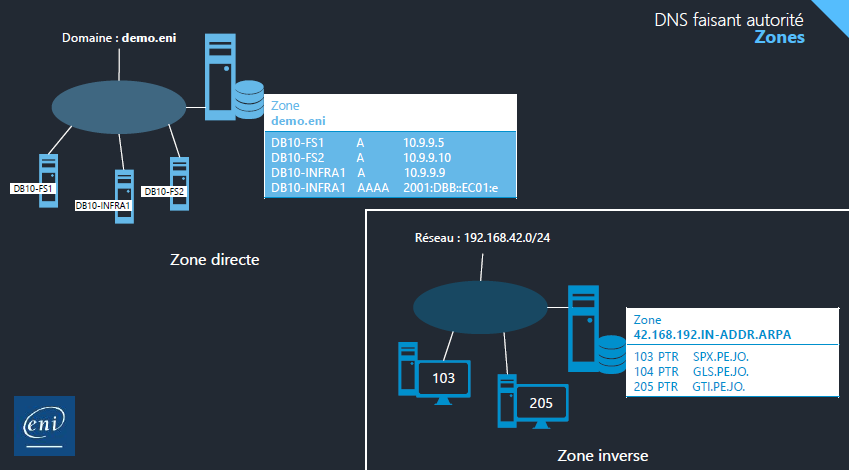
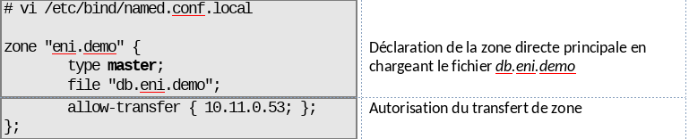
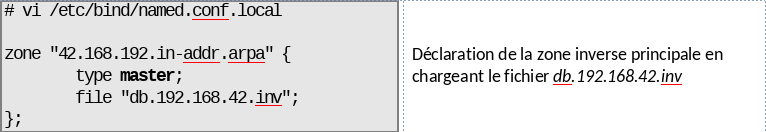
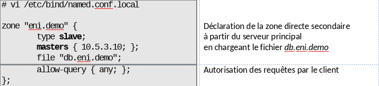
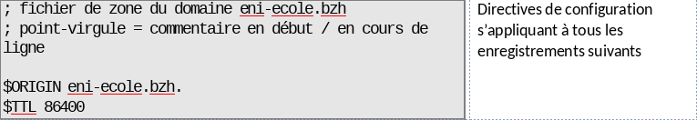
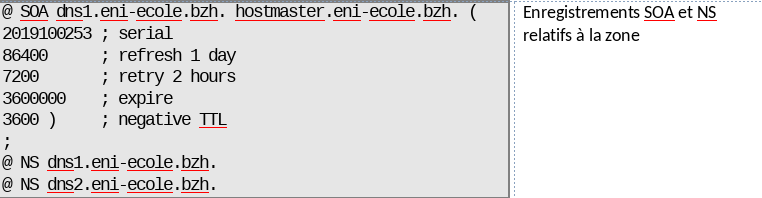
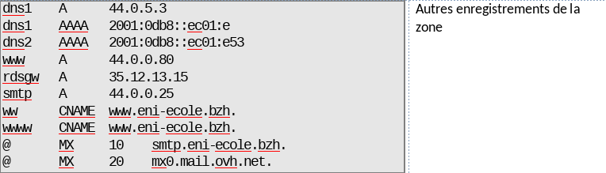
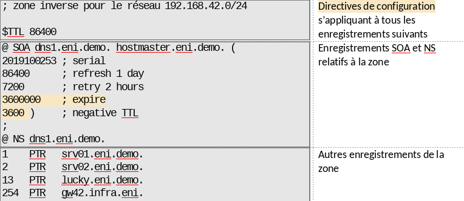

# Serveur DNS faisant autorité

Un **DNS faisant autorité** :

- Est la source d'information pour un ou plusieurs domaines
- Est interrogé par des serveurs DNS résolveur
- Peut gérer la zone d'un domaine (primaire) ou une copie (secondaire)

# Zones

Une zone est en ensemble d'informations ayant une caractéristique commune :

- Une partie du nom de domaine
- Un réseau IP d'appartenance
- Une **zone directe** référence des équipements appartenant à un même nom de domaine
- Une **zone inverse** référence des équipements appartenant à un même réseau logique

# Enregistrements

Les données d'une zone sont stockées sous forme d'**enregistrements**.

| Type  | Utilité                                                                                                                              |
| ------- | --------------------------------------------------------------------------------------------------------------------------------------- |
| SOA   | Contient les caractéristiques de la zone, identifie par un **FQDN** résolvable le serveur qui peut y écrire                        |
| NS    | Identifie par un FQDN résolvable le·s serveur·s qui dispose·nt d’un exemplaire de la zone et fait / font autorité pour celle-ci |
| A     | Correspondance entre un nom (connu) et une adresse IPv4 (attendue)                                                                    |
| AAAA  | Correspondance entre un nom (connu) et une adresse IPv6 (attendue)                                                                    |
| SRV   | Correspondance entre un type de service et le FQDN du serveur le fournissant                                                          |
| MX    | Permet d’identifier le·s serveur·s de messagerie d’un domaine donné                                                              |
| CNAME | Correspondance entre un nom et un autre nom                                                                                           |
| PTR   | Correspondance entre une adresse d’hôte (connue) et un FQDN (attendu). Enregistrements uniquement présents dans des zones inverses |

# Serveur primaire / Serveur secondaire

- Un serveur faisant autorité sur une zone peut être source d'information et source de modification. Il est possible d'y modifier les enregistrements de la zone. On parle de **serveur primaire** pour la zone (ou serveur maître).
- Inversement, un serveur faisant autorité sur une zone peut ne disposer que d'une copie de cette zone. Il récupère la zone et ses mises à jour depuis le serveur primaire. On parle de **serveur secondaire** ou serveur esclave pour la zone.
- Un serveur physique hébergeant le service DNS peut avoir des zones primaires et des zones secondaires. La notion de primaire et secondaire se met en place au niveau de chaque zone.

# Configuration d'un serveur DNS faisant autorité

## Serveur DNS faisant autorité

Pour mettre en place une gestion de zone sur un serveur DNS Bind9, il faut :

- Définir les paramètres de la zone dans le fichier `/etc/bind/named.conf.local`
- Définir le fichier de données de la zone, i.e. la base de données des enregistrements

## Zone DNS primaire

- Configuration d'une zone primaire :

- Configuration d'une zone primaire inverse :

## Zone DNS secondaire

- Configuration d'une zone secondaire :

## Fichier de zone

Le fichier de zone contient les données de la zone. On va distinguer 3 parties:

- Les directives globales de la zone

- Le SOA et les NS

Vous devez toujours modifier le serial à chaque modification de la zone sous la forme `AAAAMMJJxx`.

- Les enregistrements de la zone

- Pour une zone inverse

