# Module 01 - le Modèle OSI

## Objectifs
- Représenter le modèle OSI.
- Expliquer le principe d’encapsulation.
- Expliquer le principe de désencapsulation.
- Illustrer la communication entre ordinateurs.
- Connaître le fonctionnement des couches du modèle OSI.

## Présentation du modèle OSI

### Modèle OSI (Open System Interconnection)
- Présenté en 7 couches indépendantes et communicantes.
- Représente la communication entre systèmes d’information en réseau.
- Proposé par l’organisme de normalisation ISO (International Organization for Standardization).

### Protocole
- Ensemble de règles à respecter permettant la communication entre systèmes d’information en réseau.
- Exemple : Internet Protocol (ensemble de protocoles utilisés sur Internet puis dans les réseaux locaux).

### PDU (Protocol Data Unit / Unité de données de Protocole)
- Unité de mesure des données échangées dans un réseau.
- Constitué de plusieurs éléments distincts :
  - Des informations de contrôle de protocole (PCI : Protocol Control Information).
  - Des unités de données de service (SDU : Service Data Unit).

## Les couches OSI
- **Physique**
  - Rôle : Point d’accès au réseau.
- **Liaison**
  - Rôle : Traduction des données, Fiabilisation de la communication.
- **Réseau**
  - Rôle : Routage.
- **Transport**
  - Rôle : Transmission de bout en bout entre applications / Segmentation des données.
- **Session**
  - Rôle : Transmission de bout en bout entre PCs.
- **Présentation**
  - Rôle : Communication entre applications.
- **Application**
  - Rôle : Communication entre l’utilisateur et les applications, Entrée et sortie des données, (Dé)Chiffrement / (Dé)Compression, Formatage des données (dédiées <–> non-dédiées), Authentification entre les PC, Synchronisation des échanges, Création de points de contrôle, Contrôle de flux (segmentation et réduction de l’encombrement), Communication entre même type d'applications (ports), Communication entre les PC expéditeur et destinataire, Choix de la meilleure route (routage), Adressage logique (adresses IPv4 & IPv6), Communication entre nœuds adjacents, Contrôle d’erreurs et de flux, Adressage physique (adresses Mac), Conversion des données informatiques en bits, Mis en forme de signal en fonction du média (Modulation).

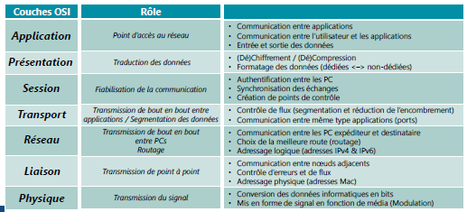

## Communication entre les couches

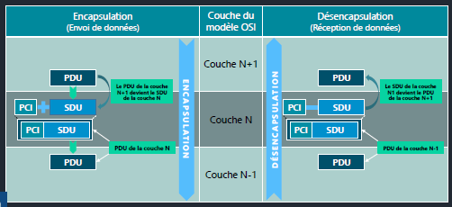

### Les ports
  
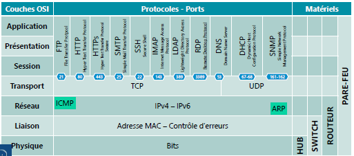

## Encapsulation
- Comment ça marche ?
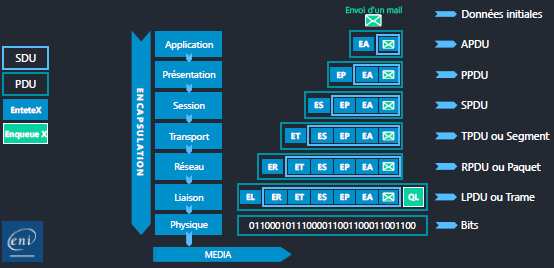

## Désencapsulation
- Comment ça marche ?
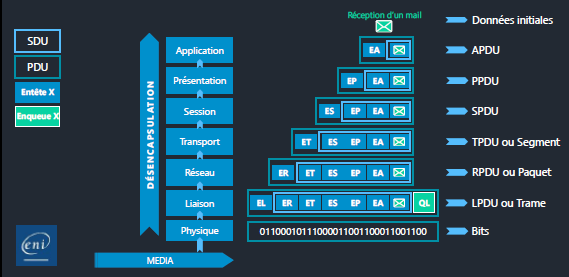

## Analogie avec La Poste
- Scénario
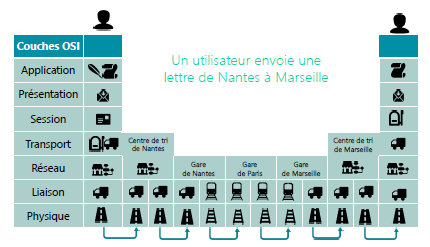

## Modèle OSI et communication
- Exemple de communication
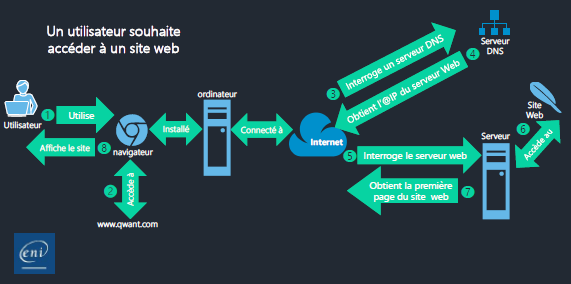 
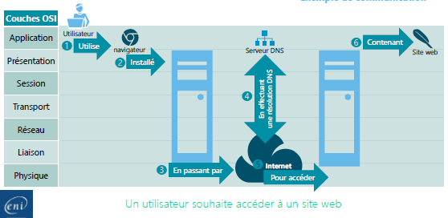
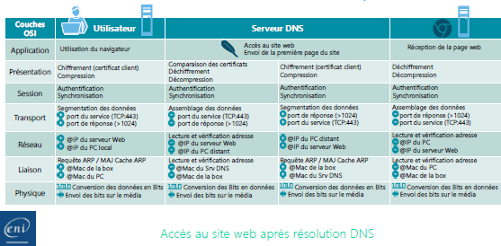

## Les couches du modèle OSI
### Couche Physique
- Connexion physique entre les nœuds réseau.
- Connexion garantie par la carte réseau.
- La carte réseau est présente sur les couches 1 et 2 du modèle OSI.
 - Couche 1 : connectique et modulation de données.
 - Couche 2 : adresse physique (adresse MAC).

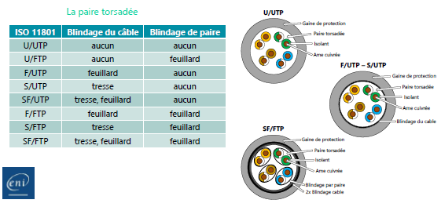
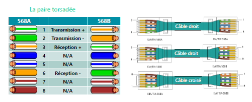
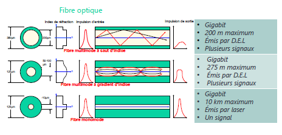

### Couche liaison

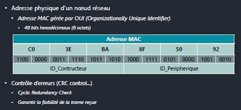

#### Les protocoles
- ARP (Address Resolution Protocol) : résolution de l’adresse MAC à partir de l’adresse logique.
- DHCP (Dynamic Host Configuration Protocol) : fournit une configuration réseau aux postes clients (bail).
- PXE (Pre-boot eXecution Environment)...
 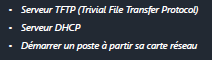

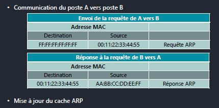

### Couche Réseau
- Adresse logique d’un nœud réseau.
 - ID_Réseau + ID_Hôte.
 - Unique sur un réseau logique.
- Tous les postes d’un réseau peuvent communiquer.
- Adresse IP + Masque de sous-réseau = Adresse de réseau logique.
 - Utilisation d’opérateur « & logique ».

- Communication du poste A vers poste B.
- Mise à jour du cache ARP.

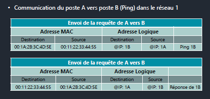

### Couche Transport
- Segmentation et numérotation des données.
- Ajout des ports.
 - Port de destination (Application à contacter).
 - Port local d’écoute (Port local aléatoire ouvert pour la réponse).
- Deux protocoles : TCP (Transmission Control Protocol) et UDP (User Datagram Protocol).

- Communications entre deux postes.
 - Un poste joue le rôle de client.
 - Un poste joue le rôle de serveur.
- Plusieurs communications simultanées pour un poste.
 - Introduction de sockets.

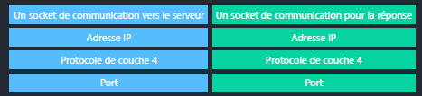

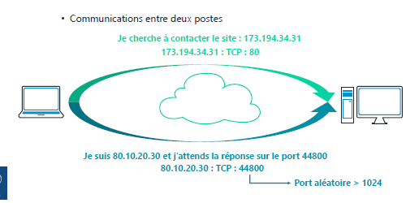

Aller plus loin : https://www.youtube.com/watch?v=26jazyc7VNk

Moyens mnémotechniques pour se souvenir des 7 couches :
- A Peine Serré, Tu Rends Le Portefeuille
- Ah petite salope, t’as recraché la purée
  
``Application, présentation, session, transport, réseau, Liaison, physique``

