# Cours sur les bases des réseaux

## 02 – Les unités informatiques

Ce cours vise à vous familiariser avec les concepts de base des unités informatiques.

### Objectifs

À la fin de ce cours, vous devriez être en mesure de :

- Comprendre le principe de numération binaire, octale, décimale et hexadécimale.
- Effectuer des conversions entre ces bases de numération.
- Appréhender les différentes unités informatiques utilisées dans le domaine des réseaux.

### Les bases de numération

#### Base 2 (binaire)

La base 2, également connue sous le nom de binaire, utilise les valeurs 0 et 1 pour représenter les nombres.

| Valeurs utilisées   |
|---------------------|
| 0                   |
| 1                   |

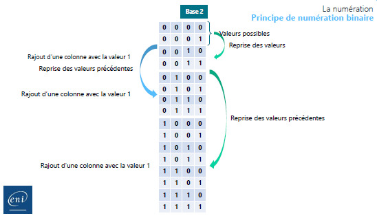

#### Base 8 (octal)

La base 8, ou octale, utilise les valeurs de 0 à 7.

| Valeurs utilisées   |
|---------------------|
| 0                   |
| 1                   |
| 2                   |
| 3                   |
| 4                   |
| 5                   |
| 6                   |
| 7                   |

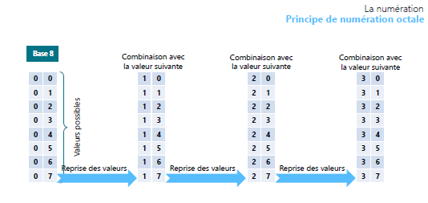

#### Base 10 (décimale)

La base 10, ou décimale, utilise les chiffres de 0 à 9.

| Valeurs utilisées   |
|---------------------|
| 0                   |
| 1                   |
| 2                   |
| 3                   |
| 4                   |
| 5                   |
| 6                   |
| 7                   |
| 8                   |
| 9                   |

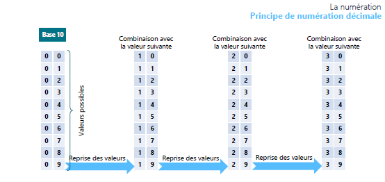

#### Base 16 (hexadécimale)

La base 16, ou hexadécimale, utilise les chiffres de 0 à 9 ainsi que les lettres A, B, C, D, E et F pour représenter les valeurs.

| Valeurs utilisées   |
|---------------------|
| 0                   |
| 1                   |
| 2                   |
| 3                   |
| 4                   |
| 5                   |
| 6                   |
| 7                   |
| 8                   |
| 9                   |
| A                   |
| B                   |
| C                   |
| D                   |
| E                   |
| F                   |

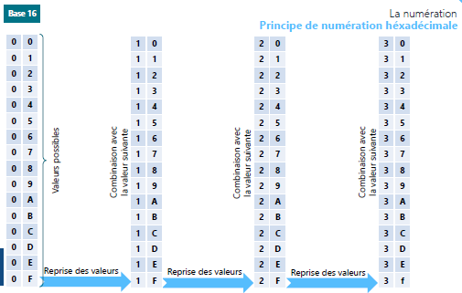

## Equivalence des valeurs

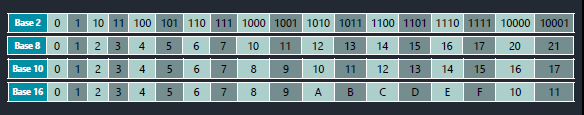

### Principes de numération

La numération binaire est utilisée pour représenter les données sous forme de 0 et de 1. Elle forme la base des calculs informatiques.

## La conversion

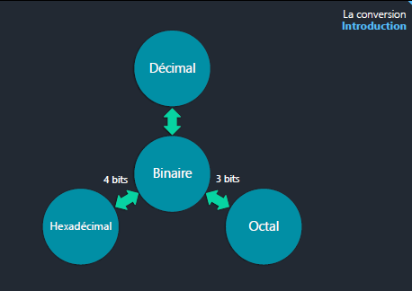

### Conversion binaire/décimale

Pour convertir un nombre binaire en décimal, vous pouvez utiliser la méthode de division ou un tableau binaire.

Exemple de conversion :

- (122)10 = (0111 1010)2

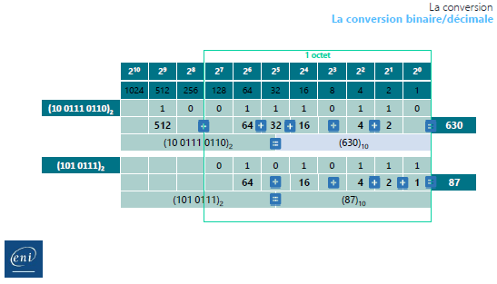

### Conversion décimale/binaire

Pour convertir un nombre décimal en binaire, vous pouvez également utiliser la méthode de division ou un tableau binaire.

Exemple de conversion :

- (122)10 = (0111 1010)2

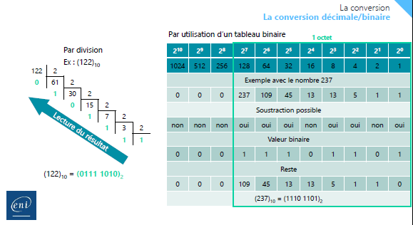

### Conversion décimale/octale

La conversion entre décimal et octal peut être effectuée en passant par la conversion binaire.

Exemple de conversion :

- (1166)10 =( 2216)8

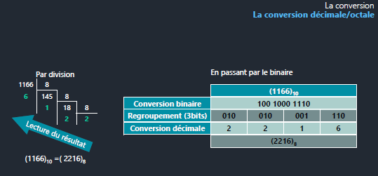

### Conversion octale/décimale

La conversion entre octal et décimal peut également être effectuée en passant par la conversion binaire.

Exemple de conversion :

- (2631)8 = (1433)10

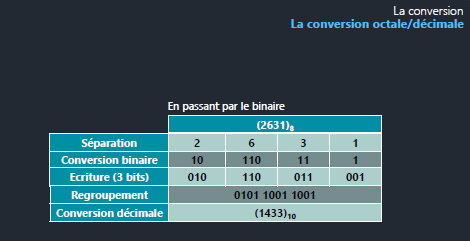

### Conversion décimale/hexadécimale

La conversion entre décimal et hexadécimal peut être réalisée en passant par la conversion binaire.

Exemple de conversion :

- (51966)10 = (CAFE)16

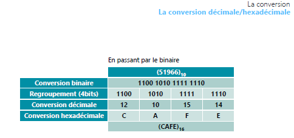

### Conversion hexadécimale/décimale

La conversion entre hexadécimale et décimale peut également être réalisée en passant par la conversion binaire.

Exemple de conversion :

- (C1A6)16 = (49 574)10

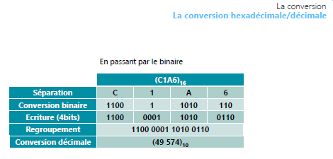

### Trucs et astuces de conversion rapide

Les bits sont des impulsions électriques : 1 allume, 0 éteint. L’ordinateur agit en fonction de ce qu’il reçoit.

Un octet est composé de 8 bits.
Sous excel, on dresse une table de binaire (donc en puissances de 2) :

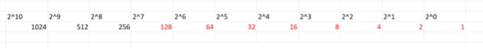

#### Exemple : transformer ``224`` en binaire : 128 + 64 + 32, le reste des bits à 0

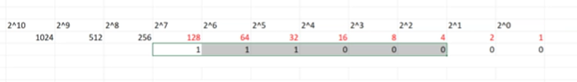

#### Pour ``124`` :

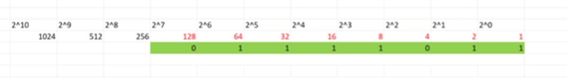
On met un zéro sous le 128 car on compte 8 bits. Au-dessus on ne compte pas.

#### Pour ``3212`` :

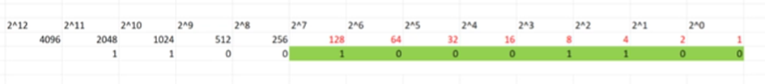

#### Dans l’autre sens :

Par exemple pour ``10 111 001`` :

Je pose les 8 bits :

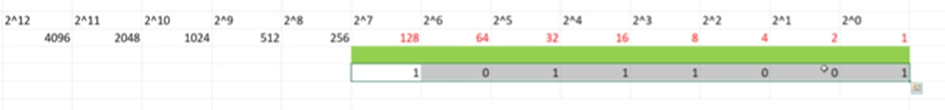
128 + 32 + 16 + 8 + 1 = ``185``

> Pour aller plus loin : https://www.youtube.com/watch?v=jU49zvp6Rsg

### Comprendre les unités informatiques

#### Les différentes unités informatiques

Les unités informatiques sont utilisées pour mesurer la capacité de stockage et la vitesse de transfert des données. Voici quelques-unes des unités les plus couramment utilisées :

- Le Kilooctet (ko)
- Le Mégaoctet (Mo)
- Le Gigaoctet (Go)
- Le Téraoctet (To)

L’unité de base est le bit (``b``) > 
Les constructeurs utilisent l’``octet`` (ou ``byte``) qui représente 8 bits

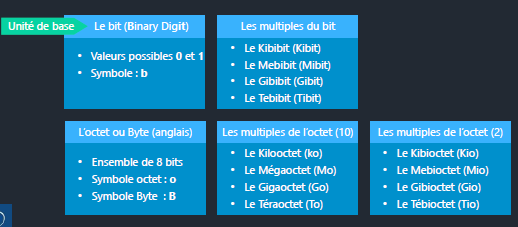

##### Les multiples de l’octet (10)

- Le Kibioctet (Kio)
- Le Mebioctet (Mio)
- Le Gibioctet (Gio)
- Le Tébioctet (Tio)

L’ordinateur va calculer en binaire, donc en kibibit et non en kibioctet, ce qui explique que la capacité d’un disque dur théorique ne soit pas complètement utilisée en réalité par un ordinateur, car il travaille en puissance de 2.

##### Les multiples de l’octet (2)

- Ensemble de 8 bits
- Symbole octet : o
- Symbole Byte : B (anglais)

##### L’octet ou Byte (anglais)

- Valeurs possibles 0 et 1
- Symbole : b (bit, Binary Digit)

##### Les multiples du bit

- Le Kibibit (Kibit)
- Le Mebibit (Mibit)
- Le Gibibit (Gibit)
- Le Tebibit (Tibit)

#### Les préfixes

Les préfixes sont utilisés pour représenter les multiples des unités informatiques.

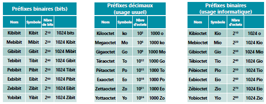

##### Préfixes décimaux (usage usuel)

- Kilooctet (ko) : 10^3 octets
- Mégaoctet (Mo) : 10^6 octets
- Gigaoctet (Go) : 10^9 octets
- Téraoctet (To) : 10^12 octets

##### Préfixes binaires (usage informatique)

- Kibioctet (Kio) : 2^10 octets
- Mebioctet (Mio) : 2^20 octets
- Gibioctet (Gio) : 2^30 octets
- Tébioctet (Tio) : 2^40 octets

### Équivalence

Voici quelques équivalences importantes entre les unités informatiques :

- Kilooctet (ko) = Kilobit
- Kibioctet (Kio) = Kibibit

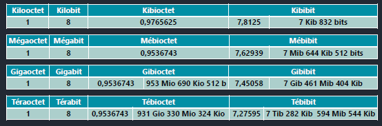
