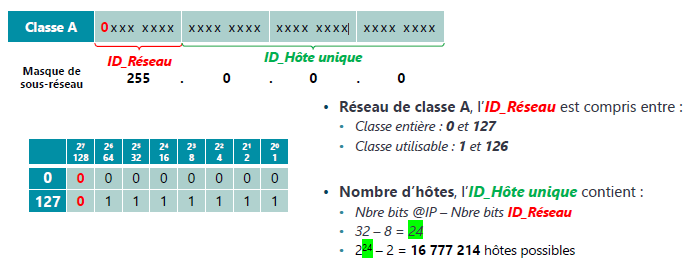
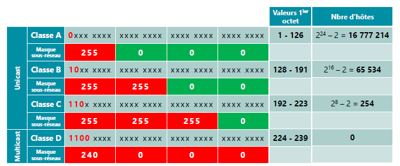
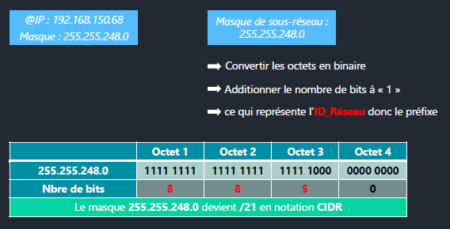
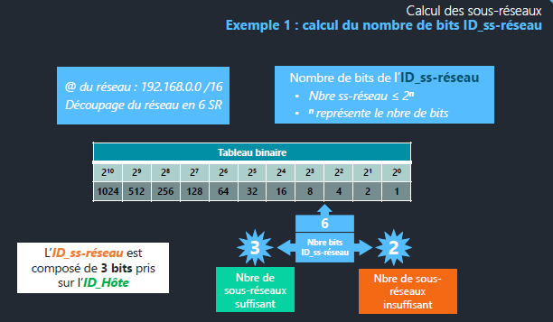
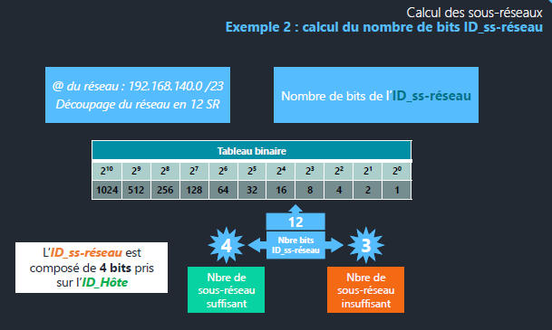

# Module 03 - L'adressage IPv4

## Présentation de l’adressage IPv4

- Une adresse IPv4 est constituée de 32 bits découpés en 4 octets distincts.
- Une adresse IPv4 est composée : 
  - D’un identifiant réseau *(ID_Réseau)*
  - D’un identifiant d’hôte unique sur le réseau logique *(ID_Hôtes)*
- Pour communiquer avec d’autres hôtes sur son réseau logique, un hôte réseau a besoin :
  - D’une adresse IP
  - D’un masque de sous-réseau. 
- À partir de son adresse IP et son masque de sous-réseau, l’hôte réseau va calculer :
  - Son adresse de réseau logique
  - Son adresse de diffusion

## Les classes IPv4 (RFC 790)

### Résumé des classes:

## Calcul des adresses IPv4

Pour calculer les adresses :

- Identifier les deux parties (ID_Réseau & ID_Hôtes) en fonction du masque de sous-réseau
- Obtenir l'adresse de réseau : passer tous les bits de l'ID_Hôtes à 0
- Obtenir l'adresse de diffusion : passer tous les bits de l'ID_Hôtes à 1  
- Obtenir le masque de sous-réseau : passer tous les bits de l'ID_Réseau à 1
- Obtenir le nombre d'hôtes : prendre le nombre de bits (n) de l'ID_Hôtes. Utiliser la formule : 
  - Nbre d’hôtes = 2^n – 2

## La notation CIDR 

La notation CIDR (Classless Inter Domain Routing) publiée en septembre 1993 (RFC 1518 et 1519)

- Suppression du fonctionnement par classes car :
  - devenu obsolète,
  - trop restrictif,
  - peu évolutif
- Suppression du masque de sous-réseau, remplacer par le préfixe
- Le préfixe représente le nombre de bits de l’ID_Réseau

Exemples :

- Classe A : 255.0.0.0 /8
- Classe B : 255.255.0.0 /16  
- Classe C : 255.255.255.0 /24
- Classe D : 240.0.0.0 /4

Pour calculer le préfixe à partir du masque ou vice-versa :

- Préfixe à partir du masque : additionner le nombre de bits à « 1 » 
- Masque à partir du préfixe : mettre des 1 aux n premiers bits, et des 0 après

## Les adresses privées RFC 1918

- Les adresses privées ont été définies en février 1996.
- Elles sont utilisables seulement dans les réseaux locaux privés.
- Elles ne sont pas routables sur Internet.

Plages d'adresses privées utilisables :

- Classe A:
  - 10.0.0.0 - 10.255.255.255 
  - 10.0.0.0/8
- Classe B:
  - 172.16.0.0 - 172.31.255.255
  - 172.16.0.0/12
- Classe C:
  - 192.168.0.0 - 192.168.255.255
  - 192.168.0.0/16

## Les adresses APIPA RFC 3927

Adresses d'autoconfiguration (APIPA) *définies en mai 2005* :

- Adresse de réseau : 169.254.0.0/16
- Non routables sur Internet
- Non distribuables par DHCP
- Non déclarées dans DNS

## Les sous-réseaux RFC 1878

La création de sous-réseaux :

- Limite l'impact des diffusions ARP  
- Équilibre le trafic
- Isole des machines
- Sécurité 
- Optimisation des adresses IP

Nouvelles parties dans l'IP:

- ID_Réseau
- ID_sous-réseau (à partir de bits ID_Hôtes) 
- ID_Hôtes

Pour calculer les sous-réseaux :

- Déterminer le nombre de bits nécessaires pour l'ID_sous-réseau
- Assigner les adresses de sous-réseau

Aller plus loin :
https://www.youtube.com/watch?v=3YP5tp0MIrM&t=12s
