# Base des réseaux

## Objectifs

- Expliquer la communication entre ordinateurs
- Présenter le routage
- Calculer des adresses de sur-réseaux

### La communication 

La communication entre ordinateurs se fait via des interfaces réseau (cartes réseau) qui possèdent une adresse physique (MAC) et une adresse logique (IP).

### Domaine de diffusion

Les ordinateurs sont regroupés en domaines de diffusion (broadcast). Toutes les machines d'un même domaine de diffusion peuvent communiquer directement entre elles sans passerelle.

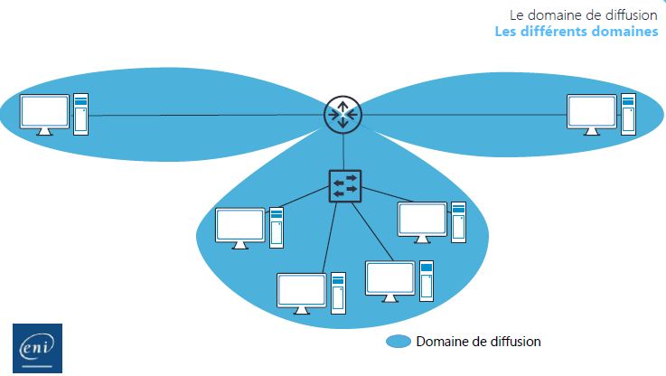

### Délimitation des domaines 

Un domaine de diffusion est délimité par des routeurs. Les routeurs possèdent deux (ou plusieurs) interfaces, chacune dans un domaine différent. Ils font le lien entre les domaines.

### Théorie

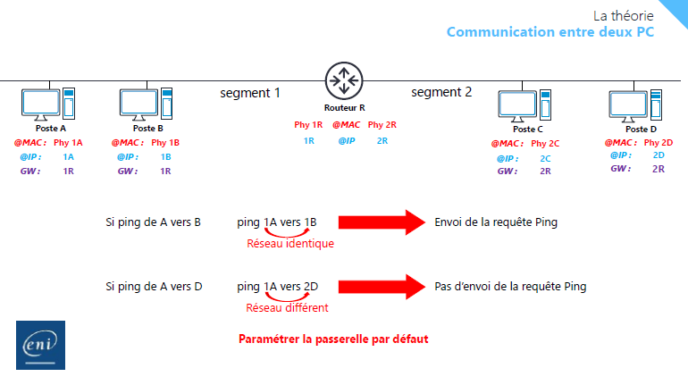

### Communication entre deux PC (ping) 

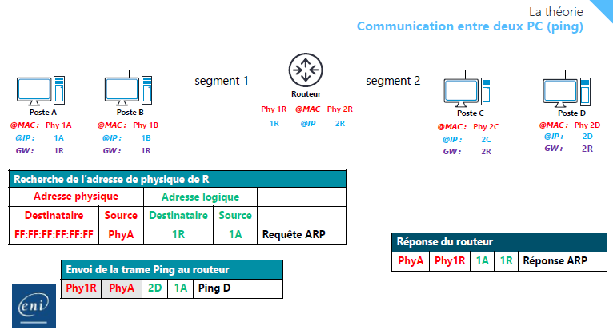

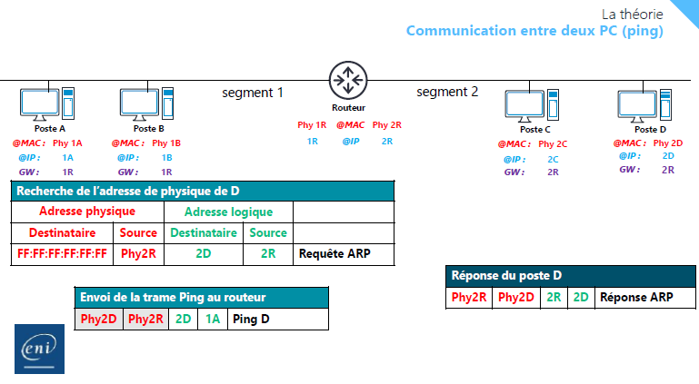

### Pratique

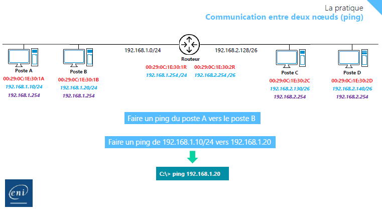

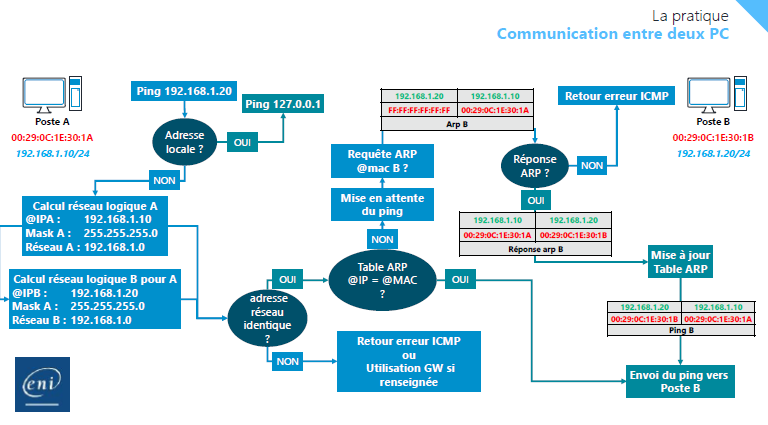

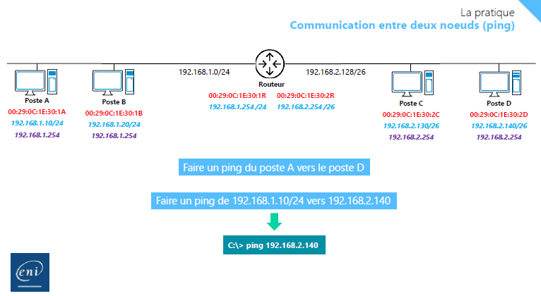

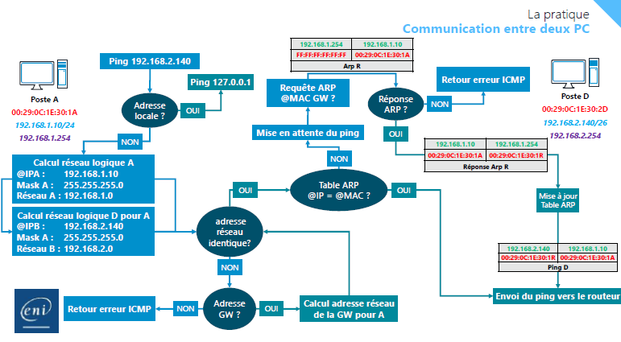

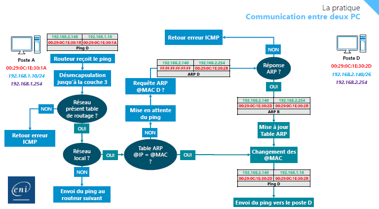

## Le routage  

### La couche réseau

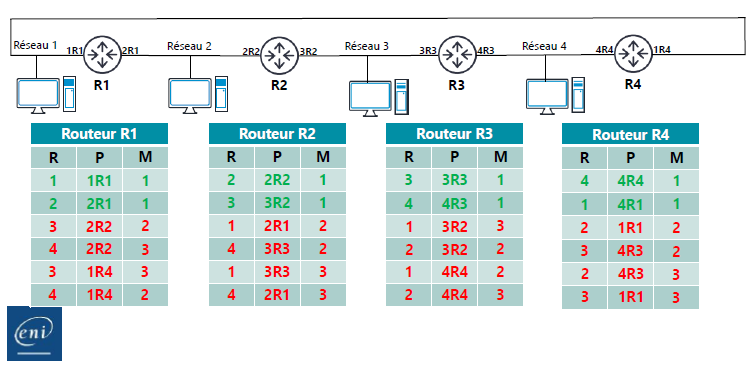

## Le sur-réseau

### Création de sur-reseaux (RFC 1519)

- Dans une infrastructure routée
- Diminuer le nombre de routes à créer sur les routeurs
- Diminuer l’utilisation des ressources sur les routeurs
  - Moins de mémoire utilisée
  - Moins de temps processeur
- Routage plus rapide
- Augmenter la stabilité du réseau  

### Le calcul de sur-réseau 

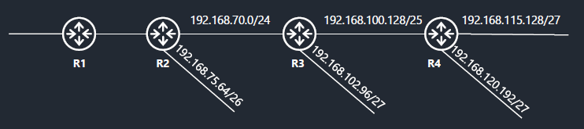

- Indiquer à R1 quels sont les réseaux présents
  - En une seule route
  - En faisant l’agrégation des réseaux
 - Création d’un sur-réseau  

### Calcul de l'adresse de sur-réseau

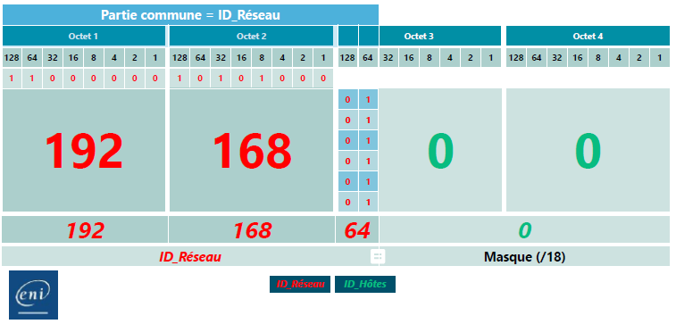

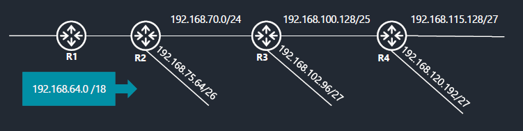

- Rajout de la route ``192.168.64.0 /18`` en passant par ``R2``  

## En complément :

[Télécharger la fiche demo](fiche_démo_la_communication_réseau.pdf "La communication réseau")