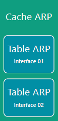
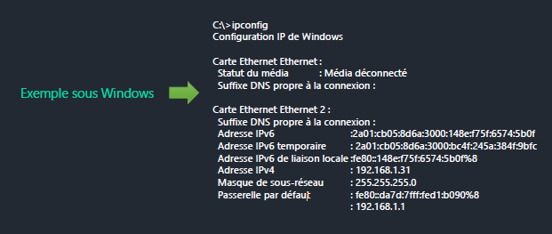
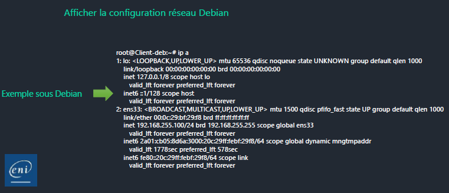

# Les premières commandes

## Objectifs

- Utiliser les commandes réseau
- Différencier les commandes

## Commande ARP

- Visualiser le cache ARP  
 - Correspondance @IP = @MAC
 - Enregistrements statiques (ajout dans le cache)  
 - Enregistrements dynamiques (requêtes ARP)
- Modifier le cache  
 - Ajout d’enregistrements statiques
- Vider le cache
 - Supprimer un enregistrement  
 - Supprimer tous les enregistrements

### Cache ARP

Le cache ARP contient la correspondance entre les adresses IP et les adresses MAC des machines du réseau local. 

Il est constitué d'enregistrements statiques ajoutés manuellement et d'enregistrements dynamiques ajoutés suite aux requêtes ARP.

### Windows

- `arp -a` : Affiche le cache arp 
- `arp -a -n @ipiface` : Affiche la table d'une interface
- `arp -s @ip @mac` : Ajoute un enregistrement statique 
- `arp -s @ip @mac @ipiface` : Ajoute un enregistrement statique dans la table ARP d'une interface
- `arp -d` : Vide le cache
- `arp -d @ipiface` : Vide le cache d'une interface

### Debian

- `arp -a` : Affiche le cache (Nom d'hôte --> @MAC)
- `arp -n` : Affiche le cache (@IP --> @MAC)  
- `arp -a -i interface` : Affiche le cache pour une interface
- `arp -n -i interface` : Affiche le cache pour une interface
- `arp -s hôte @mac` : Ajoute un enregistrement statique
- `arp –d hôte` : Supprime un enregistrement

## Commande IPCONFIG

### Windows

- `ipconfig` : Affiche la configuration réseau simplifiée
- `ipconfig /all` : Affiche la configuration réseau complète
- `ipconfig /displaydns` : Affiche le cache DNS
- `ipconfig /flushdns` : Vide le cache DNS
- `ipconfig /renew` : Demande de renouvellement de bail  
- `ipconfig /release` : Libération d'un bail

## Commande IP

### Debian

- `ip a` ou `ip addr` ou `ip address` ou `ip address show` : Affiche la configuration réseau
- `ip address show iface` : Affiche la configuration réseau d'une interface
- `ip -4 addr` : Affiche la configuration réseau IPv4 
- `ip addr add @ip/cidr dev iface` : Attribue une @ip à une interface
- `ip link set dev iface up` : Active une interface
- `ip link set dev iface down` : Désactive une interface

## Commande PING

Le protocole ICMP permet de vérifier la « présence » d'un nœud informatique et sa capacité à répondre au réseau. 

Pour recevoir une réponse, l'hôte distant doit être :

- Démarré
- Connecté au réseau  
- Appartenir au même réseau logique
- Avoir les demandes ICMP autorisées dans son pare-feu

### Windows

- Réponse reçue :
  - `Réponse de @ip : octets=32 ....`
- Pas de réponse :
  - `Réponse de @ip : impossible de joindre l’hôte...`
  - L'hôte n'a pas répondu car :
    - Il n'est pas démarré
    - Il n'est pas connecté au réseau  
    - Son pare-feu bloque ICMP
    - Il n'existe pas
- `PING : échec de la transmission. Défaillance générale` : L'hôte n'appartient pas au même réseau logique 

### Debian

- Réponse reçue :
  - `64 bytes from @ip : icmp_seq=1 ttl=64 time...` 
- Pas de réponse :
  - `From @ip icmp_seq=1 Destination Host Unreachable`
  - L'hôte n'a pas répondu car :
    - Il n'est pas démarré
    - Il n'est pas connecté au réseau
    - Son pare-feu bloque ICMP
    - Il n'existe pas
    - Il n'appartient pas au même réseau logique

## Commande NETSTAT

Permet d'afficher des informations sur les connexions réseau et les statistiques.

### Windows

- `netstat -a` : Connexions TCP actives et ports TCP/UDP en écoute
- `netstat -b` : Processus des connexions TCP actives et ports TCP/UDP
- `netstat -p proto` : Connexions pour un protocole (TCP, UDP, TCPv6, UDPv6)
- `netstat -E` : Statistiques Ethernet (octets, paquets)

- `netstat -n` : Connexions TCP actives et ports TCP/UDP en écoute  
- `netstat -r` : Table de routage
- `netstat -s` : Statistiques par protocole

### Debian

- `netstat` : Connexions TCP actives
- `netstat -r` : Table de routage
- `netstat -i` : Statistiques Ethernet 
- `netstat -p` : Processus des connexions TCP actives
- `netstat -n` : @IP des connexions TCP actives

## Commande SS 

### Debian

Equivalent de `netstat` sous Debian:

- `ss -a` : Affiche toutes les connexions
- `ss -4` : Connexions IPv4
- `ss -6` : Connexions IPv6
- `ss -p` : Processus des connexions actives
- `ss -t` : Connexions TCP
- `ss -u` : Connexions UDP

## Commande TRACERT

### Windows 

Permet d'afficher le chemin vers une destination et les interfaces d'entrée des routeurs traversés :

- `tracert @IP/site` 
- `tracert -4 @IP/site` : forcer l'utilisation d'IPv4

### Debian

Équivalent de `tracert` sous Linux :

- `traceroute @IP/site`
- `traceroute -4 @IP/site` : forcer l'utilisation d'IPv4

## En complément :

[Télécharger la fiche demo](fiche_démo_les_commandes.pdf "Les commandes")