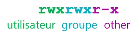
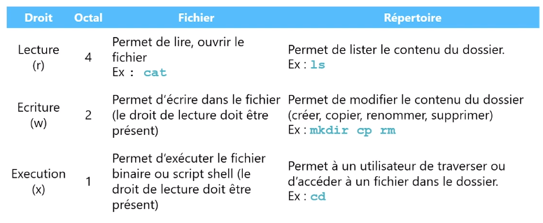
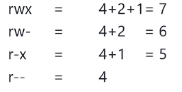
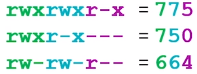
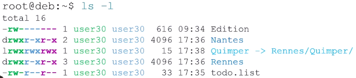
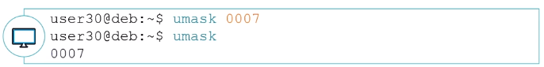
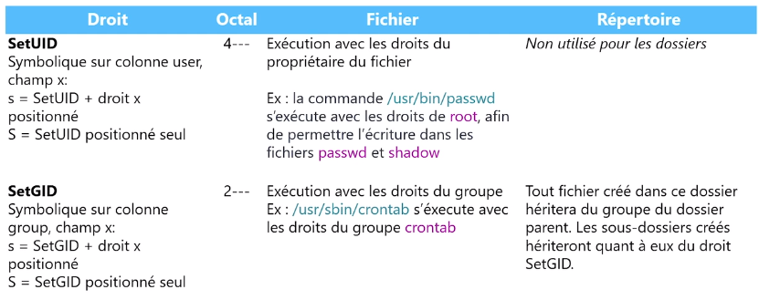
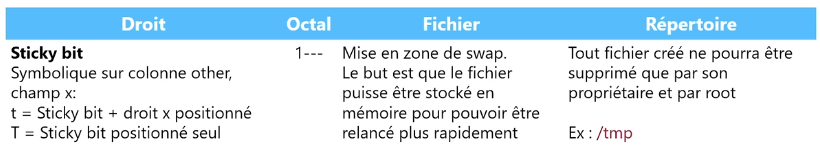

# Module 11 – Droits sur les fichiers et répertoires


## Objectifs

- Comprendre le fonctionnement des droits
- Gérer les droits sur les répertoires et fichiers
- Gérer les utilisateurs et groupes propriétaires des répertoires et fichiers
- Gérer le modèle de droits
- Les droits spéciaux

> Donner les droits suffisants, ni plus, ni moins

## Les droits Unix/Linux

### Les types de droits

• Les droits d’accès sur les fichiers sont directement inscrits dans l’inode des fichiers (répertoires). Ils sont découpés en trois colonnes : utilisateur propriétaire (user), groupe propriétaire (group) et les autres (other).

• En pratique, il y a toujours trois groupes de trois droits.







Pour calculer les droits en octal, il faut additionner les valeurs des droits présents pour les trois groupes



Exemples :




• Pour afficher les droits d’un fichier ou répertoire, la commande ls sera utilisée.



• Dans cet exemple, sont mis en avant les droits de l’utilisateur :


## Modifier les droits et propriétaires

```
chmod <-R> [ugoa][+ - =][rwxX] fichier ou dossier
```

• La commande ``chmod`` permet de modifier les droits.
• Il est possible d’utiliser cette commande de deux façons :
 • Absolue : en octal ou symbolique avec le signe « ``=`` »
 • Relative : en symbolique avec les signes « ``+`` » ou « ``-`` »

• Attention à l’option ``–R``, le fait de réaliser un ``chmod`` de façon récursive doit être effectué de façon réfléchie et ne doit pas être généralisé à tous les usages.

### Modification des droits

• Modifier les permissions d’un répertoire en notation symbolique
```
root@deb:~# chmod g+w,o-rx /data/commun
```

• Modifier les permissions d’un répertoire en notation octale
```
root@deb:~# chmod 770 /data/commun
```
• Modifier les permissions d’un répertoire ET de son contenu
```
root@deb:~# chmod –R g+w,o-rx /data/commun
```

### Modification du proporiétaire et/ou du groupe propriétaire

```
chown <-R> [user]:[group] fichier(dossier)
```

• La commande ``chown`` permet de modifier l’utilisateur propriétaire et le groupe propriétaire

• Modifier l’utilisateur et le groupe propriétaire
```
root@deb:~# chown penthium:users /data
```
• Modifier seulement le groupe propriétaire de /data/commun ET son contenu
```
root@deb:~# chown –R :users /data/commun
```

## Modèle de droits et droits spéciaux

### Gestion du modèle de droit « Umask »

• L’``umask`` est utilisé pour déterminer les droits des fichiers et répertoires.

• La valeur de l’``umask`` sera « soustraite » à la valeur des droits maximaux à la création : ``0666`` pour un fichier, ``0777`` pour un répertoire (*le 0 est lié aux droits spéciaux*).

• Sur Debian, l’umask par défaut des utilisateurs est de ``0022``.
Il est important que l’umask de root et des utilisateurs de service ``(UID < 1000)`` reste à ``0022``.

• Il est possible pour chaque utilisateur de changer son umask avec la commande ``umask``.

• En pratique, on calcule toujours l’umask à partir des droits pour les répertoires (sinon le droit d’exécution ne sera pas posé pour les dossiers créés avec ce masque.)

• Si je souhaite obtenir des droits de lecture-écriture-exécution pour l’utilisateur et le groupe propriétaire :
- Je vais calculer la somme en octal : ``770``
- Ensuite je vais soustraire cette valeur   cible de ``777``, le maximum possible
  
   

- Ce qui amène ici le résultat ``007``

• Ou ``0007`` avec prise en compte du premier chiffre représentant les droits spéciaux

```
umask [mode]
```

• Afficher le masque courant


• Modifier le masque courant



• Pour avoir un umask spécifique lors de sa connexion, il sera possible d’ajouter une entrée avec la commande ``umask`` dans son fichier de chargement de son shell (le fichier ``~/.bashrc`` pour le shell ``bash``)

### Les droits spéciaux Unix





```
chmod <-R> [ugoa][+ - =][st] fichier ou dossier
```

## Conclusion

- Vous comprenez le fonctionnement des droits Unix Linux
- Vous savez modifier les droits et propriétaires de dossiers et fichiers
- Vous savez manipuler les modèles de droits
- Vous savez positionner des droits spéciaux