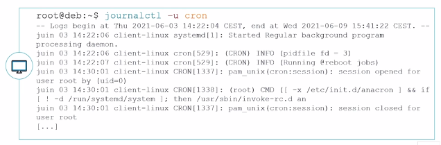
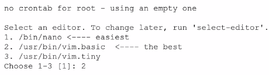
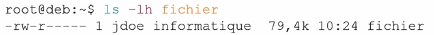
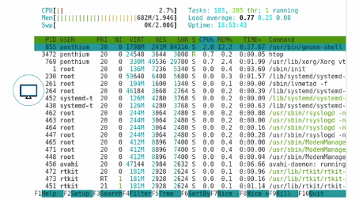
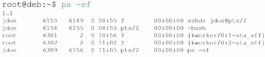

# Module 12 – Maintenance d’un système en production

## Objectifs

• Analyser le système
• Gérer les journaux
• Planifier des tâches
• Gérer les fichiers de logs


## Analyser le système


• Il est important d’analyser son système d’exploitation pour vérifier que tout fonctionne correctement. Il y a des deux types d’outils permettant cette analyse : les outils proactifs et réactifs.

• Afin d’analyser facilement son système, il est utile de lire les journaux du système (les logs).

• Afin de préserver un bon fonctionnement, il est utile d’automatiser des tâches administratives.

• Enfin, il est important de connaître des commandes de prise d’informations du système, la RAM, le CPU, les processus, etc.

> Nécessité d’analyser son système


## Journald au travers de Systemd

La gestion des journaux applicatifs est gérée sous Debian 9 par deux services :
- ``Journald`` au travers de ``systemd``
- L’ancien système ``rsyslog`` au travers de ``journald``

• Tous les services, programmes, tâches gérées par ``systemd`` ont leurs comportements remontés dans ``journald``.

• Le fait d’exécuter la commande ``systemctl status [daemon]`` affiche le statut du service mais aussi les logs de l’application.

• Ces logs sont enregistrés dans une base de données gérée par ``journald``.


## La commande Journalctl

### Regarder les logs complets de chaque service

• Puisque ``journald`` stocke les informations dans une base de données, il est possible de regarder les logs complets de chaque service via la commande 
``journalctl``.

• Le fichier de configuration de journald est ``/etc/systemd/journald``.


### Visualiser les logs en temps réel

Il est possible de visualiser les logs en temps réel avec l’option ``-f``


### Voir les logs d’un service donné

```
journalctl -u [service]
```



### Voir les logs d’un PID donné

```
journalctl _PID=[n° pid]
```


### Voir les logs d’un programme

```
journalctl /usr/bin/sshd
```


### Voir les logs par niveau de priorité

```
journalctl –p <level>
```


Les différents niveaux de priorités sont du plus critique au plus informatif : ``emerg``, ``alert``, ``crit``, ``err``, ``warning``, ``notice``, 
``info``, ``debug``.

### Cumuler les options

Il est possible de cumuler les options, par exemple :


Maintenance d'un système en production

## rsyslog à travers Journald

### Généralité

• ``Journald`` a certes l’avantage de stocker les logs dans une base de données mais ces logs sont uniquement conservés pour le démarrage en cours.

• Pour conserver les logs, Debian utilise ``rsyslog``.

• Tous les logs de ``journalctl`` sont transférés à ``rsyslog``.

### Principe de fonctionnement


• ``rsyslog`` travaille sur des « ``facilities`` » et des niveaux de priorités qui déclenchent une action.

• Les ``facilities`` les plus courantes sont :

 • ``auth`` : utilisée pour des évènements concernant la sécurité ou l'authentification à travers des applications d'accès (type SSH)

 • ``authpriv`` : utilisée pour les messages relatifs au contrôle d'accès

 • ``daemon`` : utilisée par les différents processus systèmes et d'application

 • ``kern`` : utilisée pour les messages concernant le noyau

 • ``mail`` : utilisée pour les évènements des services mail

 • ``user`` : facility par défaut quand aucune n'est spécifiée

 • ``local0`` à ``local7`` : utilisées pour les messages de différents programmes

 • ``*`` : désigne toutes les facilities

 • ``none`` : désigne aucune facility


Les différents niveaux de ``priorité`` sont :

• ``emerg`` : urgence, système inutilisable

• ``alert`` : alerte, intervention immédiate nécessaire

• ``crit`` : erreur système critique

• ``err`` : erreur de fonctionnement

• ``warning`` : avertissement

• ``notice`` : évènements normaux devant être signalés

• ``info`` : pour information

• ``debug`` : message de débogage


• Les actions correspondent généralement à l’écriture du journal dans un fichier, mais il est possible de configurer ``rsyslog`` pour qu’il envoie les messages à enregistrer vers un autre serveur ``rsyslog``.

• Exemple de configuration des règles dans le fichier ``/etc/rsyslog.conf`` :


• Le « ``-`` » devant certains chemins indique que l’enregistrement des logs est asynchrone (infos mises en mémoire avant d'être synchronisées avec le système).

### Commande d'interaction

• Il est possible de faire des tests ou créer des scripts qui interagissent avec journald et rsyslog via la commande logger.

```
logger <option> [message]
```

• Par exemple, pour envoyer un message cron de niveau info :


## Planification des tâches

### Planification utilisateur

```
crontab –e
```

Au premier lancement de la commande, Debian vous proposera de choisir l’éditeur de texte a utiliser :



Le fichier ``crontab`` est composé de six colonnes :

• **Minute** : de 0 à 59

• **Heure** : de 0 à 23

• **Jour du mois** : de 1 à 31

• **Mois** : de 1 à 12

• **Jour de la semaine** : de 0 à 7 (sachant que 0 et 7 représentent dimanche)

• **Commande** : la commande à exécuter suivant la planification (il est conseillé d’utiliser un script pour des raisons de simplification de suivi des actions).


Il est possible de formater les cinq premières colonnes :

• Avec des listes, en utilisant le caractère « ``,`` » :

 • Ex. : 1,3,5 dans la colonne des jours de la semaine génèrent une tâche tous les lundis,

mercredis et vendredis

• Avec des intervalles, en utilisant « ``-`` » :

 • Ex. : 10-20 dans la colonne jours du mois génère une tâche exécutée du 10 au 20

• Avec un joker, en utilisant « ``*`` » :

 • Ex. : ``*`` dans la colonne des heures indique toutes les heures

• Mettre un répétiteur, en utilisant « ``/`` » :

 • Ex : *``/``2 dans la colonne des mois génère une tâche exécutée en janvier, mars, mai juillet, septembre, novembre

#### Exemple de configuration :


### Planification système

#### Crontab système

• ``Cron`` utilise aussi une table spéciale pour les tâches de planification du système.

• Ces tâches sont déclarées dans le fichier ``/etc/crontab``.


#### Lancement des tâches non exécutées avec anacron


• Pour comprendre le fonctionnement d’anacron, l’explication suivante va s’appuyer sur le travail : ``cron.daily``.

• Tous les jours, si le système reste allumé 24/24, cron va exécuter cette tâche à 6h25 :


• Cette tâche a pour effet de lancer tous les scripts présents dans le répertoire ``/etc/cron.daily``.

• En regardant dans ce répertoire, on voit qu’il y a un fichier ``0anacron``. Ce script exécute une simple commande qui est :

```
anacron –u cron.daily
```


## Gestion de la taille des fichiers de log

• Nativement journald stocke ses logs dans une base de données volatile dans`` /run/log/journal``. Mais il est possible de demander à journald de garder les logs de façon durable. Dans le fichier de configuration de journald ``/etc/systemd/journald.conf``, le paramètre ``#Storage=auto`` est commenté donc journald utilise sa valeur par défaut qui est ``auto``.

• Le fait de créer un répertoire ``/var/log/journal`` rendra la conservation des logs durable. La taille de la base de données peut par contre vite devenir conséquente sur un système fortement utilisé.

### Taille des logs avec Journald

• Par défaut, journald utilisera un maximum de 10% du système de fichier hébergeant ``/var/log/journald``.

• Il est possible de définir la taille maximum utilisée sur le système de fichier de la base de données avec le paramètre ``SystemMaxUse=``. De plus, il est possible de dire que la base de données sera subdivisée en plusieurs fichiers de taille fixe avec le paramètre ``SystemMaxFileSize=``.

• Bien évidement si la décision est prise de garder les logs de ``journald`` de façon définitive, il sera peut-être intéressant de stopper ``rsyslog`` afin d’éviter les doublons d’information.


### Taille des logs avec Logrotate

• Logrotate est un programme exécuté par une tâche cron système tous les jours (et bien sûr géré aussi par anacron) présente dans ``/etc/cron.daily/logrotate``.

• Le fichier de configuration principal ``/etc/logrotate.conf`` définit des valeurs de comportement par défaut.


### Outils d'analyse du système

• Connaître la version du système


• Connaître la version du noyau Linux actif et son architecture


• Connaître le type de CPU


• Lister les informations des matériels PCI


• Lister les périphériques USB


• Lister les informations sur stockage et systèmes de fichiers (*commande déjà vue dans les modules précédents*)


• Lister les informations sur répertoires et fichiers

 • La commande ``du`` permet de prendre des informations sur la taille utile d’un répertoire.


 • La commande ``ls`` permet de prendre des informations sur les fichiers.



 • La commande ``file`` permet de connaître la nature d’un fichier.


 • La commande ``lsof`` permet de connaître l'activité des fichiers ouverts dans un répertoire donné.


## Performances et processus

- Informations en temps réel avec ``top``


- Informations en temps réel avec ``htop`` (*à installer*)



- Informations en temps réel avec ``glances`` (*à installer*)


- Lister des processus avec ``ps``



- Informations sur la ram avec ``free``


