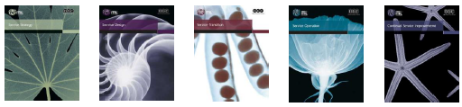

# Module 01 – Présentation d’ITIL et historique

## Qu’est-ce qu’ITIL ?
``ITIL``, acronyme de "``I``nformation ``T``echnology ``I``nfrastructure ``L``ibrary," est une bibliothèque pour l'infrastructure des technologies de l’information. Elle définit les bonnes pratiques informatiques visant à créer un système d’information le plus efficace et efficient possible.

## Découvrir ITIL
### Objectifs
Ce module a pour objectif de vous présenter ITIL et son histoire.

## Présentation d'ITIL et historique

### ITIL : Information Technology Infrastructure Library
- ITIL est une bibliothèque qui définit les bonnes pratiques informatiques.
- Elle vise à améliorer l'efficacité et l'efficience des systèmes d'information.

### ISO 9001
- Norme s'appliquant à tous les secteurs d'activité.
- Elle définit un système de gestion de qualité basé sur les processus.

### ISO 20000
- Norme internationale spécifique à la gestion des systèmes d'information.
- Elle repose sur treize processus, définis dans ITIL.
- Posséder ISO 9001 et ITIL v2 minimum facilite cette certification.

## Historique

### Fin des années 80
- Le gouvernement britannique lance une étude nationale pour uniformiser les pratiques de gestion de l'information dans l'administration.
- Création d'une bibliothèque de 42 livres appelée "ITIL."

### 1991
- Création du forum ITIL permettant aux utilisateurs d'échanger des idées et des expériences, devenu l'ITSMF.

### 2004
- Évolution vers ITIL v2 avec neuf livres centraux.
- Introduction de processus orientés sécurité et des SLA (Accords de Niveau de Service).

### 2007
- Introduction d'ITIL v3 avec cinq livres centraux.
- Intégration de la notion de "cycle de vie des services."

### Janvier 2020
- ITIL 4 n'est pas une nouvelle version, mais une mise à jour de la version 3 en conservant les principes fondamentaux.
- Il s'agit d'un référentiel international de gestion des services informatiques.

### ITIL repose sur l’évolution de l’informatique au sein des entreprises
- De la gestion de projets vers une gestion de service.
- Contenu : bonnes pratiques, langage commun, définition d'un cadre de travail.

## Les différents acteurs
- ``OGC`` (``O``ffice of ``G``overnment ``Commerce) : Propriétaire du référentiel, responsable des publications.
- ``Axelos`` : Entreprise créée en 2014 par l’OGC pour gérer ITIL.
- Organismes de gestion des certifications et des examens : APM Group, EXIN, ISEB, Loyalist College, Dansk IT, DF Certifiering.
- ``ITSMF`` (``IT S``ervice ``M``anagement ``F``orum) : Association d'utilisateurs.
- Organismes de formation et formateurs agréés.
- Experts et consultants en gestion de service certifiés ITIL.

## ITIL 4 (depuis 2020)
- ITIL 4 représente la 4e génération industrielle.
- Nouveautés : gestion de projet Agile, Lean, Cloud.