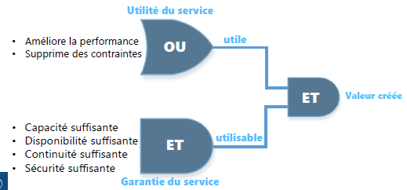
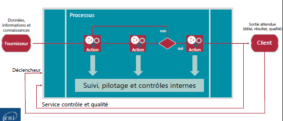
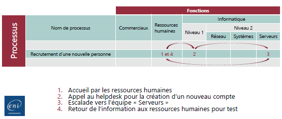
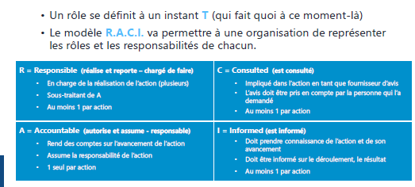
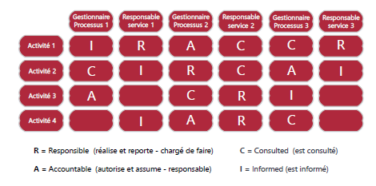
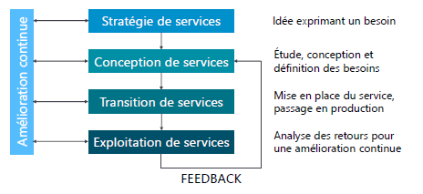

# Sensibilisation ITIL
## Module 02 – La gestion des services

### Objectifs
Dans ce module, nous aborderons les fondamentaux de la gestion des services. Qu'est-ce qu'un service ?

## La gestion des services

ITIL v3 propose une évolution de la gestion de projet vers la gestion de service, qui met davantage l'accent sur le client.

### Un projet
Un projet se caractérise par la capacité à implémenter de nouvelles fonctionnalités en réponse à de nouveaux besoins, des évolutions légales, des avancées technologiques, etc.

### Un service
Un service consiste à produire le service demandé en respectant trois critères essentiels :
- Aligner les services informatiques sur les besoins des clients.
- Améliorer la qualité des services informatiques (évaluations notamment).
- Maîtriser les coûts de fourniture.

### Définition d'un service
Un service est l'ensemble des moyens déployés pour fournir de la valeur à un client, sans qu'il en supporte les coûts ni les risques. Il inclut une application, une documentation, une formation, un support, et de l'assistance aux utilisateurs.

### Les 2 conditions requises pour créer de la valeur
- Utilité (dimension de la prestation) : La raison d'être d'un service est d'améliorer les performances, de dépasser les contraintes, ou les deux.
- Garantie (utilisabilité) : Elle assure au client que le service répondra aux exigences de qualité contractuelles, incluant la disponibilité, la performance, la continuité de service et la sécurité.

## Les 5 acteurs de services
### Le fournisseur de services informatiques (IT Service Provider)
L'entité responsable de la mise à disposition des services informatiques, pouvant être ``interne`` (type 1), de ``services partagés`` (type 2) ou ``externe`` (type 3).

### Le client
La personne ou l'organisation bénéficiaire finale du service, qui exprime les besoins métiers, négocie le service, le valide, le paie, et représente les utilisateurs.

### L'utilisateur (collaborateur du client)
La personne qui utilise un système informatique au quotidien pour son activité professionnelle et remonte ses exigences au client.

### Le propriétaire de service (Service Owner - marketing)
L'entité responsable du suivi du service informatique, impliquée dans les propositions d'amélioration du service, la négociation des SLA (Service Level Agreement) et des OLA (Operationnal Level Agreement), et la garantie que le service atteint ses objectifs.

### Le gestionnaire de service
La personne responsable de la mise en place de la démarche ITIL au sein de l'entreprise et de la vie du service, qui coordonne les activités des propriétaires de processus et des propriétaires de services.

## La gestion de service
La gestion de service comprend la planification, la mise en œuvre, l'optimisation de la fourniture des services, et le support des services. Elle s'appuie sur deux dispositions spécialisées :

### La notion de processus
Un processus est une suite d'activités structurées et logiques visant un objectif défini. Il est mesurable, a des résultats attendus, a des clients, et définit les rôles et les responsabilités des acteurs.

Deux éléments importants : **l'efficacité** (objectif atteint ?) et **l'efficience** (les ressources ont-elles été utilisées à bon escient ?)

### La notion de fonction
Une fonction est un groupe de personnes disposant d'outils et de ressources spécifiques pour exécuter un certain type de travaux, responsable des résultats spécifiques.

## Le modèle R.A.C.I.
Le modèle ``R.A.C.I``. (``R``esponsible, ``A``ccountable, ``C``onsulted, ``I``nformed) permet de définir les rôles et les responsabilités au sein de l'organisation.

Avec le modèle R.A.C.I, une personne ne peut pas dire qu'elle n'était pas au courant, ou qu'elle ne devait pas faire. C'est noté noir sur blanc.

### Le cycle de vie des services
Le cycle de vie des services ITIL comprend :
- Stratégie de services (*avoir un idée*)
- Conception de services (*est-ce réalisable ?*)
- Transition de services (*début des tests*)
- Exploitation de services (*mise en place du service, explication aux utilisateurs*)
- Amélioration continue (*regard critique pour améliorer*)

Ce module nous a permis de comprendre les principes de base de la gestion des services selon ITIL.
