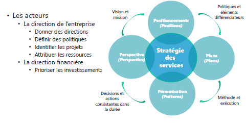
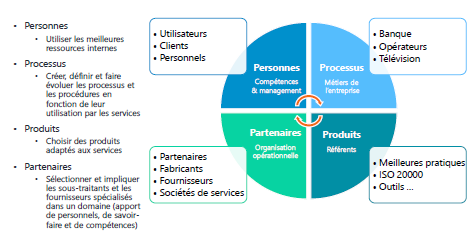
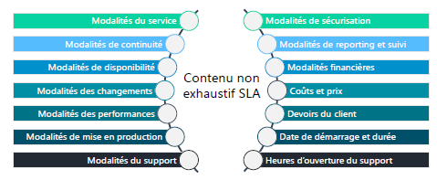
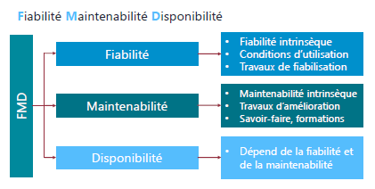
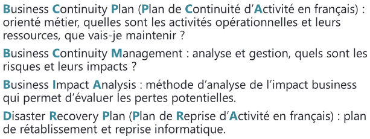
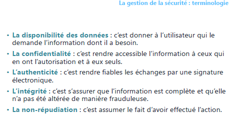
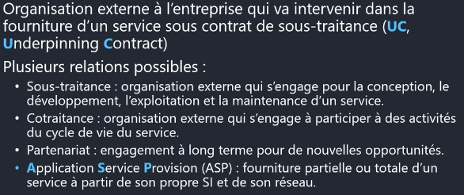

# Module 03 – Les publications centrales
## « Stratégie et Conception des services »

Dans ce module, nous allons explorer les concepts clés de la stratégie et de la conception des services. Commençons par les objectifs de ce module.

### Objectifs
- Comprendre le rôle de la stratégie des services.
- Examiner les processus liés à la stratégie des services.
- Comprendre le rôle de la conception des services.
- Explorer les processus de la conception des services.
- Définir le contenu d'un SLA (Service Level Agreement).

## La stratégie des services

La stratégie des services est cruciale pour une organisation. Elle consiste à planifier, concevoir et fournir des services de qualité qui apportent de la valeur aux clients. Voici quelques points essentiels :

- Développer l'offre de service dans un contexte concurrentiel.
- Passer de la gestion des services à un rôle stratégique de la DSI pour l'entreprise.
- Apporter de la valeur aux clients en anticipant les conflits potentiels.
- Planifier et définir une stratégie des services (services offerts).
- Rester aligné sur les demandes métiers tout en restant concurrentiel.

### La gestion de la stratégie

La gestion de la stratégie implique l'établissement de la stratégie des services en fonction du marché, des demandes des clients, des offres de la concurrence et des capacités de l'entreprise (personnel, matériel, financière).

### La gestion du portefeuille des services

Ce processus liste tous les services (futurs, actuels, retirés) et leur description, y compris les coûts associés. Les services actuels sont contenus dans le catalogue des services pour les clients.

## Les processus de la stratégie des services

### La gestion des demandes

La gestion des demandes est l'un des processus les plus critiques. Elle permet d'analyser les besoins des clients actuels et futurs en fonction des évolutions des métiers et des technologies.

### La gestion financière

Ce processus analyse les coûts d'un service afin de définir son prix. Il prend en compte les coûts directs (achat de matériels ou de fournitures) et indirects (frais liés à l'entreprise, comme la location des locaux).

### La gestion de la relation métier

La gestion de la relation métier maintient une relation de confiance avec les clients pour garantir leur satisfaction générale.

### Les acteurs

Dans la mise en œuvre de la stratégie des services, plusieurs acteurs sont impliqués, notamment la direction de l'entreprise et la direction financière.

## Les 4 « P » de la stratégie des services

- **Perspective** : Vision et mission de l'entreprise.
- **Positionnements** : Politiques et éléments différenciateurs (où se situer par rapport à la concurrence).
- **Plans** : Méthode et exécution (comment améliorer ? Comment mettre en place ?).
- **Pérennisation** : Décisions et actions consistantes dans la durée (amélioration constante).

## Terminologie

Pour mieux comprendre la stratégie des services, il est important de connaître certains termes clés :
- **ROI (Return On Investment)** : retour sur investissement, comparaison de la dépense par rapport à la valeur produite et sur quelle durée.
- **TCO (Total Cost of Ownership)** : coût total de possession, ensemble des coûts de fourniture des services.
- **Coût d'un service** : argent dépensé pour concevoir ou fournir un service.
 - **Coûts directs** : achat de matériels ou de fournitures (facture).
 - **Coûts indirects** : frais liés à l'entreprise (location des locaux).
 - **Coûts cachés** (inclus dans le TCO) : manque de formation des techniciens.
- **Prix d'un service** : le coût augmenté d'une marge.

## La conception des services

La conception des services est une étape essentielle pour produire des services de qualité tout en respectant les objectifs définis par la stratégie des services. Voici quelques points clés :

- Recueillir les exigences du client (SLR - Service Level Requirement).
- Définir la solution.
- Tenir compte des contraintes de l'architecture du système d'information.
- Définir les processus.
- Définir les indicateurs de mesure du service.

### La conception des services : définir la solution

Il s'agit de décider comment réaliser la solution en répondant à des questions telles que l'évolution des données du service, la conformité aux SLA, l'efficacité de la livraison quotidienne du service, etc.

### Les processus de la conception des services

La conception des services implique plusieurs processus, dont la coordination de la conception, la gestion du catalogue des services, la gestion des niveaux de services (SLA), la gestion de la disponibilité, la gestion de la capacité, la gestion de la continuité, la gestion de la sécurité et la gestion des fournisseurs.

## Les acteurs de la conception des services « 4P »

- **Personnes** : Utilisation des meilleures ressources internes.
- **Processus** : Création, définition et évolution des processus et des procédures en fonction de leur utilisation par les services.
- **Produits** : Choix de produits adaptés aux services.
- **Partenaires** : Sélection et implication des sous-traitants et des fournisseurs spécialisés dans un domaine.

## La gestion des niveaux de services

La gestion des niveaux de services implique la définition des modalités du service, de la continuité, de la disponibilité, des changements, des performances, de la mise en production, du support, de la sécurisation, du reporting et du suivi, ainsi que des modalités financières.

## Le contenu d'un OLA (Operationnal Level Agreement) et d'un UC (Underpinning Contract)

- Un contrat de services OLA est un contrat pour réaliser un SLA en interne.
- Un contrat de service UC est un contrat avec un prestataire externe pour réaliser un SLA.

## Terminologie de la gestion des niveaux de services

Il est essentiel de connaître certaines abréviations courantes dans la gestion des niveaux de services :
- **SLR** – *Service Level Requirement* : expression des besoins du client.
- **SLM** – *Service Level Manager* : responsable de la gestion des niveaux de services.
- **SLA** – *Service Level Agreement* : accord de niveaux de services conclu avec le client.
- **OLA** – *Operationnal Level Agreement* : accord de niveaux de services conclu avec les fournisseurs internes.
- **UC** – *Underpinning Contract* : contrat de sous-traitance.
- **Catalogue des services** - document regroupant l'ensemble des services.
- **SIP** – *Service Improvement Program* : programme d'amélioration des services.

## Terminologie de la gestion des services informatiques

Dans le domaine de la gestion des services informatiques, plusieurs termes sont couramment utilisés :
- **TMA - Tierce Maintenance Applicative** : maintenance corrective applicative effectuée par un tiers (développement).
- **BPO - Business Process Outsourcing** : sous-traitance fonctionnelle d'une application ou d'un processus métier.
- **ASP - Application Service Provision** : fournir le service directement au client final via l'infrastructure d'un fournisseur.
- **KPO - Knowledge Process Outsourcing** : appel à des consultants externes pour leurs connaissances sur les métiers ou la technologie.

## La gestion de la disponibilité

La gestion de la disponibilité est cruciale pour garantir le bon fonctionnement des services. Elle englobe les concepts de fiabilité, de maintenabilité et de disponibilité.

### Fiabilité
La fiabilité est l'aptitude d'un équipement, d'un logiciel ou d'un service à fonctionner durablement avec un nombre minimum d'interruptions ou d'incidents.

### Maintenabilité
La maintenabilité est l'aptitude d'un service ou d'un équipement à être remis en marche.

### Disponibilité
La disponibilité dépend de la fiabilité et de la maintenabilité et garantit que le service est toujours accessible.

### Fiabilité intrinsèque
Elle dépend des conditions d'utilisation et des travaux de fiabilisation.

### Maintenabilité intrinsèque
Elle dépend des travaux d'amélioration et du savoir-faire du personnel.

## La gestion de la continuité

La gestion de la continuité vise à assurer la poursuite de la livraison des services dans le respect des SLA, même en cas d'environnement dégradé. Cela nécessite des tests réguliers et l'adaptation des plans de continuité.

## La gestion de la sécurité

La gestion de la sécurité est cruciale pour protéger les données du système d'information. Elle englobe des concepts tels que la disponibilité, la confidentialité, l'intégrité, l'authenticité et la non-répudiation. Une politique d'utilisation du système d'information doit être définie.

## La gestion des fournisseurs

La gestion des fournisseurs implique la relation avec les fournisseurs, y compris le recrutement, les contrats, les niveaux de service, la résolution de litiges et les ruptures de contrat. Plusieurs types de relations peuvent être établis, notamment la sous-traitance, la cotraitance, le partenariat, l'ASP et le KPO.

Ce module vous fournira une base solide pour comprendre la stratégie et la conception des services dans le contexte de la gestion des services informatiques.

