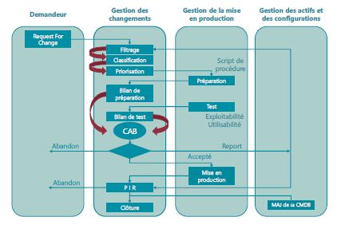

# Module 04 – Transition des services

## Objectifs
- Comprendre le rôle crucial de la transition des services dans la gestion des services informatiques.
- Identifier les différents processus impliqués dans la transition des services.
- Définir ce qu'est un changement (Change).
- Définir un CI (Configuration Item).
- Identifier les outils utilisés dans la transition des services.
- Comprendre le concept de gestion de la connaissance dans ce contexte.

## Les publications centrales « Transition des services »

  

### Objectif
Le module "Transition des services" se concentre sur la mise en production de nouveaux services ou sur l'amélioration de ceux existants.

### Son rôle
- La mise en production de services doit respecter les livrables produits par la conception des services, tout en maîtrisant les coûts.
- La phase de transition implique la réalisation, la construction, les tests, la validation et le déploiement des services.
- Il est essentiel de prévoir et de gérer efficacement les ressources nécessaires, de produire une documentation complète et de surveiller en permanence les services en production.
- La transition des services doit également garantir le respect des critères de qualité, de sécurité et des délais lors de la fourniture des services.
- La satisfaction du client est un aspect crucial à prendre en compte et à améliorer tout au long du processus.

## La transition des services

La phase de transition des services est cruciale dans le cycle de vie des services informatiques. Elle assure la mise en production réussie des services nouvellement conçus ou améliorés. Voici un aperçu des principaux processus impliqués :

### Gestion des changements (Change Management)
La gestion des changements est le point de départ de la transition des services. Elle débute par une RFC (Request For Change), une demande de changement.

### Gestion des actifs de services et des configurations (Asset and Configuration Management)
Ce processus garantit que les modifications apportées aux CI (Configuration Items) sont bien enregistrées dans le CMS (Content Management System). La gestion de la configuration est essentielle pour suivre l'évolution des éléments du système d'information.

### Gestion de la planification et support à la transition (Transition Planning and Support)
Cette étape consiste à planifier minutieusement chaque aspect de la transition, y compris la coordination des équipes, la gestion des ressources et la communication avec les parties prenantes.

### Gestion de l’évaluation des changements (Change Evaluation)
L'évaluation des changements vise à s'assurer que les procédures et les méthodes pour traiter les changements sont efficaces et efficientes. Elle contribue à minimiser les risques d'interruption de service et à maximiser la valeur fournie.

### La validation et les tests (Validation and Testing)
Ce processus inclut les tests fonctionnels et de performance pour s'assurer que les services fonctionnent conformément aux spécifications.

### Gestion des déploiements et des mises en production (Release and Deployment Management)
Il est chargé de coordonner et d'exécuter le déploiement des nouveaux services ou des mises à jour des services existants.

### Gestion de la connaissance (Knowledge Management)
La gestion de la connaissance consiste à recueillir, stocker et diffuser les connaissances et les leçons apprises tout au long de la transition des services, afin d'améliorer les futurs processus.

## La gestion des changements

La gestion des changements est un processus fondamental de la transition des services. Voici quelques détails supplémentaires sur ce processus :

### Les « 7 R » de la gestion des changements
- Raised : Qui a fait la demande ?
- Reason : Pour quelle raison ?
- Return : Quel est le retour attendu ?
- Risks : Quels sont les risques ?
- Resources : Quelles seront les ressources ?
- Responsible : Qui est le responsable ?
- Relationship : Quelles sont les relations avec les autres changements ?

### Les origines d’un changement peuvent inclure :
- Les correctifs (événement, incident, problème…).
- La législation.
- L’organisation.
- Des directives ou des standards.
- Des évolutions des services existants.
- Des nouveaux services.
- Un nouveau modèle de sourcing.
- Une innovation technologique…

### La demande de changement
Tous les clients sont habilités à émettre une demande de changement, mais cela ne garantit pas son acceptation. Toute demande de changement doit être formalisée par une RFC (Request For Change).

Une RFC doit contenir des informations essentielles telles qu'un identifiant unique, une date de demande, le nom du demandeur, une proposition de priorité de changement (priorité = impact x urgence), une description du changement, les risques potentiels, les dates de mise en place du changement, et une estimation des ressources nécessaires (humaines, matérielles, etc.).

### La gestion de la priorité d’une demande de changement
La gestion de la priorité se base souvent sur une matrice qui combine l'impact et l'urgence du changement. Cela permet de définir la priorité de traitement du changement.

| Code de priorité | Urgence   | Impact    | Priorité de changement |
|------------------|-----------|-----------|------------------------|
| 1                | Très haute | Très élevé | Très haute             |
| 2                | Haute     | Elevé     | Haute                  |
| 3                | Moyenne   | Moyen     | Moyenne                |
| 4                | Basse     | Faible    | Basse                  |
| 5                | Très basse| Très faible| Très basse             |

La priorisation aide à traiter efficacement les changements en fonction de leur impact potentiel sur l'organisation.

## Les publications centrales « Transition des services »

### Les types de changement

#### Le changement standard
- Ce type de changement concerne des actions connues, documentées, déjà réalisées, et testées. Les risques associés sont faibles et bien maîtrisés. Ils sont généralement préapprouvés, maîtrisés et associés à des procédures établies. Ils sont référencés dans un mini-catalogue de changements préautorisés.

#### Le changement normal
- Les changements normaux nécessitent une évaluation complète et une autorisation avant leur réalisation par le CAB (Change Advisory Board) (*cabinet de changement*).

#### Le changement urgent
- Les changements urgents sont liés à des situations exceptionnelles et doivent être validés et autorisés par l'ECAB (Emergency Change Advisory Board). Ils impliquent souvent le court-circuitage des procédures normales, y compris la réalisation, la mise en œuvre, la documentation et les tests.

### Cycle de vie d’un changement
Le cycle de vie d'un changement comprend plusieurs étapes, de la demande initiale à la clôture :
- Demandeur
- Gestion des changements
- Gestion de la mise en production
- Gestion des actifs et des configurations
- Clôture

Le processus commence généralement par une "Request For Change" (RFC), passe par des étapes de filtrage, de classification, de priorisation, de préparation, de création de script de procédure, de tests, d'exploitabilité, d'utilisabilité, de bilan de test, implique le CAB, et se termine par une mise en production, suivie d'une mise à jour de la CMDB (Configuration Management Database) et d'un rapport final. Si nécessaire, le changement peut être abandonné à certaines étapes du processus.

### Terminologie liée à la gestion des changements
- CI - Configuration Item : un composant du système d'information qui contribue à la fourniture de services.
- CMS - Content Management System : un logiciel de gestion des CI et de la base de connaissances.
- CAB - Change Advisory Board : un comité consultatif qui évalue et donne un avis sur les changements normaux.
- ECAB - Emergency Change Advisory Board : un comité qui autorise les changements urgents.
- PIR - Post Implementation Review : un comité qui analyse les résultats des mises en production des changements.

## La gestion des actifs de services et des configurations

### Élément de configuration (CI - Configuration Item)
- Un CI est un composant du système d'information qui contribue à la fourniture d'un ou plusieurs services. Il est identifiable par un type et un ensemble d'attributs qui le décrivent. De plus, il peut avoir des relations avec d'autres CIs, qu'elles soient de nature situationnelle, physique ou fonctionnelle.

### Exemples d'éléments de configuration
Les CIs peuvent être de différents types, tels que :
- Composants matériels
- Composants logiciels
- Équipements réseau
- Équipements téléphoniques
- Contrats de service
- Composants d'infrastructure
- Ressources utilisateurs
- Éléments environnementaux
- Documentations
- Procédures d'exploitation

### Activités de gestion des actifs de services et des configurations
La gestion des actifs de services et des configurations comprend plusieurs activités, notamment :
- Planification initiale : définir le périmètre, la stratégie et la politique de gestion des éléments de configuration.
- Analyse de l'existant : connaître les outils et les données des différents composants existants.
- Sélection, configuration et modélisation du CMS/CMDB : déterminer le type de CI, les attributs et les relations.
- Chargement initial : introduire les données initiales dans le système.
- Nomination du propriétaire et des acteurs clés : attribuer des responsabilités.
- Formation des collaborateurs : assurer que le personnel est formé à la gestion des actifs.

### Outils de gestion des actifs de services et des configurations
Plusieurs outils sont utilisés dans la gestion des actifs de services et des configurations, notamment :
- CMDB (Configuration Management Database) : une base de données qui contient des enregistrements de CI.
- CMS (Configuration Management System) : un ensemble d'outils pour gérer les données de configuration.
- DML (Definitive Media Library) : un lieu de stockage sécurisé pour les CIs logiciels, y compris les médias, les documentations et les clés de licence associées.

## La gestion des mises en production et des déploiements

### Fonctions et activités
Ce processus de gestion vise à valider, organiser et planifier le déploiement des services (nouveaux ou mis à jour) de manière "industrielle", tout en garantissant la valeur ajoutée, le respect des SLA (Service Level Agreements) et la création de documentation pour l'exploitation des services. Il implique également la gestion des versions, la convention de nommage, le modèle R.A.C.I et la gestion des délais.

### Modes de déploiement
Les déploiements peuvent se faire de différentes manières, notamment :
- Manuel : avec l'aide du personnel de la DSI, avec contrôles et surveillance.
- Automatique : sans l'aide du personnel de la DSI, fortement conseillé.
- Mode Push : le déploiement est initié par un centre vers les sites utilisateurs cibles.
- Mode Pull : le déploiement est mis à disposition des utilisateurs sur un serveur, et ces derniers initient le déploiement à leur convenance.
- Big Bang : le déploiement est effectué en une seule opération vers tous les utilisateurs.
- Par phase : le déploiement se fait selon un plan en tenant compte des périmètres définis par le client.

## La gestion de l'évaluation des changements
La gestion de l'évaluation des changements mesure l'impact des changements en évaluant les effets et les risques. Elle crée également la revue de post-implémentation (PIR), qui est indépendante de la gestion des changements.

## La validation et les tests
Cette fonction est chargée de garantir le bon fonctionnement des services (nouveaux et mis à jour) et de gérer les erreurs découvertes pendant les phases d'intégration, de préproduction et de post-mise en production. Elle crée des procès-verbaux de recette pour différents aspects, tels que la fonctionnalité, la performance, l'exploitabilité et le service régulier.

## La gestion de la planification et le support à la transition
Cette fonction organise les changements de services (nouveaux ou mis à jour) et gère les ressources nécessaires, qu'elles soient humaines ou matérielles.

## La gestion de la connaissance

### SKMS - Service Knowledge Management System
- La gestion de la connaissance a pour objectif de fournir des informations à un collaborateur avec la granularité dont il a besoin, de manière compréhensible et fiable. Elle permet de prendre des décisions optimales et d'enregistrer les situations déjà connues. La gestion de la connaissance comprend la mise en place et la gestion d'un système de gestion de la connaissance, tel que le SKMS (Service Knowledge Management System).
- Elle implique la gestion de l'information, l'assurance de l'utilisation adéquate de la base de connaissances, et l'évaluation de la performance des bases de connaissances.

### Bonne utilisation de la base
- Il est essentiel de s'assurer que la base de connaissances est utilisée de manière efficace. Cela signifie comprendre qui utilise la connaissance, qui la partage, et qui capitalise la connaissance au sein de l'entreprise. Une base de connaissances efficace n'est pas simplement une base contenant beaucoup d'informations, mais une base qui est effectivement utilisée.
- La promotion, l'information et la formation sur l'utilisation des bases de connaissances sont également importantes pour garantir leur utilisation optimale.

