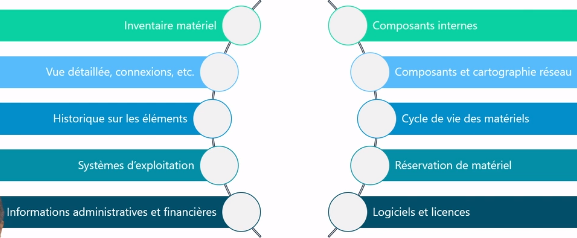
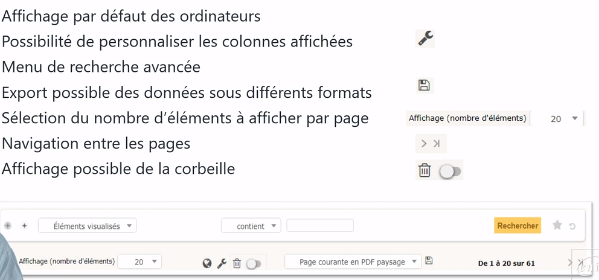
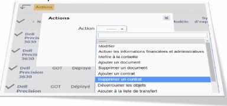
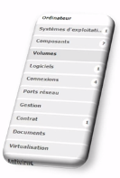
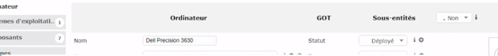

# Sensibilisation ITIL et gestion de parc
## Module 05 – Découverte de GLPI

### Objectifs
- Découvrir l'outil GLPI
- Définir les différentes fonctionnalités
- Découvrir les fonctionnalités de recherche
- Découvrir son utilisation au quotidien

### Découverte de GLPI

1. ``GLPI`` : ``G``estion ``L``ibre de ``P``arc ``I``nformatique
2. ITSM : Information Technology Service Management conforme avec ITIL
3. Logiciel libre sous licence GPL 100% libre
4. Logiciel complet pour la gestion de parc et centre de services
5. Plusieurs langues et plug-ins disponibles
6. Installation possible sous Windows et Linux
7. Pour les petits comme les grands systèmes d'information

### GLPI : fonctionnalités gestion de parc
- Inventaire matériel
  - Vue détaillée, connexions, etc.
  - Historique sur les éléments
  - Systèmes d’exploitation
  - Informations administratives et financières
  - Composants internes
  - Composants et cartographie réseau
  - Cycle de vie des matériels
  - Réservation de matériel
  - Logiciels et licences

### GLPI : les interfaces
- Interface simplifiée
  - Interface la plus restrictive
  - Destinée aux utilisateurs finaux
  - Permet de créer un ticket, suivre ses tickets, accéder aux réservations et à la FAQ
- Interface standard
  - Interface principale de GLPI
  - Tous les modules y sont disponibles en fonction des droits de chacun
  - Utilisée pour les tâches techniciens, d'administration et de configuration
  - 3 vues de travail : personnelle, groupe et globale

### GLPI : recherche rapide
- Permet d'effectuer une recherche uniquement sur les champs affichés
- Étendue de la recherche aux champs affichés par défaut de tous les éléments d'inventaire
- Utilisation possible des caractères suivants (REGEX) :

  - « ^ » pour symboliser le début du champ
  - « $ » pour symboliser la fin du champ
  - « NULL » pour rechercher les champs vides
  - Utilisation conjointe de « ^ » et « $ » pour la valeur exacte d'un champ

### GLPI : gestion de parc
- Menu parc

### Recherche basique multicritères
- Possibilité de recherches combinant plusieurs critères
- Combinaison possible de critères à l'aide d'opérateurs logiques
- Opérateurs logiques disponibles : ET/OU – ET PAS/OU PAS
- S'applique à un grand nombre de paramètres de l'objet concerné
- Plusieurs critères de recherches selon le paramètre choisi (Contient – Est – N'est pas – Sous – Pas sous – Avant – Après, etc.)

### Recherche avancée
- Possibilité d'utiliser des caractères spéciaux pour les recherches
  - ``NULL`` : s'assurer qu'un champ est vide
  - ``<Nb`` ou ``>Nb`` : utilisé dans le cas des dates, prend un nombre de mois
  - ``^`` : tester le début d'un champ
  - ``$``: tester la fin d'un champ
  - ``^$`` : tester une valeur exacte pour un champ
  - ``[Année]-[Mois]-[Jours]`` : tester un champ date

### Recherche sauvegardée
- Possibilité de sauvegarder ses recherches
- Création d'une recherche sauvegardée 
  - Un nom
  - Une visibilité/portée
  - Entité de rattachement avec ou sans récursivité
  - Comptage
- Accès à ses recherches 

### Modification massive
- Pour effectuer une modification sur un ensemble d'éléments
- Utilisé conjointement aux recherches avancées
- Généralement appliquée sur tous les éléments retournés d'une recherche
- 

### Fiche élément

- Accessible en cliquant sur un élément
- Contient toutes les informations de l'élément
- Menu de navigation vertical sur la gauche
- Certains onglets communs à tous les éléments
- Possibilité d'afficher tous les onglets sur la même page
- Navigation possible entre les fiches des éléments de la page courante
