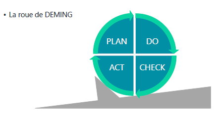

# Sensibilisation ITIL

## Module 07 – Les publications centrales
### « Amélioration continue des services »

#### Objectifs
- Définir le rôle de l’amélioration continue des services
- Connaitre la roue de Deming

### L'amélioration continue des services »

**Objectifs**
- Analyser les résultats des différents contrats (SLA, OLA, UC)
- Identifier et mettre en œuvre toutes les actions conduisant à l’amélioration des services
- Améliorer la rentabilité sans diminuer la qualité : l’efficience
- Améliorer la relation client
- S’assurer que les méthodes de gestion sont efficaces

**Missions**
- Analyser les évolutions et les tendances
- Conduire les enquêtes de satisfaction et les audits internes
- Émettre des préconisations d’amélioration
- Conduire les revues de l’amélioration continue des services

#### Les indicateurs
- Les ``K``ey ``P``erformance ``I``ndicators (``KPI``)
- Les ``C``ritical ``S``uccess ``F``actors (``CSF``)
- Les bases de référence
- La mesure des services
 - Métriques techniques (ne pas communiquer au client)
 - Métriques de processus
 - Métriques de services (à communiquer au client)

#### La roue de DEMING
1. PLAN (Planifier)
2. DO (Faire)
3. CHECK (Vérifier)
4. ACT (Agir *ou réorienter*)

