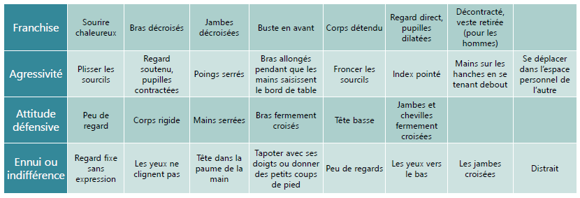
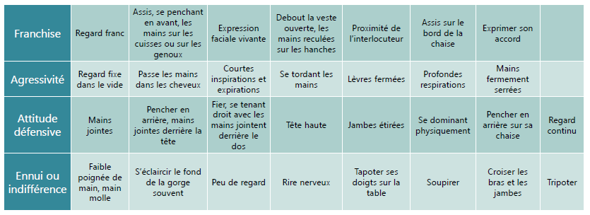
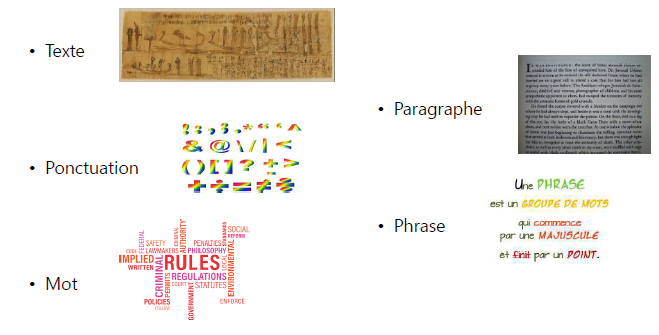
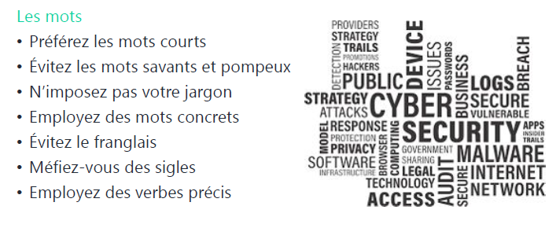
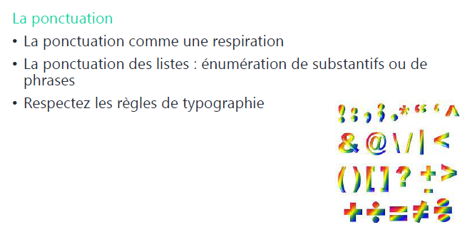
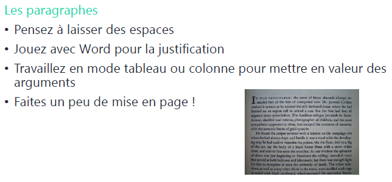
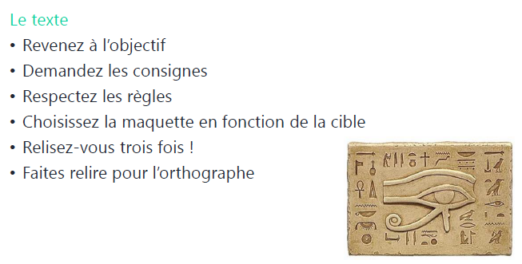
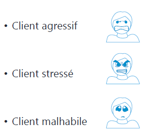

# Sensibilisation ITIL

## Module 08 – Savoir, Savoir-faire, Savoir-être

### Objectifs
- Définir le savoir, les connaissances
- Définir le savoir-faire, les compétences
- Définir le savoir-être, les aptitudes

### Quel est le rôle du technicien support ?

1. Régler les incidents et les problèmes rencontrés par les utilisateurs.
2. Diagnostiquer un incident.
3. Effectuer une réparation matérielle.
4. Proposer une solution de contournement.
5. Commander et changer des matériels défectueux.
6. Installer du nouveau matériel (intégrer et gérer un réseau).
7. Surveiller la sécurité.
8. Former les utilisateurs.

### Quelles sont les compétences requises ?

#### Le savoir – connaissance

- Définition : faculté mentale produisant une assimilation par l’esprit d’un contenu objectif préalablement traduit en signes et en idées.

#### Le savoir-faire – compétence

- Définition : compétence acquise par l’expérience dans les problèmes pratiques, dans l’exercice d’un métier.

#### Le savoir-être – aptitude

- Définition : correspond à la capacité de produire des actions et des réactions adaptées à l’environnement humain et écologique.

> Source Wikipédia

### Compétences et profils

- Compétences professionnelles.
- Connaissances système.
- Connaissances réseau.
- Connaissances de l’ERP et du métier du client (workflow).
- Profils.
 - Sens de l’écoute.
 - Calme.
 - Qualités relationnelles.
 - Efficacité.
 - Organisation.
 - Veille technologique.

### Savoirs - Connaissances

- Vous êtes-vous déjà dit ?
  > « J’ai déjà eu ce problème, mais je ne sais plus comment j’ai fait pour le régler. »

Pour éviter ce problème :
- Il faut une bonne base de connaissance.
- Wiki.
- Logiciel interne.
- Site intranet.
- Logiciel de gestion de parc (GLPI).
- Il faut une bonne veille technologique.

### Le savoir

- Documentez les bonnes pratiques.
- Partagez les solutions pour les incidents communs.
- Permettez aux utilisateurs finaux de résoudre par eux-mêmes leurs incidents.
- Facilitez les recherches en rendant visible les articles qu'aux personnes nécessaires.
- Partagez vos idées, vos expériences, votre veille technologique.

#### Avantages

- Solutions pour les utilisateurs finaux 24/7 par un navigateur web.
- Réduit la charge de travail du service helpdesk.
- Améliore la productivité générale et donc l’efficience.
- Facilité d’utilisation et de partage.
- Réduction des temps de résolution qui permet de respecter les SLA.

### Savoir-faire - Compétences

- La compétence désigne la mobilisation d’un ensemble de ressources en vue de résoudre une situation complexe.

### La communication

#### La communication interne

- La communication externe tente de répondre à l’un des objectifs suivants :
  - Faire passer une information, une connaissance ou une émotion.
  - Créer un langage commun pour faciliter la compréhension (ITIL).
  - Créer une relation pour être connu et ainsi fidélisé.
  - Créer une influence pour inciter l’autre.

#### La communication interne 

Permet :

- Implication.
- Adaptation au changement.
- Bonne ambiance.
- Disparition des rumeurs.

#### Le verbal

- L’émission des signaux ne signifie pas forcément leur bonne réception par le(s) récepteur(s)
- Une bonne communication nécessite la réception et la compréhension de l’information par le(s) destinataire(s).
- Vous êtes tour à tour émetteur et récepteur.
 - Émetteur : soyez clair, précis et compréhensible.
 - Récepteur : soyez disponible et sachez écouter (donc, vous taire).

#### Le non verbal

- Gestes naturels : mouvements d’instinct ou réflexes (haussement d’épaules).
- Gestes sociaux : mouvements volontaires, liés à la culture, à l’origine sociale.
- Regard : sa direction est une indication du degré d’intérêt porté à l’autre.
- Expression du visage : disponibilité d’esprit, degré de sympathie.
- Posture et mouvement : degré d’assurance, de disponibilité.
- Vêtements : statut social, style de vie, mais aussi mise en valeur de l’autre…

### La technique

- Questionnement (découverte des besoins)
- Écoute (analyse des besoins)
- Reformulation (finalisation et obtention de oui)

#### Questionnement

- Questionnement ouvert : favorise la généralisation
  - En quoi est-ce important ?
  - Quel est votre avis ?
  - Qu’est-ce que cela représente pour vous ?
- Questionnement fermé : favorise la spécification
  - Quand ?
  - Combien de fois ?
  - Avec qui ?
  - Êtes-vous d’accord ?

#### L’écoute

- Être ouvert à l’autre
- Lire entre les lignes du discours
- Percevoir l’environnement
- Écouter le message
- Objectifs
  - Obtenir de l’information
  - Rester ouvert aux perceptions de l’autre
  - Comprendre le degré de motivation

#### La reformulation

- Redire avec d’autres mots ce que votre client vient d’exprimer
- Objectifs
  - Montrer que l’on a écouté
  - Vérifier que l’on a compris
  - Éventuellement, faire préciser votre client
- Exemples
  - *Ainsi selon vous …*
  - *Si j’ai bien compris …*
  - *Vous voulez dire …*
  - *En somme, vous trouvez que …*
- Trois méthodes de reformulation
 - De reflet
 - De résumé
 - De clarification
- La reformulation
 - Met en confiance
 - Relance le débat
 - Clarifie le débat
 - Met en mots le ressenti

### La communication écrite

Elle permet de véhiculer l’image de son auteur
 - L’écrit est indispensable dans la vie professionnelle
 - On adapte son écrit en fonction de son interlocuteur
  - Choix du vocabulaire
  - Texte concis
  - Document de synthèse pour les décideurs

#### Utiliser la messagerie
- Une communication rapide, instantanée
- Écrite
- Asynchrone
- Vers un ou plusieurs interlocuteurs
- Dotée de mémoire externe
- Synthétique, percutante
- Permet l’échange

#### Problèmes posés par la messagerie
- Stress
- Surcharge
- Urgence
- Interruption
- Dépersonnalisation de la relation
- Aplatissement des structures hiérarchiques
- À ne pas confondre avec le chat
- Mauvaise interprétation
- Attention à la gestion de la confidentialité

### Savoir-être - Aptitudes

- Sang-froid
- Disponibilité
- Rapidité d'adaptation
- Facilité de parole
- Rapidité d'analyse
- Écoute

#### Client agressif

- De mauvaise foi
- Ne reconnaissant surtout pas son erreur
- Suffisant
- Désagréable
  
  - Ne pas insister, il ne s'agit pas d'avoir le dernier mot
  - Si cela lui fait plaisir, lui laisser croire à sa supériorité

#### Client agressif

- Colérique
  - Ne pas le laisser aller trop loin, il faut aussi se faire respecter
  - Ne pas entrer dans son jeu en se mettant en colère aussi
  - Garder son calme pour désamorcer le conflit, à s'énerver tout seul, il finira par se sentir ridicule

#### Client stressé

- Évaluer le niveau du blocage
  - Blocage partiel
  - Blocage total
- Rassurer l'utilisateur et montrer que :
  - Vous prenez les choses en main
  - Vous prenez en compte son urgence

#### Client malhabile

- Débutant sur son logiciel
  - Se mettre à sa place
  - Le déculpabiliser
- Réfractaire à l'informatique
  - Jouer la complicité avec humour
  - L'encourager à persévérer si possible

#### Phrases à proscrire
  - Ne pas dire
    - *Je ne sais pas*
  - Dire
    - Je vais me renseigner
    - Votre problème est relativement complexe
    - Fixer un délai
  - Phrases à proscrire
    - Ne pas dire
      - *Je ne comprends pas ce qu’il se passe*
    - Dire
      - Il y a sûrement une explication
  - Phrases à proscrire
    - Ne pas dire
      - *Vous avez commis une erreur*
    - Dire
      - Ce programme est complexe à utiliser
      - Le déculpabiliser sans remettre en cause la qualité du logiciel
  - Phrases à proscrire
    - Ne pas dire
      - *On m’a répondu …*
      - *Un collègue m’a dit …*
    - Dire
      - J’ai trouvé la solution
  - Phrases à proscrire
    - Ne pas dire
      - *Ce logiciel est nul*
    - Dire
      - Ne pas décourager l’utilisateur / le client, mais plutôt le stimuler en lui laissant entrevoir toutes les capacités du logiciel une fois qu’il le maîtrisera
  - Phrases à proscrire
    - Ne pas dire
      - *Je ne comprends pas ce que vous dîtes*
    - Dire
      - Essayer de reformuler ce que le client a pu vous dire
      - Si ce n’est pas possible
      - Lui laisser entendre que son problème n’est pas simple
      - Éviter les questions trop larges
      - Essayer de définir avec lui le problème étape par étape en reformulant ce que vous avez compris à chaque étape de son explication

