# Sensibilisation ITIL

## Module 09 - Assistance avec GLPI

### Objectifs

- Découvrir la création d'un ticket.
- Découvrir le traitement d'un ticket.
- Appréhender la base de connaissance.

### Assistance avec GLPI


#### Le ticket

Dans le monde de l'informatique, tout fonctionne à base de ticket. Cela permet de solliciter la DSI. Un ticket passe par plusieurs statuts, notamment le cycle de vie du ticket. Il peut être de type incident ou demande et doit contenir un minimum d'informations. Les avantages du ticket incluent la traçabilité, la détection des problèmes, la répartition des tâches, la communication, et l'utilisation d'un outil de gestion de ticket.

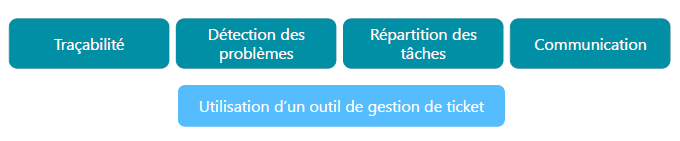

#### L'assistance sous GLPI

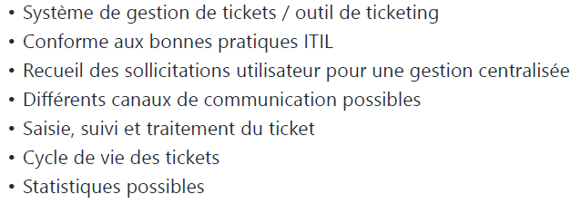

Trois grandes façons de créer un ticket :

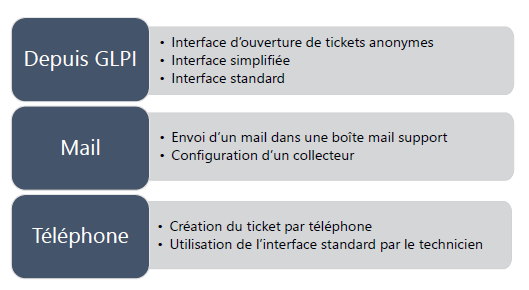

#### Cycle de vie d'un ticket

Le cycle de vie d'un ticket comprend les étapes suivantes :

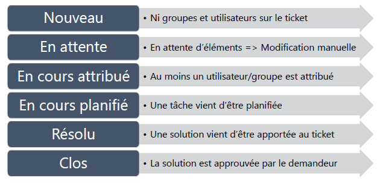

#### Traitement d'un ticket : aperçu

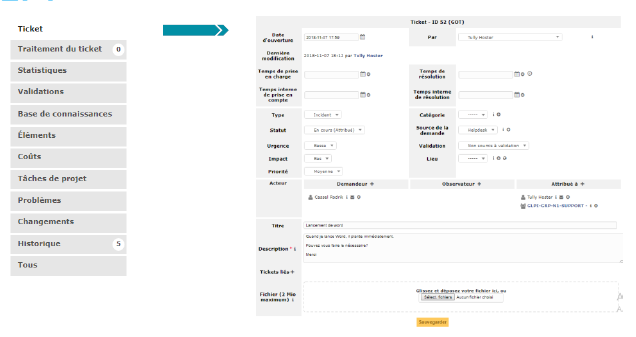

#### Traitement d'un ticket : attribution

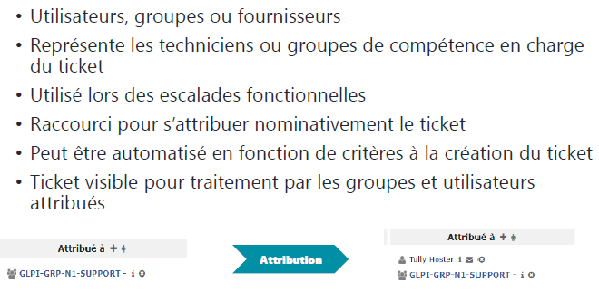

#### Traitement d'un ticket : observateurs

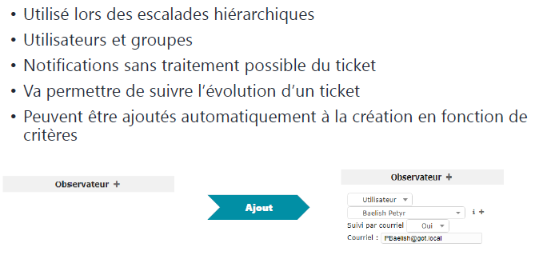

#### Traitement d'un ticket : SLA

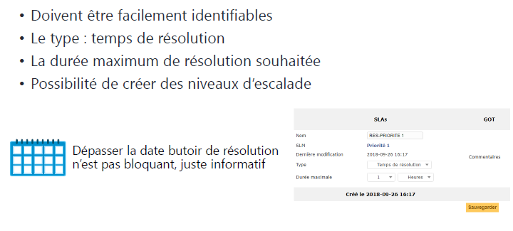

#### Traitement d'un ticket : validation

- Un ticket peut nécessiter une validation hiérarchique.
- La validation peut être manuelle ou automatique à la création.
- Non bloquant pour le traitement du ticket.
- Des droits spécifiques sont nécessaires pour être un "valideur".
- Demandes multiples possibles.
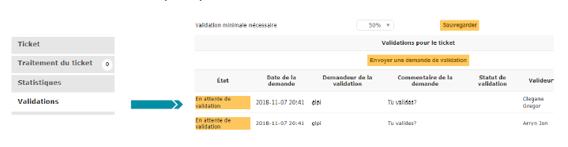
- Les valideurs reçoivent une notification de validation et approuvent ou refusent en accédant au ticket à valider.
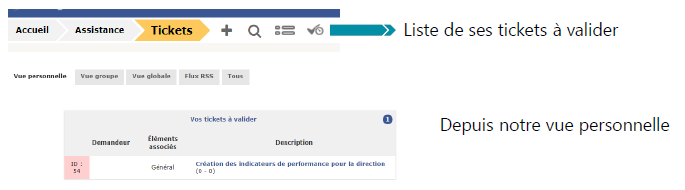
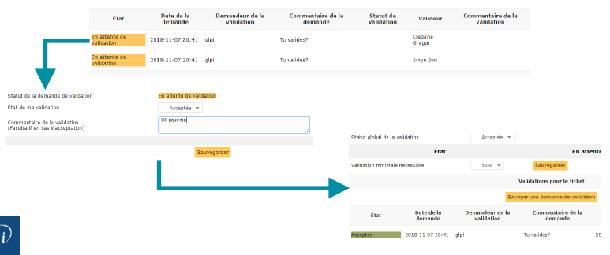

#### Traitement d'un ticket : traitement

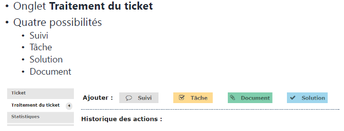

#### Traitement d'un ticket : clôture

- La clôture du ticket s'effectue à l'approbation de la solution.
- Peut être effectuée par le demandeur ou le rédacteur (ticket par téléphone).
- Accessible par le mail de validation ou le menu ticket de l'interface simplifiée.
- Commentaire obligatoire en cas de refus.
- Possibilité de planifier ou rendre la clôture immédiate à la résolution.

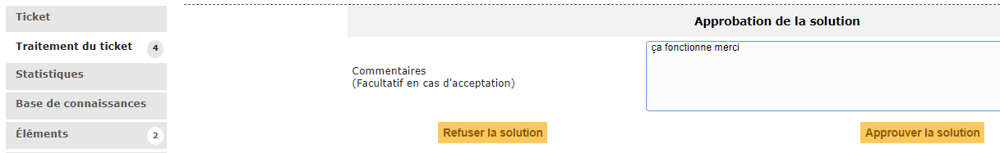

#### Ticket : éléments liés

- La liaison de CI (Configuration Item) est possible à la création d'un ticket.
- Utile pour le diagnostic et les statistiques.
- Nécessite une CMDB (Configuration Management Database) à jour et bien renseignée.

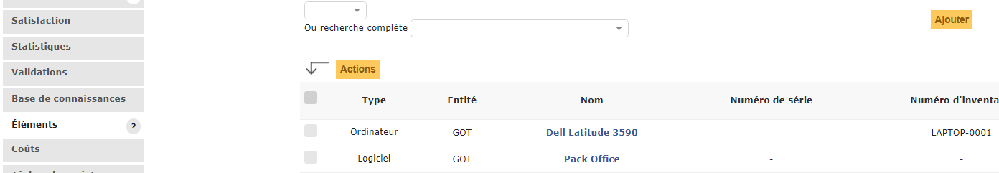

#### Base de connaissances : article

- La base de connaissances a pour objectif de centraliser des connaissances internes aux différents techniciens.
- Elle met à disposition des utilisateurs des informations (FAQ).
- Elle est accessible depuis ```Outils => Base de connaissances```.
- Elle peut avoir des restrictions pour un nombre d'acteurs.
- Elle nécessite une validation de publications d'articles.
- Gestion des révisions et liaisons possibles avec les tickets et les éléments d'inventaire (CI).
- FAQ : sous-partie de la base de connaissances à destination des utilisateurs.
- Organisation possible par catégories et restrictions temporelles.

#### Base de connaissances : création

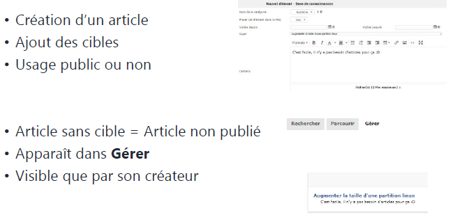

#### Base de connaissances : cibles

- Les cibles permettent de publier l'article à différentes personnes, y compris entités, profils, groupes et utilisateurs.

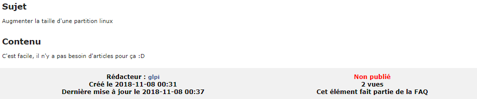
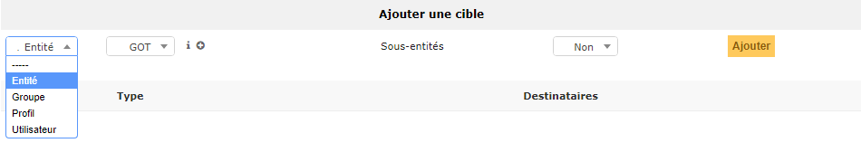

#### Base de connaissances publiques

- La base de connaissances permet d'éviter la création systématique d'un ticket.
- La ``FAQ`` (Foire Aux Questions) est accessible depuis l'interface simplifiée.
- L'accès est rapide ou par catégories.


