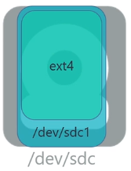
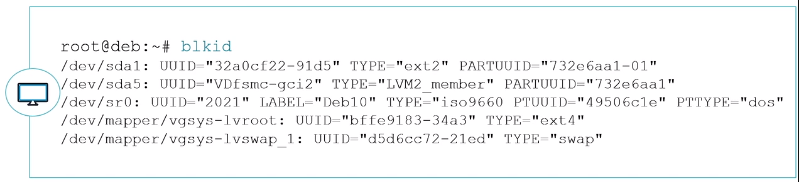
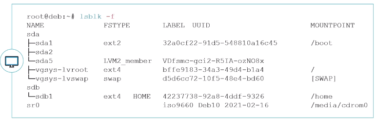
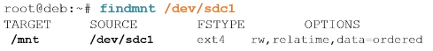

# Gestion des espaces de stockage – File System

## Objectifs

- Découvrir des systèmes de fichiers Linux
- Appliquer des FS sur l’espace de stockage
- Gérer les systèmes de fichiers
- Monter les systèmes de fichiers

> Préparer le stockage à recevoir des données


## Considérations générales sur les systèmes de fichiers


- Tous les systèmes de fichiers de type Unix sont basés sur le même principe et les mêmes éléments élémentaires. Les systèmes de fichiers Unix sont segmentés en blocs de données, actuellement à 4 Ko par défaut
- Chaque bloc pourra avoir différentes structures :
  - **Superbloc** : bloc contenant les informations vitales du système de fichiers
  - **Inode** : bloc contenant les inodes contenant les informations d’un fichier
  - **Bloc d’indirection** : bloc redirigeant vers d’autres blocs (cf. plus loin dans ce chapitre)
  - **Bloc de données** : bloc contenant les données réelles du fichier
  - **Table des inodes** : bloc contenant la liste des blocs d’inodes
  - **Table des inodes libres** : bloc contenant la liste des inodes libres
  - **Table des blocs libres** : bloc contenant la liste des blocs de données libres


### Le Superbloc

- Le superbloc contient les informations vitales du système de fichiers. Donc par mesure de sécurité, il est dupliqué à différents endroits du système de fichiers. Il contient les informations suivantes :
  - Taille des blocs
  - Taille du système de fichiers
  - Nombre de montages effectués
  - Nombre maximum de montages avant vérification
  - Date de dernier montage
  - Intervalle maximum entre deux montages avant vérification
  - Un pointeur vers l’inode racine du système de fichier


### Inodes et bloc d’indirection

- Les inodes sont regroupés par bloc dans un système de fichiers. La taille d’un inode est de 128 octets. Avec des blocs de 4 Ko, il y aura 32 inodes par bloc d’inodes. Un inode contient des informations propres au fichier qu’il représente :
  - Type de fichier : *-,d,b,c,l,p,s*
  - Mode ou droit d’accès : en octal, ex : *0644 (rw-r--r--)*
  - Nombre de liens physiques : si la valeur tombe à zéro, le fichier est considéré comme supprimé.
  - **UID** : propriétaire
  - **GID** : groupe propriétaire


### Inodes et bloc d’indirection

- **Taille du fichier** : en octets
- **Champs date** : atime (dernier accès au fichier), ctime (dernier changement des informations de l’inode), mtime (dernier changement de données réelles du fichier)
- **15 adresses** : pointant vers les blocs de données réelles du fichier

> L’inode **ne possède pas** le nom du fichier, celui-ci est renseigné dans le répertoire contenant ce fichier.


## Systèmes de fichiers Linux

### Systèmes de fichiers EXT

- L’``ext2``, l’``ext3`` et l’``ext4`` sont implémentés sur un système Debian
- La différence entre ``ext2`` et ``ext3`` est la journalisation, améliorant la récupération du système de fichier en cas de crash (extinction brutale du PC par exemple)
- Le système de fichier ``ext4`` est une amélioration de l’``ext3`` mais réécrit de zéro
- ``ext4`` est le système de fichier par défaut sur Debian 10.
- Son avantage est qu’il est peu sujet à la fragmentation grâce à la préallocation des blocs de données contigus

> Caractéristiques :

- Taille maximale de fichier :  16 Tio (avec des blocs de 4 Ko)
- Nombre maximal de fichiers :  4 milliards
- Taille maximale du nom de fichier :  255 octets
- Taille maximale de volume :  1 Eio (limité à 16 Tio par e2fsprogs avec des blocs de 4 Ko)

- D’autres systèmes de fichiers sont gérés sous Debian, entre autres : NTFS, FAT
- Il est bien sûr possible d’installer d’autres outils de gestion de systèmes de fichiers comme XFS, Btrfs, etc.

## Outils de gestion des systèmes de fichiers

### Création de systèmes de fichiers

- Le formatage va installer sur un périphérique de stockage un système de fichier. Sans un système de fichier, le périphérique de stockage est inutilisable
- Un périphérique de stockage peut être une partition (ex: ``/dev/sdc1``) ou un volume logique (ex : ``/dev/vgsys/lvroot ou /dev/mapper/vgsys-lvhome``)

> Dans un volume classique

  

> Dans un groupe de volume

 

```
mkfs.[fstype] <options> [périphérique de stockage]
```

> ``mkfs.[fstype]`` est une commande simplifiant la mémorisation des commandes de création de systèmes de fichiers. C’est en fait une *fausse commande* qui fait appel à la vraie commande de création

- Exemple : ``mkfs.ext4`` est la commande mke2fs avec des options préconfigurées pour générer de l’ext4
- Pour savoir quelle est la commande utilisée par un mkfs.``[fstype]``, il suffit de consulter la commande ``man mkfs.[fstype]``


- Création d’un système de fichiers ``ext4`` sur partition ``/dev/sda2``
```
root@deb:~# mkfs.ext4 /dev/sda2
```

- Création d’un système de fichiers ``ext4`` sur volume logique lv1
```
root@deb:~# mkfs.ext4 /dev/vggroup1/lv1
```
- Création d’un système de fichiers ``NTFS`` (nécessite le paquet ``ntfs-3g``)
```
root@deb:~# mkfs.ntfs /dev/sde1
```

### Modification de systèmes de fichiers

```
tune2fs <options> [périphérique de stockage]
```

- ``tune2fs`` permet de modifier des options d’un système de fichiers type ext
- Il permet aussi de récupérer les informations du superbloc
- Options usuelles 
  - **-L** permet de modifier l’étiquette du système de fichiers
  - **-l** permet d’afficher les informations du superbloc
  - **-i** permet de modifier l’intervalle entre deux vérifications
  - **-c** permet de modifier le nombre maximum de montages déclenchant une vérification

```
resize2fs <options> [périphérique de stockage]
```

- ``resize2fs`` permet de changer la taille d’un système de fichiers


### Vérification d’un système de fichiers

```
fsck.<fstype> <options> [périphérique de stockage]
```

- La vérification d’un système de fichiers permet de contrôler l’intégrité des données présentes sur celui-ci
- Il est possible de le faire manuellement tout comme il est possible de l’automatiser au démarrage
- Comme pour les commandes de formatage, la vérification peut facilement se faire avec les commandes ``fsck.<fstype>``


### Prise d’information

```
blkid <options> [périphérique de stockage]
```

- La commande ``blkid`` permet d’afficher les informations relatives à un périphérique particulier. Sans argument, elle affichera les informations relatives à tous les périphériques formatés




```
lsblk <options> [périphérique de stockage]
```

- La commande ``lsblk`` permet d’afficher sous forme arborescente les informations relatives aux périphériques et aux systèmes de fichiers


Pour afficher les UUID et LABELS, il faut ajouter l'option ``-f``



## Monter des systèmes de fichiers

### Montage d’un système de fichiers

- Sous un système d’exploitation Linux, comme tout est fichier, la mise à disposition d’un système de fichier venant d’un espace de stockage (partition, LVM, RAID, etc.) se fera en définissant un répertoire comme point de montage
- Ce point de montage sera le chemin par lequel accéder aux données du système de fichier
- Pour un montage temporaire d’un système de fichiers, il est conseillé d’utiliser le répertoire ``/mnt``. S’il faut  monter plusieurs systèmes de fichiers de façon temporaire, il est possible de créer des sous-répertoires dans ``/mnt``, pour chacun des systèmes de fichiers


### Montage manuel avec mount

```
mount <options> [périphérique source] [/point/de/montage]
```

- La commande mount permettra de mettre à disposition un système de fichiers dans un répertoire
- Options possibles :
  - ``-t [fstype]``  Détermine le type de système de fichiers à monter
  - ``-o [option]``  Permet de définir différentes options séparées par une virgule
  - ``sync/async`` Active ou non l’utilisation de la mise en tampon  en RAM des données avant écriture dans le système de fichiers. *(Par défaut : ``async``)*


### Montage manuel avec mount

- Quelques autres options possibles :
  - ``exec/noexec`` Active la possibilité d’exécuter des fichiers exécutables présents sur le système de fichiers. *(Par défaut : ``exec``)*
  - ``ro/rw`` Monte le système de fichiers en lecture seule ou en lecture/écriture. *(Par défaut : ``rw``)*
  - ``suid/nosuid`` Active la possibilité d’exécuter les binaires avec l’interprétation du SUID positionné dessus. *(Par défaut : ``suid``)*
  - ``remount`` Permet de changer une ou des options de montage sans démonter le système de fichiers.

> Cas pratique

  
  


### mount

La sortie de ``mount`` est faiblement lisible mais permet de 

savoir facilement les options de montage appliquées


### Informations sur les montages

•``findmnt`` permet une meilleure lisibilité et surtout de prendre l’information sur un seul point de montage


Pour voir l’information sur un seul point de montage, il suffit de le cibler :




### Démonter un volume

```
umount [périphérique de stockage] 
```
ou
```
umount [point de montage] 
```
- À faire par exemple pour retirer une clé USB ou disque externe
- Attention, il ne faudra pas qu’un utilisateur utilise le volume monté pour permettre sa déconnexion.

```
root@deb:~# umount /mnt
```


### Montage automatique des systèmes de fichiers


#### Montage automatique

Les montages automatiques sont effectués par systemd au tout début du démarrage du système d’exploitation. La déclaration des montages automatiques est présente dans le fichier ``/etc/fstab``


- La section ``<file system>`` :
  - Cette colonne déclare le système à monter. Cette source peut être exprimée de plusieurs façons :
    - Via un ``UUID``, la façon la plus sécurisée mais humainement plus difficile à reconnaître
    - Via le ``LABEL``, humainement plus pratique que l’UUID mais il pose un problème en cas de doublon
    - Via le ``chemin du périphérique``, on l’utilise principalement pour les LVM car il n’est pas possible d’avoir plusieurs volumes LVM avec le même nom sur un système
    - Il est fortement déconseillé de l’utiliser pour des partitions (*ex : ``/dev/sdb1``*)
 
- La section ``<mount point>`` :
  - Cette colonne déclare le répertoire de montage du système de fichiers

- La section ``<type>`` :
  - Cette colonne déclare le type de système de fichiers. Il est possible de mettre ``auto`` mais cela ralentit le montage des périphériques
- La section ``<options>`` :
  - Cette colonne déclare les options de montage. Il est possible de mettre ``defaults``
  - Les options dans defaults sont : ``async,nouser,exec,rw,auto,suid,dev``
- La section ``<dump>`` :
  - Cette colonne est très faiblement utilisée. Elle correspond à des paramètres de configuration de la commande ``dump``
- La section ``<pass>`` :
  - Cette section permet de savoir si le système doit analyser l’intégrité du système de fichiers afin de corriger les problèmes avant de le monter. (commande ``fsck``)
   - Si la valeur est à ``0`` : pas de vérification, si elle est supérieure à 0 alors le système analysera les systèmes de fichiers (``1`` pour la racine, ``2`` pour les autres)


- Afin de garantir la bonne intégration d’une nouvelle ligne dans le fichier ``/etc/fstab``, il est important de la tester avant le redémarrage du poste. Le moyen le plus simple est d’utiliser la commande mount en ne précisant que le point de montage
- 


- Dans cet exemple, la commande indique qu’elle ne trouve pas d’entrée de ``/srv/data`` dans le ``fstab``
- Dans le cas où une ligne indique ``/srv/data`` dans le fichier ``fstab`` alors le montage se fera par rapport aux différentes déclarations
- Si la commande ne renvoie rien, c’est que le montage s’est correctement effectué
  

### Informations sur les systèmes de fichiers

- Nous avons déjà utilisé les *commandes informatives* suivantes : 
``• blkid`` permet de récupérer les informations sur les disques, partitions et volumes logiques LVM

``• lsblk`` va donner un affichage plus hiérarchisé de ces mêmes informations 

``• findmnt`` offre un affichage hiérarchisé des systèmes de 


```
df <options> [/point/de/montage]
```

- La commande ``df`` permet de prendre des informations utiles sur les systèmes de fichiers montés
- Options usuelles :
  - ``-h`` : affiche la taille en puissance de 1024 (K,M,G…)
  - ``-i`` : affiche les informations sur les inodes


- La commande ``ls -l`` ne permet pas de connaître la taille d’un répertoire. En effet, elle remonte juste la taille utilisée par l’inode du répertoire et non son contenu. Pour connaître la taille d’un répertoire, il faut utiliser la commande ``du`` (*disk usage*)
```
du <options> [/point/de/montage]
```

- Options usuelles :
  - ``-h`` : affiche la taille en puissance de 1024 (K,M,G…)
  - ``-s`` : n’affiche pas les sous-répertoires mais uniquement le répertoire en argument


### Conclusion

- Vous savez créer et manipuler des systèmes de fichiers Linux
- Vous savez monter ceux-ci en manuel
- Vous savez automatiser un montage au démarrage du système d’exploitation
